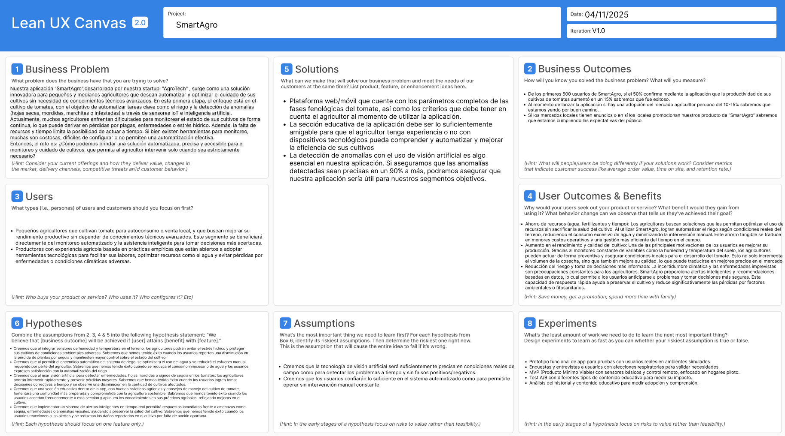

<h1 style="text-align: center;"> Informe del TF  </h1>
<h2 style="text-align: center;"> Universidad Peruana de Ciencias Aplicadas </h2>

<h4 style="text-align: center;"> Ingeniería de Software </h4>
<h4 style="text-align: center;"> Arquitecturas De Software Emergentes </h4>
<h4 style="text-align: center;"> Ciclo 2025-10 </h4>
<h4 style="text-align: center;"> Código del Curso:  </h4>
<h4 style="text-align: center;"> NRC:  </h4>
<h4 style="text-align: center;"> Docente: Rojas Malasquez,  Royer Edelwer  </h4>
<h4 style="text-align: center;"> Startup: AgroTech  </h4>
<h4 style="text-align: center;"> Producto:  TomateRitmo </h4>

## Team Members
|             Nombre              | Código de alumno |
|:-------------------------------:|:----------------:|
|    Guillen Luna, Paolo César    |    U202124343    |
|       Elias Yauri Paucar        |    U202211817    |
|||
|||

## Registro de versiones del informe
|   Fecha    | Versión |      Autor      |                                 Descripción de modificación                                 |
|:----------:|:-------:|:---------------:|:-------------------------------------------------------------------------------------------:|
| 06/04/2024 | 1.0     |  Guillen Paolo  | Creación del documento de trabajo en formato markdown junto al realizamiento de la carátula |
| 06/04/2024 | 1.0     |   |  |
| 07/04/2024 | 1.0     |   | |

## Project Report Collaboration Insights

URL del repositorio del proyecto: [https://github.com/upc-pre-202401-si730-ws53-Error-404]

## Contenido 
1. [**Capítulo I: Introducción.**](#1.)  
1.1. [***Startup Profile***](#1.1.)  
1.1.1. [Descripción del startup](#1.1.1.) 
1.1.2.[Perfiles de los integrantes del equipo](#1.1.2.) 
1.2. [***Solution Profile***](#1.2.) 
1.2.1. [Antecedentes y Problemática](#1.2.1.) 
1.2.2. [Lean UX Process](#1.2.2.) 
1.2.2.1. [Lean UX Problem Statements](#1.2.3.) 
1.2.2.2. [Lean UX Assumptions](#1.2.4.) 
1.2.2.3. [Lean UX Hypothesis Statements](#1.2.5.) 
1.2.2.4.  [Lean UX Canvas](#1.2.5.) 
1.3. [***Segmentos objetivo***](#1.2.6.) 
2. [**Capítulo II: Requirements Elicitation & Analysis**](#2.) 
2.1. [***Competidores***](#2.1.) 
2.1.1. [Análisis competitivo](#2.1.1.) 
2.1.2. [Estrategias y tácticas frente a competidores](#2.1.2.) 
2.2. [***Entrevistas***](#2.2.) 
2.2.1. [Diseño de entrevistas](#2.2.1.) 
2.2.2. [Registro de entrevistas](#2.2.2.) 
2.2.3. [Análisis de entrevistas](#2.2.3.) 
2.3. [***Needfinding***](#2.3.) 
2.3.1. [User Personas](#2.3.1.) 
2.3.2. [User Task Matrix](#2.3.2.) 
2.3.3. [User Journey Mapping](#2.3.3.) 
2.3.4. [Empathy Mapping](#2.3.4.) 
2.3.5. [As-is Scenario Mapping](#2.3.5.) 
2.4. [***Ubiquitous Language***](#2.4.) 
3. [**Capítulo III: Requirements Specification**](#3.) 
3.1. [***To-Be Scenario Mapping***](#3.1.) 
3.2. [***User Stories***](#3.2.) 
3.3. [***Impact Mapping***](#3.3.) 
3.4. [***Product Backlog***](#3.4.) 
4. [**Capítulo IV: Product Design.**](#4.) 
4.1. [***Style Guidelines***](#4.1.) 
4.1.1. [General Style Guidelines](#4.1.1.) 
4.1.2. [Web Style Guidelines](#4.1.2.) 
4.2. [***Information Architecture***](#4.2.) 
4.2.1. [Organization Systems](#4.2.1.) 
4.2.2. [Labeling Systems](#4.2.2.) 
4.2.3. [SEO Tags and Meta Tags](#4.2.3.) 
4.2.4. [Searching Systems](#4.2.4.) 
4.2.5. [Navigation Systems](#4.2.5.) 
4.3. [***Landing Page UI Design***](#4.3.) 
4.3.1. [Landing Page Wireframe](#4.3.1.) 
4.3.2. [Landing Page Mock-up](#4.3.2.) 
4.4. [***Web Applications UX/UI Design***](#4.4.) 
4.4.1. [Web Applications Wireframes](#4.4.1.) 
4.4.2. [Web Applications Wireflow Diagrams](#4.4.2.) 
4.4.3. [Web Applications Mock-ups](#4.4.3.) 
4.4.4. [Web Applications User Flow Diagrams](#4.4.4.) 
4.5. [***Web Applications Prototyping***](#4.5.) 
4.6. [***Domain-Driven Software Architecture***](#4.6.) 
4.6.1. [Software Architecture Context Diagram](#4.6.1.) 
4.6.2. [Software Architecture Container Diagrams](#4.6.2.) 
4.6.3. [Software Architecture Components Diagrams](#4.6.3.) 
4.7. [***Software Object-Oriented Design***](#4.7.) 
4.7.1. [Class Diagrams](#4.7.1.) 
4.7.2. [Class Dictionary](#4.7.2.) 
4.8. [***Database Design***](#4.8.) 
4.8.1. [Database Diagram](#4.8.1.) 

8. [**Conclusiones**](#8.) 
9. [**Bibliografía**](#9.) 
10. [**Anexos**](#10.) 

<h2>Capítulo I: Introducción</h2>

<h3> 1.1 Startup Profile</h3>

En esta sección se presenta la descripción del startup y los perfiles de los miembros del equipo.

<h4> 1.1.1. Descripción del startup</h4>
 

Nuestra startup, **AgroTech**, nace con el propósito de transformar la agricultura tradicional mediante el uso de tecnologías emergentes como la visión artificial, el Internet de las Cosas (IoT) y la inteligencia artificial. Nos enfocamos inicialmente en el cultivo de **tomates**, combinando sensores inteligentes con una plataforma móvil/web para monitorear, analizar y automatizar procesos clave del cultivo.
A diferencia de otros sistemas agrícolas que requieren intervención constante del usuario, TomateRitmo busca ofrecer una experiencia completamente automatizada: desde la detección de anomalías en las hojas (como plagas o enfermedades) hasta el riego automático en respuesta a niveles críticos de sequedad. Esto permite a los agricultores, tanto principiantes como profesionales, optimizar sus recursos, reducir pérdidas y aumentar la productividad sin descuidar la salud del cultivo.

Nuestro enfoque es práctico, accesible y centrado en el usuario. Creemos que la tecnología aplicada al campo no solo debe ser eficiente, sino también intuitiva, inclusiva y adaptable a distintos niveles de conocimiento técnico.

**Misión:** Desarrollar soluciones inteligentes que automaticen el monitoreo y cuidado de cultivos mediante tecnologías como visión artificial, IoT e inteligencia artificial, facilitando así una agricultura más eficiente, sostenible y accesible para todos.

**Visión:** Agrotech aspira a convertirse en un referente en agricultura automatizada, reconocido por mejorar la calidad de vida del agricultor mediante tecnología de vanguardia, y por su compromiso con una producción agrícola más precisa, sostenible y conectada.

<h4> 1.1.2. Perfiles de los integrantes del equipo</h4>

|                                                                                                                                                                                                          Descripción de los perfiles de los integrantes del equipo                                                                                                                                                                                                           |                                                              Foto del integrante                                                              |
|:----------------------------------------------------------------------------------------------------------------------------------------------------------------------------------------------------------------------------------------------------------------------------------------------------------------------------------------------------------------------------------------------------------------------------------------------------------------------------:|:---------------------------------------------------------------------------------------------------------------------------------------------:|
| Mi nombre es **Paolo César Guillen Luna**, estudiante de la carrera de Ingeniería de Software, en la UPC y fanático de los videojuegos. Me considero alguien creativo y con determinación en alcanzar sus metas, dentro del campo del desarrollo de software, me gustaría especializarme en lo que es el testing de este, razón por la cual aparte de seguir la malla curricular de mi carrera también ando aprendiendo herramientas diversas como Playwright, Cypress, etc. |      |
| Mi nombre es **Elias Yauri**, soy una persona muy participativa cuando se trata en el tema laboral y en el trabajo en equipo, siempre trato de que haya una comunicación constante con todos los miembros del grupo para que de esta forma podamos tener toda una buena afinidad como grupo y que el trabajo se realice de manera exitosa.  |  |
|||
|||

<h3> 1.2. Solution Profile</h3>

<h4> 1.2.1. Antecedentes y Problemática</h4>

##### What (Qué)
###### ¿Cuál es el problema?
En América Latina, los pequeños y medianos agricultores enfrentan importantes desafíos en el manejo de sus cultivos, principalmente por la falta de acceso a tecnologías automatizadas, monitoreo en tiempo real y datos confiables para la toma de decisiones. Esto genera pérdidas considerables por factores como sequía, enfermedades, plagas o decisiones inadecuadas de riego y fertilización.

Según la FAO (2020), las pérdidas poscosecha pueden alcanzar hasta 30% en hortalizas como el tomate, y gran parte de estas se deben a problemas prevenibles con tecnología. Además, el Banco Mundial (2019) señala que el nivel de digitalización agrícola en la región es muy bajo, especialmente en explotaciones de menos de 5 hectáreas.

##### When (Cuando)
###### ¿Cuándo sucede el problema?
El problema ocurre a lo largo de todo el ciclo del cultivo, pero se vuelve crítico en etapas sensibles como floración y maduración, donde el manejo incorrecto del agua o la falta de detección temprana de plagas puede reducir drásticamente el rendimiento.

Según el IICA (2022), el 80% de los agricultores en zonas rurales no cuenta con herramientas para el monitoreo continuo, lo que agrava el problema durante los momentos de ausencia física o cuando no se tiene tiempo para revisar manualmente cada planta.

##### Where (Dónde)
###### ¿A dónde se dirige?
La solución está pensada para agricultores de pequeña escala, especialmente aquellos que cultivan tomates en regiones con acceso limitado a asesoramiento técnico. También es útil en zonas periurbanas o rurales donde la conexión a internet y electricidad es intermitente, pero se puede trabajar con módulos offline/semiconectados.

###### ¿Dónde surge el problema?
El problema se origina directamente en los campos de cultivo, donde el monitoreo tradicional depende de la experiencia del agricultor. En estos entornos, los sensores y la inteligencia artificial aún no son comunes, pese a su potencial para mejorar los rendimientos (FAO, 2020).

##### Who (Quién)
###### ¿Quiénes están involucrados? ¿Quién lo utilizará?
Los beneficiarios directos son agricultores que cultivan tomate (y potencialmente otros cultivos), que buscan mejorar su productividad mediante herramientas accesibles y automatizadas. También pueden involucrarse cooperativas agrícolas, gobiernos locales y ONGs interesadas en impulsar la agricultura inteligente.

Según la CEPAL (2021), el 60% de los alimentos en América Latina provienen de la agricultura familiar, pero estos productores tienen bajo acceso a tecnologías que optimicen su labor diaria.

##### Why (Por qué)
###### ¿Cuál es la causa del problema?
La causa raíz es la baja adopción de tecnologías agrícolas inteligentes debido a barreras económicas, educativas y de infraestructura. Aunque existen soluciones comerciales, muchas son costosas, complejas o requieren conocimientos técnicos avanzados.

El IICA (2022) advierte que si no se logra una transformación digital efectiva del agro, la región enfrentará serios problemas de productividad, seguridad alimentaria y sostenibilidad.

#### 2H
##### How (Cómo)
###### ¿Cómo se utilizará el producto?
El agricultor podrá interactuar con TomateRitmo a través de una app web/móvil que muestra datos en tiempo real sobre humedad del suelo, temperatura ambiental, y estado visual de las hojas mediante visión artificial. Si el sistema detecta sequedad o anomalías (como manchas, mordidas o amarillamiento), se activará el riego automático o se enviará una alerta.

##### How much (Cuánto)
###### ¿Cuál es la magnitud del problema?
* 30% de pérdida promedio en cultivos de hortalizas (FAO, 2020)
* Más del 70% de los agricultores en América Latina no usa herramientas digitales (Banco Mundial, 2019)
* El 80% del agua de riego se desperdicia por falta de control preciso (IICA, 2022)

Si TomateRitmo logra implementarse en solo el 20% de pequeños productores de tomate, podría generar un aumento de productividad de hasta un 25% y reducir en más del 40% el uso ineficiente de agua, contribuyendo también a la sostenibilidad ambiental.

<h4> 1.2.2. Lean UX Process</h4>

<h5> 1.2.2.1. Lean UX Problem Statements</h5>

##### **Problem Statement:** 
Nuestra aplicación "TomateRitmo",desarrollada por nuestra startup, "AgroTech" , surge como una solución innovadora para pequeños y medianos agricultores que desean automatizar y optimizar el cuidado de sus cultivos sin necesidad de conocimientos técnicos avanzados. En esta primera etapa, el enfoque está en el cultivo de tomates, con el objetivo de automatizar tareas clave como el riego y la detección de anomalías (hojas secas, mordidas, marchitas o infestadas) a través de sensores IoT e inteligencia artificial.

Actualmente, muchos agricultores enfrentan dificultades para monitorear el estado de sus cultivos de forma continua, lo que puede derivar en pérdidas por plagas, enfermedades o estrés hídrico. Además, la falta de recursos y tiempo limita la posibilidad de actuar a tiempo. Si bien existen herramientas para monitoreo, muchas son costosas, difíciles de configurar o no permiten una automatización efectiva.

Entonces, el reto es: ¿Cómo podemos brindar una solución automatizada, precisa y accesible para el monitoreo y cuidado de cultivos, que permita al agricultor intervenir solo cuando sea estrictamente necesario?

Para ello, nos enfocamos en:

* Enfoque centrado en el agricultor: la solución debe ser intuitiva y accesible desde un celular o computadora.
* Alcance claro: Nos centramos en el monitoreo y automatización de riego, detección de anomalías visuales mediante IA, y alertas preventivas.
* Medidas de éxito: Reducción de pérdidas por estrés hídrico o plagas, incremento en el rendimiento del cultivo, y adopción sostenida del sistema.

##### **User Assumptions:**
###### **¿Quién es el usuario?**
El usuario es un agricultor principiante o profesional que cultiva tomate y busca mejorar la eficiencia y salud de sus cultivos a través de tecnología. También pueden ser estudiantes de agronomía, técnicos agrícolas, o cooperativas interesadas en la transformación digital del campo.

###### **¿Qué problemas tiene nuestro producto? ¿Qué resuelve?**
TomateRitmo resuelve la falta de monitoreo constante de variables críticas (temperatura, humedad del suelo, apariencia del cultivo), ofreciendo una solución integral que permite actuar a tiempo mediante alertas o incluso ejecutar acciones automáticas como el riego.

###### **¿Qué características son importantes?**

Entre las características que consideramos relevantes están: 
* Monitoreo en tiempo real de humedad y temperatura mediante sensores IoT.
* Visión artificial para detección de anomalías en hojas de tomate.
* Activación automática de riego si el sistema detecta sequedad.
* Notificaciones inteligentes al agricultor vía app móvil/web.
* Historial visual y ambiental del cultivo.
* Control manual o automático del sistema.

###### **¿Dónde encaja nuestro producto en su trabajo o vida?**
TomateRitmo se integra en la rutina diaria del agricultor, facilitando el seguimiento sin necesidad de presencia constante en el campo. Permite gestionar el cultivo desde casa o mientras realiza otras actividades, generando eficiencia y tranquilidad.

###### **¿Cuándo y cómo es nuestro producto usado?**
El sistema se usa durante todo el ciclo de vida del cultivo, especialmente en etapas críticas como floración o fructificación. Puede usarse de manera autónoma o manual, siendo clave en momentos de clima extremo o cuando el agricultor está ausente.

###### **¿Cómo debe verse nuestro producto y cómo debe comportarse?**
La interfaz debe ser simple, clara y funcional, con íconos visuales e instrucciones breves. El comportamiento del sistema debe ser confiable, proactivo (actuar antes de que haya un daño grave), y generar reportes entendibles para cualquier nivel de conocimiento.

<h5> 1.2.2.2. Lean UX Assumptions.</h5>

##### **Feature Assumptions:**

**Creemos que** al integrar sensores de humedad y temperatura en el terreno, los agricultores podrán evitar el estrés hídrico y proteger sus cultivos de condiciones ambientales adversas.

**Creemos que** al permitir el encendido automático del sistema de riego, se optimizará el uso del agua y se reducirá el esfuerzo manual requerido por parte del agricultor.

**Creemos que** al usar visión artificial para detectar enfermedades, hojas mordidas o signos de sequía en los tomates, los agricultores podrán intervenir rápidamente y prevenir pérdidas mayores.

**Creemos que** una sección educativa dentro de la app, con buenas prácticas agrícolas y consejos de manejo del cultivo de tomate, fomentará una comunidad más preparada y comprometida con la agricultura sostenible.

**Creemos que** implementar un sistema de alertas inteligentes en tiempo real permitirá respuestas inmediatas frente a amenazas como sequía, enfermedades o anomalías visuales, ayudando a preservar la salud del cultivo.

<h5> 1.2.2.3. Lean UX Hypothesis Statements.</h5>

Hipótesis 1: Sensores para evitar estrés hídrico

**Creemos que** al integrar sensores de humedad y temperatura en el terreno, los agricultores podrán evitar el estrés hídrico y proteger sus cultivos de condiciones ambientales adversas.
**Sabremos que** hemos tenido éxito cuando los usuarios reporten una disminución en la pérdida de plantas por sequía y manifiesten mayor control sobre el estado del cultivo.

Hipótesis 2: Riego automático optimizado

**Creemos que** al permitir el encendido automático del sistema de riego, se optimizará el uso del agua y se reducirá el esfuerzo manual requerido por parte del agricultor.
**Sabremos que** hemos tenido éxito cuando se reduzca el consumo innecesario de agua y los usuarios expresen satisfacción con la automatización del riego.

Hipótesis 3: Visión artificial para detección temprana de anomalías

**Creemos que** al usar visión artificial para detectar enfermedades, hojas mordidas o signos de sequía en los tomates, los agricultores podrán intervenir rápidamente y prevenir pérdidas mayores.
**Sabremos que** hemos tenido éxito cuando los usuarios logren tomar decisiones correctivas a tiempo y se observe una disminución en la cantidad de cultivos afectados.

Hipótesis 4: Contenido educativo agrícola

**Creemos que** una sección educativa dentro de la app, con buenas prácticas agrícolas y consejos de manejo del cultivo de tomate, fomentará una comunidad más preparada y comprometida con la agricultura sostenible.
**Sabremos que** hemos tenido éxito cuando los usuarios accedan frecuentemente a esta sección y apliquen los conocimientos en sus prácticas agrícolas, reflejando mejoras en el cultivo.

Hipótesis 5: Alertas inteligentes en tiempo real

**Creemos que** implementar un sistema de alertas inteligentes en tiempo real permitirá respuestas inmediatas frente a amenazas como sequía, enfermedades o anomalías visuales, ayudando a preservar la salud del cultivo.
**Sabremos que** hemos tenido éxito cuando los usuarios reaccionen a las alertas y se reduzcan los daños reportados en el cultivo por falta de acción oportuna.

<h5> 1.2.2.4. Lean UX Canvas.</h5>

El Lean UX Canvas es una herramienta que se utiliza en el campo del diseño centrado en el usuario (UX) y la metodología Lean para optimizar la creación y el desarrollo de productos. Su objetivo principal es proporcionar un marco estructurado para la colaboración entre equipos multidisciplinarios. A través de esta herramienta, los equipos pueden visualizar y analizar aspectos clave del diseño y la experiencia del usuario, lo que facilita la toma de decisiones informadas durante el proceso de desarrollo.

## ***Lean UX Canvas realizado en la aplicación web "Figma":*** 

<h3> 1.3. Segmento Objetivo</h3>

1. Pequeños agricultores que cultivan tomate para autoconsumo o venta local, y que buscan mejorar su rendimiento productivo sin depender de conocimientos técnicos avanzados. Este segmento se beneficiará directamente del monitoreo automatizado y la asistencia inteligente para tomar decisiones más acertadas.
2. Productores con experiencia agrícola basada en prácticas empíricas que están abiertos a adoptar herramientas tecnológicas para facilitar sus labores, optimizar recursos como el agua y evitar pérdidas por enfermedades o condiciones climáticas adversas.

[//]: #CAPITULO2

<h2> Capítulo II: Requirements Elicitation & Analysis</h2>

<h3> 2.1. Competidores</h3>

<h4> 2.1.Análisis Competitivo</h4>

||TomateRitmo  | | | | |
|:-:|:-:|:-:|:-:|:-:|:-:|
|**Overview**|Plataforma especializada en el cultivo de tomate, integrando sensores IoT y visión artificial para detección de anomalías a lo largo del cultivo|Solución agrícola que ofrece monitoreo en tiempo real y análisis de datos para mejorar la eficiencia en cultivos diversos.|Sistema de gestión agronómica que utiliza sensores de suelo para proporcionar recomendaciones de riego y fertilización.	|Herramienta de gestión agrícola que digitaliza operaciones y registros para mejorar la toma de decisiones.	|Plataforma que proporciona análisis de datos y predicciones para optimizar la producción y rentabilidad agrícola.|
|**Ventajas Competitivas**|Enfoque exclusivo en tomate, integración de visión artificial para detección de enfermedades y automatización del cultivo bajo paramétros|Interfaz intuitiva y fácil de usar, adecuada para agricultores con diferentes niveles de experiencia tecnológica.	|Tecnología avanzada de sensores de suelo que proporciona datos precisos para decisiones agronómicas.	|Amplia gama de funciones para la gestión operativa de la finca, incluyendo planificación y seguimiento de tareas.	|Análisis predictivo y seguimiento financiero que ayuda a maximizar la rentabilidad de las explotaciones.|
|**Mercado Objetivo**|Agricultores especializados en tomate, tanto profesionales como pequeños productores.	|Agricultores de diversos cultivos que buscan mejorar la eficiencia mediante tecnología accesible.	|Productores agrícolas que requieren datos precisos del suelo para optimizar riego y fertilización.	|Grandes explotaciones agrícolas que necesitan digitalizar y gestionar múltiples aspectos operativos.	|Agricultores interesados en utilizar análisis de datos para mejorar la producción y la rentabilidad.|
|**Estrategias de Marketing**|Alianzas con cooperativas de tomate y demostraciones en campo	|Promoción a través de ferias agrícolas y asociaciones locales.	|Colaboraciones con distribuidores de equipos agrícolas y presencia en eventos del sector.	|Marketing dirigido a grandes explotaciones y asociaciones agrícolas.	|Campañas digitales enfocadas en la rentabilidad y eficiencia operativa.|
|**Productos & Servicios**|Sensores de humedad y temperatura, visión artificial para detección de enfermedade y sistema de riego automatizado	|Sensores ambientales, plataforma de análisis de datos y soporte técnico.	|Sensores de suelo, plataforma de análisis agronómico y recomendaciones personalizadas.	|Software de gestión agrícola, aplicaciones móviles y soporte técnico.	|Plataforma de análisis de datos, predicciones de rendimiento y seguimiento financiero.|
|**Precios & Costos**|Modelo de suscripción mensual con opciones según el tamaño de la explotación.	|Tarifas escalables según el número de sensores y servicios contratados.	|Precios basados en el número de sensores y el tamaño de la explotación.	|Suscripción anual con diferentes niveles de servicio.	|Modelo freemium con opciones de pago para funciones avanzadas.|
|**Canales de distribución (WEB y/o Móvil)**|Aplicación web y móvil para Android|Aplicación web y móvil para Android e iOS.	|Aplicación web y móvil para Android e iOS.	|Aplicación web y móvil para Android e iOS.	|Aplicación web y móvil para Android e iOS.	|
|**Fortalezas**|Especialización en tomate con integración de tecnologías avanzadas como visión artifical	|Facilidad de uso y soporte técnico accesible.	|Datos precisos del suelo y recomendaciones agronómicas personalizadas.	|Gestión integral de operaciones agrícolas.	|Análisis predictivo y enfoque en la rentabilidad.|
|**Debilidades**|Enfoque limitado al cultivo de tomate, lo que puede restringir su mercado.	|Menor especialización en cultivos específicos.	|Requiere inversión en sensores y tecnología.	|Puede ser complejo para pequeñas explotaciones.	|Dependencia de la calidad de los datos ingresados por el usuario.|
|**Oportunidades**|Expansión a otros cultivos, integración con sistemas de mercado y exportación.	|Ampliación de servicios y soporte en más regiones.	|Desarrollo de nuevas funciones basadas en inteligencia artificial.	|Integración con maquinaria agrícola y automatización.	|Alianzas con instituciones financieras para ofrecer servicios adicionales.|
|**Amenazas**|Competencia de soluciones más generalistas y cambios en las regulaciones agrícolas.	|Entrada de nuevos competidores con tecnologías más avanzadas.	|Cambios en las condiciones climáticas que afecten la demanda de sus servicios.	|Resistencia al cambio por parte de agricultores tradicionales.	|Fluctuaciones en los precios de los productos agrícolas que afecten la inversión en tecnología.|

<h4> 2.1.2. Estrategias y tácticas frente a competidores</h4>

  
A partir del análisis competitivo realizado se logró identificar las fortalezas, debilidades, oportunidades y amenazas destacadas en los competidores. Esta información adquirida es esencial para trazar estrategias y tácticas para diferenciarnos de nuestros competidore. A continuación se brindará tanto estrategias como tácticas para alcanzar esta meta:

**Fortalezas de nuestros competidores:**

- Ofrecen soluciones para múltiples cultivos, lo que les permite abarcar un mercado más amplio.
- Cuentan con contenido educativo y asesoría agrícola para principiantes.
- Tienen presencia establecida en el mercado con varios años de experiencia y una base sólida de usuarios.

**Estrategias y tácticas para nuestras fortalezas:**

**Estrategias:**
- Posicionar a TomateRitmo como la solución más precisa y avanzada del mercado para el cultivo de tomate.
- Comunicar los beneficios específicos y tangibles que nuestra tecnología aporta frente a enfoques generalistas.
- Enfocar los esfuerzos en nichos especializados con mayor demanda de precisión y rendimiento.

**Tácticas:**
- Mostrar casos reales de éxito y mejoras en rendimiento del cultivo de tomate usando TomateRitmo.
- Participar en ferias agrícolas especializadas y eventos de tecnología agropecuaria.
- Utilizar marketing comparativo que demuestre la efectividad de nuestro enfoque centrado en datos e IA.

**Debilidades de nuestros competidores:**
- No ofrecen una personalización profunda para un cultivo específico.
- La detección de anomalías suele ser manual o limitada a sensores básicos.
- Interfaces de usuario complejas o poco intuitivas.
- En algunos casos, falta de integración con sistemas IoT o automatización limitada.

**Estrategias y tácticas para nuestras debilidades:**

**Estrategias:**
- Aprovechar la especialización en tomate como una ventaja para ofrecer una solución más eficaz y adaptada.
- Enfocarnos en una interfaz sencilla y basada en flujos intuitivos para cualquier usuario.
- Desarrollar tecnología propietaria con visión artificial que supere la capacidad de inspección manual.

**Tácticas:**
- Lanzar versiones beta con usuarios reales que validen la facilidad de uso y efectividad.
- Mostrar ejemplos en tiempo real de cómo se detectan enfermedades con nuestra IA.
- Capacitar a distribuidores o partners locales para mejorar la adopción de la tecnología.

**Oportunidades de nuestros competidores:**
- Pueden expandirse rápidamente a nuevos mercados emergentes gracias a su infraestructura existente.
- Pueden integrar nuevas tecnologías como IA o visión artificial para actualizar sus sistemas.
- Pueden asociarse con instituciones agrícolas o gubernamentales para mejorar su alcance.

**Estrategias y tácticas para nuestras oportunidades:**

**Estrategias:**
- Acelerar la innovación tecnológica en detección y automatización para mantener la delantera.
- Expandirse con versiones localizadas en países con alta producción de tomate.
- Posicionar la solución como un aliado para políticas de agricultura sostenible y modernización.

**Tácticas:**
- Desarrollar alianzas estratégicas con distribuidores agrícolas locales en países clave.
- Identificar oportunidades de subvención o apoyo institucional para tecnología agrícola.
- Incorporar funcionalidades que respondan rápidamente a tendencias del mercado (como ahorro de agua).

**Amenazas de nuestros competidores:**
- La aparición de soluciones más completas que abarquen todo el ciclo agrícola.
- La evolución tecnológica rápida podría hacer obsoletos ciertos enfoques.
- Cambios regulatorios que puedan limitar el uso de tecnologías IoT o drones.

**Estrategias y tácticas para nuestras amenazas:**

**Estrategias:**
- Adoptar una filosofía de innovación constante para evitar ser superados tecnológicamente.
- Anticiparse a los cambios regulatorios con un equipo atento a la normativa agrícola e IoT.
- Diseñar una arquitectura flexible que permita escalar e integrar nuevos módulos sin rediseñar todo.

**Tácticas:**
- Participar en comités, ferias y foros agrícolas donde se anticipen cambios legales o tecnológicos.
- Mantener versiones de TomateRitmo actualizadas regularmente con mejoras incrementales.
- Preparar protocolos de contingencia y adaptación para diversas normativas regionales.

  
<h3> 2.2. Entrevistas</h3>

    
En esta sección se procederá a detallar las preguntas para el método de recoleccion de
  requisitos que son las entrevistas. Para la formulación se siguieron buenas prácicas tales como 
  formulación de preguntas abiertas, así mismo obtenemos características demográficas con las entrevistas
  

  <h4>PREGUNTAS GENERALES</h4>
  
Bienvenido gracias por brindarnos esta entrevista (empieza con las preguntas generales) 

  
  * Nos gustaría saber su nombre, edad y ocupación
  * ¿Qué tan acostumbrado está con el uso de tecnología en su vida diaria?
  * Dentro de su vida diaria, ¿tiene incovenientes utilizando dichas herramientas digitales?
  * Alguna vez tuvo que enfrentarse con una situación donde usted no entendía para nada como servía una aplicación, de ser así, ¿cómo sobrellevo ese problema?

  <h4>SECTOR AGRICULTORES EXPERIMENTADOS: </h4>
  
1. ¿Cuál es el proceso actual que sigue para monitorear el estado de sus cultivos de tomate?
2. ¿Utiliza alguna tecnología o herramienta digital actualmente? ¿Cuál?
3. ¿Qué información considera más valiosa para optimizar el cuidado de sus cultivos?
4. ¿Ha enfrentado pérdidas por enfermedades, sequía u otros factores ambientales? ¿Qué las causó?
5. ¿Qué tan útil le resultaría recibir alertas en tiempo real sobre amenazas para sus cultivos?
6. ¿Qué opinión le merece una herramienta que detecte automáticamente anomalías en las hojas o el riego?
7. ¿Qué funcionalidades considera indispensables en una app de monitoreo para cultivos de tomate?
8. ¿Qué tan abierto estaría a usar sensores IoT en su terreno? ¿Y visión artificial?
9. ¿Estaría dispuesto a invertir en una herramienta tecnológica que le ayude a prevenir pérdidas?
10. ¿Cuánto estaría dispuesto a pagar por una solución tecnológica que automatice el monitoreo?
11. ¿Qué tanto valoraría una plataforma fácil de usar que cuente con funciones avanzadas para mejorar la productividad agrícola?

  <h4>SECTOR AUTOCULTIVADORES: </h4>

1. ¿Cuál es su motivación principal para cultivar tomates en casa?
2. ¿Cómo hace actualmente el seguimiento del estado de sus plantas?
3. ¿Ha utilizado alguna app o herramienta digital para ayudarle con sus cultivos?
4. ¿Qué información le gustaría recibir para cuidar mejor sus tomates?
5. ¿Qué dificultades ha tenido al momento de mantener sus plantas saludables?
6. ¿Le parecería útil una app que le avise cuando sus tomates presenten señales de enfermedad o sequía?
7. ¿Qué tan dispuesto estaría a probar una app que automatice el riego y detecte problemas visuales?
8. ¿Cuánto estaría dispuesto a invertir en una herramienta que facilite su cultivo en casa?
9. ¿Qué tanto le interesa la trazabilidad o el historial visual del desarrollo de sus tomates?
10. ¿Qué tan importante le parece usar tecnología para obtener mejores resultados en su cultivo personal?

<h4> 2.2.1. Diseño de entrevistas</h4>

<h4> 2.2.2. Registro de entrevistas</h4>

<h4> 2.2.3. Análisis de entrevistas</h4>

<h3> 2.3 Needfinding</h3>

<h4> 2.3.1. User Personas</h4>

    
En esta sección se presentan las personas que se han identificado como usuarios de la aplicación. Teniendo en cuenta
    nuestros segmentos predefinidos, AGRICULTORES EXPERIMENTADOS y AUTOCULTIVADORES A continuación se presentan los User Persona.

    

<h4> 2.3.2. User Task Matrix</h4>

<h4> 2.3.3. User Journey Mapping</h4>

<h4> 2.3.4. Empathy Mapping</h4>

<h4> 2.3.5. As-is Scenario Mapping</h4>

<h3> 2.4 Ubiquitous Language</h3>

  
[//]: #CAPITULO3

<h2>Capítulo 3: Requirements Specification</h2>

<h3> 3.1. To-be scenario mapping</h3>

Se presenta el escenario ideal con nuestra solución de nuestro ususarios incluyendo nuestros 2 segmentos. 

La imagen muestra el escenario ideal de AGRICULTORES EXPERIMENTADOS con los pasos y lo que hace, piensa y siente.

La imagen muestra el escenario ideal con los pasos de los AUTOCULTIVADORES y lo que hace, piensa y siente.

<h3> 3.2. User Stories</h3>

<h3> 3.3. Impact Mapping. </h3>

<h3> 3.4. Product Backlog.</h3>

Para una correcta calificacion de los story points, optamos por seguir la escala de Fibonacci

<h2>Anexos</h2>

<h2>Bibliografía</h2>

FAO. (2020). Perdidas y desperdicios de alimentos en América Latina. Organización de las Naciones Unidas para la Alimentación y la Agricultura. https://www.fao.org

IICA. (2022). Transformación digital de la agricultura. Instituto Interamericano de Cooperación para la Agricultura. https://www.iica.int

CEPAL. (2021). La digitalización del agro: Una oportunidad para el desarrollo rural sostenible. Comisión Económica para América Latina y el Caribe. https://www.cepal.org

Banco Mundial. (2019). Hacia una Agricultura 4.0. https://www.worldbank.org

Zhang, Y., et al. (2020). IoT-based smart agriculture: An overview on technologies and applications. Agricultural Systems, Elsevier. https://www.sciencedirect.com/journal/agricultural-systems

<h2>Anexos</h2>

