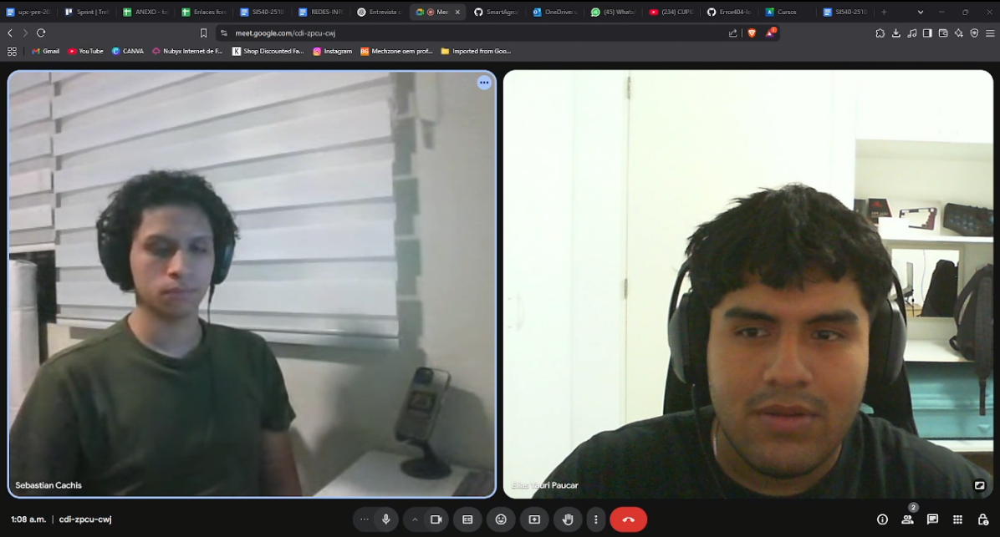

<h1 style="text-align: center;"> Informe del TF  </h1>
<h2 style="text-align: center;"> Universidad Peruana de Ciencias Aplicadas </h2>

<h4 style="text-align: center;"> Ingeniería de Software </h4>
<h4 style="text-align: center;"> Arquitecturas De Software Emergentes </h4>
<h4 style="text-align: center;"> Ciclo 2025-10 </h4>
<h4 style="text-align: center;"> Código del Curso:  </h4>
<h4 style="text-align: center;"> NRC:  </h4>
<h4 style="text-align: center;"> Docente: Rojas Malasquez,  Royer Edelwer  </h4>
<h4 style="text-align: center;"> Startup: AgroTech  </h4>
<h4 style="text-align: center;"> Producto:  TomateRitmo </h4>

## Team Members
|             Nombre              | Código de alumno |
|:-------------------------------:|:----------------:|
|    Guillen Luna, Paolo César    |    U202124343    |
|       Elias Yauri Paucar        |    U202211817    |
| Cruz Palomino Adriano Sebastian |    U202210697    |
| Rengifo Mirabal Randy Becker |    u20211d683    |

## Registro de versiones del informe
|   Fecha    | Versión |      Autor      |                                 Descripción de modificación                                 |
|:----------:|:-------:|:---------------:|:-------------------------------------------------------------------------------------------:|
| 06/04/2025 | 1.0     |  Guillen Paolo  | Creación del documento de trabajo en formato markdown junto al realizamiento de la carátula |
| 06/04/2025 | 1.0     | Elias Yauri Paucar  | Registro de las entrevistas de cada segmento objetivo |
| 18/04/2025 | 1.0     | Rengifo Murabal Randy Becker  | Registro de las entrevistas del segmento de Autocultivadores |
| 07/04/2025 | 1.0     |   | |

## Project Report Collaboration Insights

URL del repositorio del proyecto: []

## Contenido 
1. [**Capítulo I: Introducción.**](#1.)  
1.1. [***Startup Profile***](#1.1.)  
1.1.1. [Descripción del startup](#1.1.1.) 
1.1.2.[Perfiles de los integrantes del equipo](#1.1.2.) 
1.2. [***Solution Profile***](#1.2.) 
1.2.1. [Antecedentes y Problemática](#1.2.1.) 
1.2.2. [Lean UX Process](#1.2.2.) 
1.2.2.1. [Lean UX Problem Statements](#1.2.3.) 
1.2.2.2. [Lean UX Assumptions](#1.2.4.) 
1.2.2.3. [Lean UX Hypothesis Statements](#1.2.5.) 
1.2.2.4.  [Lean UX Canvas](#1.2.5.) 
1.3. [***Segmentos objetivo***](#1.2.6.) 
2. [**Capítulo II: Requirements Elicitation & Analysis**](#2.) 
2.1. [***Competidores***](#2.1.) 
2.1.1. [Análisis competitivo](#2.1.1.) 
2.1.2. [Estrategias y tácticas frente a competidores](#2.1.2.) 
2.2. [***Entrevistas***](#2.2.) 
2.2.1. [Diseño de entrevistas](#2.2.1.) 
2.2.2. [Registro de entrevistas](#2.2.2.) 
2.2.3. [Análisis de entrevistas](#2.2.3.) 
2.3. [***Needfinding***](#2.3.) 
2.3.1. [User Personas](#2.3.1.) 
2.3.2. [User Task Matrix](#2.3.2.) 
2.3.3. [User Journey Mapping](#2.3.3.) 
2.3.4. [Empathy Mapping](#2.3.4.) 
2.3.5. [As-is Scenario Mapping](#2.3.5.) 
2.4. [***Ubiquitous Language***](#2.4.) 
3. [**Capítulo III: Requirements Specification**](#3.) 
3.1. [***To-Be Scenario Mapping***](#3.1.) 
3.2. [***User Stories***](#3.2.) 
3.3. [***Impact Mapping***](#3.3.) 
3.4. [***Product Backlog***](#3.4.) 
4. [**Capítulo IV: Strategic-Level Software Design**](#4.) 
4.1. [***Strategic-Level Attribute-Driven Design***](#4.1.) 
4.1.1. [Design Purpose](#4.1.1.) 
4.1.2. [Attribute-Driven Design Inputs](#4.1.2.) 
4.1.2.1. [Primary Functionality (Primary User Stories)](#4.1.2.1.) 
4.1.2.2. [Quality attribute Scenarios](#4.1.2.2.) 
4.1.2.3. [Constraints](#4.1.2.3.) 
4.1.3. [Architectural Drivers Backlog](#4.1.3.) 
4.1.4. [Architectural Design Decisions](#4.1.4.) 
4.1.5. [Quality Attribute Scenario Refinements](#4.1.5.) 
4.2. [***Strategic-Level Domain-Driven Design***](#4.2.) 
4.2.1. [EventStorming](#4.2.1.) 
4.2.2. [Candidate Context Discovery](#4.2.2.) 
4.2.3. [Domain Message Flows Modeling](#4.2.3.) 
4.2.4. [Bounded Context Canvases](#4.2.4.) 
4.2.5. [Context Mapping](#4.2.5.) 
4.3. [***Software Architecture***](#4.3.) 
4.3.1. [Software Architecture System Landscape Diagram](#4.3.1.) 
4.3.2. [Software Architecture Context Level Diagrams](#4.3.2.) 
4.3.3. [Software Architecture Container Level Diagrams](#4.3.3.) 
4.3.4. [Software Architecture Deployment Diagrams](#4.3.4.) 

8. [**Conclusiones**](#8.) 
9. [**Bibliografía**](#9.) 
10. [**Anexos**](#10.) 

<h2>Capítulo I: Introducción</h2>

<h3> 1.1 Startup Profile</h3>

En esta sección se presenta la descripción del startup y los perfiles de los miembros del equipo.

<h4> 1.1.1. Descripción del startup</h4>
 

Nuestra startup, **AgroTech**, nace con el propósito de transformar la agricultura tradicional mediante el uso de tecnologías emergentes como la visión artificial, el Internet de las Cosas (IoT) y la inteligencia artificial. Nos enfocamos inicialmente en el cultivo de **tomates**, combinando sensores inteligentes con una plataforma móvil/web para monitorear, analizar y automatizar procesos clave del cultivo.
A diferencia de otros sistemas agrícolas que requieren intervención constante del usuario, TomateRitmo busca ofrecer una experiencia completamente automatizada: desde la detección de anomalías en las hojas (como plagas o enfermedades) hasta el riego automático en respuesta a niveles críticos de sequedad. Esto permite a los agricultores, tanto principiantes como profesionales, optimizar sus recursos, reducir pérdidas y aumentar la productividad sin descuidar la salud del cultivo.

Nuestro enfoque es práctico, accesible y centrado en el usuario. Creemos que la tecnología aplicada al campo no solo debe ser eficiente, sino también intuitiva, inclusiva y adaptable a distintos niveles de conocimiento técnico.

**Misión:** Desarrollar soluciones inteligentes que automaticen el monitoreo y cuidado de cultivos mediante tecnologías como visión artificial, IoT e inteligencia artificial, facilitando así una agricultura más eficiente, sostenible y accesible para todos.

**Visión:** Agrotech aspira a convertirse en un referente en agricultura automatizada, reconocido por mejorar la calidad de vida del agricultor mediante tecnología de vanguardia, y por su compromiso con una producción agrícola más precisa, sostenible y conectada.

<h4> 1.1.2. Perfiles de los integrantes del equipo</h4>

|                                                                                                                                                                                                          Descripción de los perfiles de los integrantes del equipo                                                                                                                                                                                                           |                                                              Foto del integrante                                                              |
|:----------------------------------------------------------------------------------------------------------------------------------------------------------------------------------------------------------------------------------------------------------------------------------------------------------------------------------------------------------------------------------------------------------------------------------------------------------------------------:|:---------------------------------------------------------------------------------------------------------------------------------------------:|
| Mi nombre es **Paolo César Guillen Luna**, estudiante de la carrera de Ingeniería de Software, en la UPC y fanático de los videojuegos. Me considero alguien creativo y con determinación en alcanzar sus metas, dentro del campo del desarrollo de software, me gustaría especializarme en lo que es el testing de este, razón por la cual aparte de seguir la malla curricular de mi carrera también ando aprendiendo herramientas diversas como Playwright, Cypress, etc. |      |
| Mi nombre es **Elias Yauri**, soy una persona muy participativa cuando se trata en el tema laboral y en el trabajo en equipo, siempre trato de que haya una comunicación constante con todos los miembros del grupo para que de esta forma podamos tener toda una buena afinidad como grupo y que el trabajo se realice de manera exitosa.  |  |
| Mi nombre es **Adriano Sebastian Cruz Palomino**, tengo 20 años, soy alumno de Ingeniería de Software en la UPC, actualmente estoy cursando el 7mo ciclo. Soy una persona curiosa, responsable, y comprometida con mis estudios, siempre busco aprender más y mejorar mis habilidades. ||
| Mi nombre es Randy Becker Rengifo Mirabal, tengo 21 años y soy estudiante de la carrera de Ingeniería de Software en la Universidad Peruana de Ciencias Aplicadas (UPC), actualmente cursando el octavo ciclo. Me considero una persona proactiva, responsable y comprometida con mis deberes. Siempre busco nuevas oportunidades para aprender, crecer profesionalmente y fortalecer mis habilidades tanto técnicas como personales. Tengo gran interés por la tecnología, el desarrollo de software y la innovación. Me adapto con facilidad a distintos entornos de trabajo, disfruto trabajar en equipo y estoy enfocado en encontrar soluciones eficientes a los problemas que se presentan. Además, me apasiona estar en constante aprendizaje, ya sea a través de proyectos académicos, personales o colaborativos.||
|||

<h3> 1.2. Solution Profile</h3>

<h4> 1.2.1. Antecedentes y Problemática</h4>

##### What (Qué)
###### ¿Cuál es el problema?
En América Latina, los pequeños y medianos agricultores enfrentan importantes desafíos en el manejo de sus cultivos, principalmente por la falta de acceso a tecnologías automatizadas, monitoreo en tiempo real y datos confiables para la toma de decisiones. Esto genera pérdidas considerables por factores como sequía, enfermedades, plagas o decisiones inadecuadas de riego y fertilización.

Según la FAO (2020), las pérdidas poscosecha pueden alcanzar hasta 30% en hortalizas como el tomate, y gran parte de estas se deben a problemas prevenibles con tecnología. Además, el Banco Mundial (2019) señala que el nivel de digitalización agrícola en la región es muy bajo, especialmente en explotaciones de menos de 5 hectáreas.

##### When (Cuando)
###### ¿Cuándo sucede el problema?
El problema ocurre a lo largo de todo el ciclo del cultivo, pero se vuelve crítico en etapas sensibles como floración y maduración, donde el manejo incorrecto del agua o la falta de detección temprana de plagas puede reducir drásticamente el rendimiento.

Según el IICA (2022), el 80% de los agricultores en zonas rurales no cuenta con herramientas para el monitoreo continuo, lo que agrava el problema durante los momentos de ausencia física o cuando no se tiene tiempo para revisar manualmente cada planta.

##### Where (Dónde)
###### ¿A dónde se dirige?
La solución está pensada para agricultores de pequeña escala, especialmente aquellos que cultivan tomates en regiones con acceso limitado a asesoramiento técnico. También es útil en zonas periurbanas o rurales donde la conexión a internet y electricidad es intermitente, pero se puede trabajar con módulos offline/semiconectados.

###### ¿Dónde surge el problema?
El problema se origina directamente en los campos de cultivo, donde el monitoreo tradicional depende de la experiencia del agricultor. En estos entornos, los sensores y la inteligencia artificial aún no son comunes, pese a su potencial para mejorar los rendimientos (FAO, 2020).

##### Who (Quién)
###### ¿Quiénes están involucrados? ¿Quién lo utilizará?
Los beneficiarios directos son agricultores que cultivan tomate (y potencialmente otros cultivos), que buscan mejorar su productividad mediante herramientas accesibles y automatizadas. También pueden involucrarse cooperativas agrícolas, gobiernos locales y ONGs interesadas en impulsar la agricultura inteligente.

Según la CEPAL (2021), el 60% de los alimentos en América Latina provienen de la agricultura familiar, pero estos productores tienen bajo acceso a tecnologías que optimicen su labor diaria.

##### Why (Por qué)
###### ¿Cuál es la causa del problema?
La causa raíz es la baja adopción de tecnologías agrícolas inteligentes debido a barreras económicas, educativas y de infraestructura. Aunque existen soluciones comerciales, muchas son costosas, complejas o requieren conocimientos técnicos avanzados.

El IICA (2022) advierte que si no se logra una transformación digital efectiva del agro, la región enfrentará serios problemas de productividad, seguridad alimentaria y sostenibilidad.

#### 2H
##### How (Cómo)
###### ¿Cómo se utilizará el producto?
El agricultor podrá interactuar con TomateRitmo a través de una app web/móvil que muestra datos en tiempo real sobre humedad del suelo, temperatura ambiental, y estado visual de las hojas mediante visión artificial. Si el sistema detecta sequedad o anomalías (como manchas, mordidas o amarillamiento), se activará el riego automático o se enviará una alerta.

##### How much (Cuánto)
###### ¿Cuál es la magnitud del problema?
* 30% de pérdida promedio en cultivos de hortalizas (FAO, 2020)
* Más del 70% de los agricultores en América Latina no usa herramientas digitales (Banco Mundial, 2019)
* El 80% del agua de riego se desperdicia por falta de control preciso (IICA, 2022)

Si TomateRitmo logra implementarse en solo el 20% de pequeños productores de tomate, podría generar un aumento de productividad de hasta un 25% y reducir en más del 40% el uso ineficiente de agua, contribuyendo también a la sostenibilidad ambiental.

<h4> 1.2.2. Lean UX Process</h4>

<h5> 1.2.2.1. Lean UX Problem Statements</h5>

##### **Problem Statement:** 
Nuestra aplicación "TomateRitmo",desarrollada por nuestra startup, "AgroTech" , surge como una solución innovadora para pequeños y medianos agricultores que desean automatizar y optimizar el cuidado de sus cultivos sin necesidad de conocimientos técnicos avanzados. En esta primera etapa, el enfoque está en el cultivo de tomates, con el objetivo de automatizar tareas clave como el riego y la detección de anomalías (hojas secas, mordidas, marchitas o infestadas) a través de sensores IoT e inteligencia artificial.

Actualmente, muchos agricultores enfrentan dificultades para monitorear el estado de sus cultivos de forma continua, lo que puede derivar en pérdidas por plagas, enfermedades o estrés hídrico. Además, la falta de recursos y tiempo limita la posibilidad de actuar a tiempo. Si bien existen herramientas para monitoreo, muchas son costosas, difíciles de configurar o no permiten una automatización efectiva.

Entonces, el reto es: ¿Cómo podemos brindar una solución automatizada, precisa y accesible para el monitoreo y cuidado de cultivos, que permita al agricultor intervenir solo cuando sea estrictamente necesario?

Para ello, nos enfocamos en:

* Enfoque centrado en el agricultor: la solución debe ser intuitiva y accesible desde un celular o computadora.
* Alcance claro: Nos centramos en el monitoreo y automatización de riego, detección de anomalías visuales mediante IA, y alertas preventivas.
* Medidas de éxito: Reducción de pérdidas por estrés hídrico o plagas, incremento en el rendimiento del cultivo, y adopción sostenida del sistema.

##### **User Assumptions:**
###### **¿Quién es el usuario?**
El usuario es un agricultor principiante o profesional que cultiva tomate y busca mejorar la eficiencia y salud de sus cultivos a través de tecnología. También pueden ser estudiantes de agronomía, técnicos agrícolas, o cooperativas interesadas en la transformación digital del campo.

###### **¿Qué problemas tiene nuestro producto? ¿Qué resuelve?**
TomateRitmo resuelve la falta de monitoreo constante de variables críticas (temperatura, humedad del suelo, apariencia del cultivo), ofreciendo una solución integral que permite actuar a tiempo mediante alertas o incluso ejecutar acciones automáticas como el riego.

###### **¿Qué características son importantes?**

Entre las características que consideramos relevantes están: 
* Monitoreo en tiempo real de humedad y temperatura mediante sensores IoT.
* Visión artificial para detección de anomalías en hojas de tomate.
* Activación automática de riego si el sistema detecta sequedad.
* Notificaciones inteligentes al agricultor vía app móvil/web.
* Historial visual y ambiental del cultivo.
* Control manual o automático del sistema.

###### **¿Dónde encaja nuestro producto en su trabajo o vida?**
TomateRitmo se integra en la rutina diaria del agricultor, facilitando el seguimiento sin necesidad de presencia constante en el campo. Permite gestionar el cultivo desde casa o mientras realiza otras actividades, generando eficiencia y tranquilidad.

###### **¿Cuándo y cómo es nuestro producto usado?**
El sistema se usa durante todo el ciclo de vida del cultivo, especialmente en etapas críticas como floración o fructificación. Puede usarse de manera autónoma o manual, siendo clave en momentos de clima extremo o cuando el agricultor está ausente.

###### **¿Cómo debe verse nuestro producto y cómo debe comportarse?**
La interfaz debe ser simple, clara y funcional, con íconos visuales e instrucciones breves. El comportamiento del sistema debe ser confiable, proactivo (actuar antes de que haya un daño grave), y generar reportes entendibles para cualquier nivel de conocimiento.

<h5> 1.2.2.2. Lean UX Assumptions.</h5>

##### **Feature Assumptions:**

**Creemos que** al integrar sensores de humedad y temperatura en el terreno, los agricultores podrán evitar el estrés hídrico y proteger sus cultivos de condiciones ambientales adversas.

**Creemos que** al permitir el encendido automático del sistema de riego, se optimizará el uso del agua y se reducirá el esfuerzo manual requerido por parte del agricultor.

**Creemos que** al usar visión artificial para detectar enfermedades, hojas mordidas o signos de sequía en los tomates, los agricultores podrán intervenir rápidamente y prevenir pérdidas mayores.

**Creemos que** una sección educativa dentro de la app, con buenas prácticas agrícolas y consejos de manejo del cultivo de tomate, fomentará una comunidad más preparada y comprometida con la agricultura sostenible.

**Creemos que** implementar un sistema de alertas inteligentes en tiempo real permitirá respuestas inmediatas frente a amenazas como sequía, enfermedades o anomalías visuales, ayudando a preservar la salud del cultivo.

<h5> 1.2.2.3. Lean UX Hypothesis Statements.</h5>

Hipótesis 1: Sensores para evitar estrés hídrico

**Creemos que** al integrar sensores de humedad y temperatura en el terreno, los agricultores podrán evitar el estrés hídrico y proteger sus cultivos de condiciones ambientales adversas.
**Sabremos que** hemos tenido éxito cuando los usuarios reporten una disminución en la pérdida de plantas por sequía y manifiesten mayor control sobre el estado del cultivo.

Hipótesis 2: Riego automático optimizado

**Creemos que** al permitir el encendido automático del sistema de riego, se optimizará el uso del agua y se reducirá el esfuerzo manual requerido por parte del agricultor.
**Sabremos que** hemos tenido éxito cuando se reduzca el consumo innecesario de agua y los usuarios expresen satisfacción con la automatización del riego.

Hipótesis 3: Visión artificial para detección temprana de anomalías

**Creemos que** al usar visión artificial para detectar enfermedades, hojas mordidas o signos de sequía en los tomates, los agricultores podrán intervenir rápidamente y prevenir pérdidas mayores.
**Sabremos que** hemos tenido éxito cuando los usuarios logren tomar decisiones correctivas a tiempo y se observe una disminución en la cantidad de cultivos afectados.

Hipótesis 4: Contenido educativo agrícola

**Creemos que** una sección educativa dentro de la app, con buenas prácticas agrícolas y consejos de manejo del cultivo de tomate, fomentará una comunidad más preparada y comprometida con la agricultura sostenible.
**Sabremos que** hemos tenido éxito cuando los usuarios accedan frecuentemente a esta sección y apliquen los conocimientos en sus prácticas agrícolas, reflejando mejoras en el cultivo.

Hipótesis 5: Alertas inteligentes en tiempo real

**Creemos que** implementar un sistema de alertas inteligentes en tiempo real permitirá respuestas inmediatas frente a amenazas como sequía, enfermedades o anomalías visuales, ayudando a preservar la salud del cultivo.
**Sabremos que** hemos tenido éxito cuando los usuarios reaccionen a las alertas y se reduzcan los daños reportados en el cultivo por falta de acción oportuna.

<h5> 1.2.2.4. Lean UX Canvas.</h5>

El Lean UX Canvas es una herramienta que se utiliza en el campo del diseño centrado en el usuario (UX) y la metodología Lean para optimizar la creación y el desarrollo de productos. Su objetivo principal es proporcionar un marco estructurado para la colaboración entre equipos multidisciplinarios. A través de esta herramienta, los equipos pueden visualizar y analizar aspectos clave del diseño y la experiencia del usuario, lo que facilita la toma de decisiones informadas durante el proceso de desarrollo.

## ***Lean UX Canvas realizado en la aplicación web "Figma":*** 

<h3> 1.3. Segmento Objetivo</h3>

1. Pequeños agricultores que cultivan tomate para autoconsumo o venta local, y que buscan mejorar su rendimiento productivo sin depender de conocimientos técnicos avanzados. Este segmento se beneficiará directamente del monitoreo automatizado y la asistencia inteligente para tomar decisiones más acertadas.
2. Productores con experiencia agrícola basada en prácticas empíricas que están abiertos a adoptar herramientas tecnológicas para facilitar sus labores, optimizar recursos como el agua y evitar pérdidas por enfermedades o condiciones climáticas adversas.

[//]: #CAPITULO2

<h2> Capítulo II: Requirements Elicitation & Analysis</h2>

<h3> 2.1. Competidores</h3>

<h4> 2.1.Análisis Competitivo</h4>

||TomateRitmo  | | | | |
|:-:|:-:|:-:|:-:|:-:|:-:|
|**Overview**|Plataforma especializada en el cultivo de tomate, integrando sensores IoT y visión artificial para detección de anomalías a lo largo del cultivo|Solución agrícola que ofrece monitoreo en tiempo real y análisis de datos para mejorar la eficiencia en cultivos diversos.|Sistema de gestión agronómica que utiliza sensores de suelo para proporcionar recomendaciones de riego y fertilización.	|Herramienta de gestión agrícola que digitaliza operaciones y registros para mejorar la toma de decisiones.	|Plataforma que proporciona análisis de datos y predicciones para optimizar la producción y rentabilidad agrícola.|
|**Ventajas Competitivas**|Enfoque exclusivo en tomate, integración de visión artificial para detección de enfermedades y automatización del cultivo bajo paramétros|Interfaz intuitiva y fácil de usar, adecuada para agricultores con diferentes niveles de experiencia tecnológica.	|Tecnología avanzada de sensores de suelo que proporciona datos precisos para decisiones agronómicas.	|Amplia gama de funciones para la gestión operativa de la finca, incluyendo planificación y seguimiento de tareas.	|Análisis predictivo y seguimiento financiero que ayuda a maximizar la rentabilidad de las explotaciones.|
|**Mercado Objetivo**|Agricultores especializados en tomate, tanto profesionales como pequeños productores.	|Agricultores de diversos cultivos que buscan mejorar la eficiencia mediante tecnología accesible.	|Productores agrícolas que requieren datos precisos del suelo para optimizar riego y fertilización.	|Grandes explotaciones agrícolas que necesitan digitalizar y gestionar múltiples aspectos operativos.	|Agricultores interesados en utilizar análisis de datos para mejorar la producción y la rentabilidad.|
|**Estrategias de Marketing**|Alianzas con cooperativas de tomate y demostraciones en campo	|Promoción a través de ferias agrícolas y asociaciones locales.	|Colaboraciones con distribuidores de equipos agrícolas y presencia en eventos del sector.	|Marketing dirigido a grandes explotaciones y asociaciones agrícolas.	|Campañas digitales enfocadas en la rentabilidad y eficiencia operativa.|
|**Productos & Servicios**|Sensores de humedad y temperatura, visión artificial para detección de enfermedade y sistema de riego automatizado	|Sensores ambientales, plataforma de análisis de datos y soporte técnico.	|Sensores de suelo, plataforma de análisis agronómico y recomendaciones personalizadas.	|Software de gestión agrícola, aplicaciones móviles y soporte técnico.	|Plataforma de análisis de datos, predicciones de rendimiento y seguimiento financiero.|
|**Precios & Costos**|Modelo de suscripción mensual con opciones según el tamaño de la explotación.	|Tarifas escalables según el número de sensores y servicios contratados.	|Precios basados en el número de sensores y el tamaño de la explotación.	|Suscripción anual con diferentes niveles de servicio.	|Modelo freemium con opciones de pago para funciones avanzadas.|
|**Canales de distribución (WEB y/o Móvil)**|Aplicación web y móvil para Android|Aplicación web y móvil para Android e iOS.	|Aplicación web y móvil para Android e iOS.	|Aplicación web y móvil para Android e iOS.	|Aplicación web y móvil para Android e iOS.	|
|**Fortalezas**|Especialización en tomate con integración de tecnologías avanzadas como visión artifical	|Facilidad de uso y soporte técnico accesible.	|Datos precisos del suelo y recomendaciones agronómicas personalizadas.	|Gestión integral de operaciones agrícolas.	|Análisis predictivo y enfoque en la rentabilidad.|
|**Debilidades**|Enfoque limitado al cultivo de tomate, lo que puede restringir su mercado.	|Menor especialización en cultivos específicos.	|Requiere inversión en sensores y tecnología.	|Puede ser complejo para pequeñas explotaciones.	|Dependencia de la calidad de los datos ingresados por el usuario.|
|**Oportunidades**|Expansión a otros cultivos, integración con sistemas de mercado y exportación.	|Ampliación de servicios y soporte en más regiones.	|Desarrollo de nuevas funciones basadas en inteligencia artificial.	|Integración con maquinaria agrícola y automatización.	|Alianzas con instituciones financieras para ofrecer servicios adicionales.|
|**Amenazas**|Competencia de soluciones más generalistas y cambios en las regulaciones agrícolas.	|Entrada de nuevos competidores con tecnologías más avanzadas.	|Cambios en las condiciones climáticas que afecten la demanda de sus servicios.	|Resistencia al cambio por parte de agricultores tradicionales.	|Fluctuaciones en los precios de los productos agrícolas que afecten la inversión en tecnología.|

<h4> 2.1.2. Estrategias y tácticas frente a competidores</h4>

  
A partir del análisis competitivo realizado se logró identificar las fortalezas, debilidades, oportunidades y amenazas destacadas en los competidores. Esta información adquirida es esencial para trazar estrategias y tácticas para diferenciarnos de nuestros competidore. A continuación se brindará tanto estrategias como tácticas para alcanzar esta meta:

**Fortalezas de nuestros competidores:**

- Ofrecen soluciones para múltiples cultivos, lo que les permite abarcar un mercado más amplio.
- Cuentan con contenido educativo y asesoría agrícola para principiantes.
- Tienen presencia establecida en el mercado con varios años de experiencia y una base sólida de usuarios.

**Estrategias y tácticas para nuestras fortalezas:**

**Estrategias:**
- Posicionar a TomateRitmo como la solución más precisa y avanzada del mercado para el cultivo de tomate.
- Comunicar los beneficios específicos y tangibles que nuestra tecnología aporta frente a enfoques generalistas.
- Enfocar los esfuerzos en nichos especializados con mayor demanda de precisión y rendimiento.

**Tácticas:**
- Mostrar casos reales de éxito y mejoras en rendimiento del cultivo de tomate usando TomateRitmo.
- Participar en ferias agrícolas especializadas y eventos de tecnología agropecuaria.
- Utilizar marketing comparativo que demuestre la efectividad de nuestro enfoque centrado en datos e IA.

**Debilidades de nuestros competidores:**
- No ofrecen una personalización profunda para un cultivo específico.
- La detección de anomalías suele ser manual o limitada a sensores básicos.
- Interfaces de usuario complejas o poco intuitivas.
- En algunos casos, falta de integración con sistemas IoT o automatización limitada.

**Estrategias y tácticas para nuestras debilidades:**

**Estrategias:**
- Aprovechar la especialización en tomate como una ventaja para ofrecer una solución más eficaz y adaptada.
- Enfocarnos en una interfaz sencilla y basada en flujos intuitivos para cualquier usuario.
- Desarrollar tecnología propietaria con visión artificial que supere la capacidad de inspección manual.

**Tácticas:**
- Lanzar versiones beta con usuarios reales que validen la facilidad de uso y efectividad.
- Mostrar ejemplos en tiempo real de cómo se detectan enfermedades con nuestra IA.
- Capacitar a distribuidores o partners locales para mejorar la adopción de la tecnología.

**Oportunidades de nuestros competidores:**
- Pueden expandirse rápidamente a nuevos mercados emergentes gracias a su infraestructura existente.
- Pueden integrar nuevas tecnologías como IA o visión artificial para actualizar sus sistemas.
- Pueden asociarse con instituciones agrícolas o gubernamentales para mejorar su alcance.

**Estrategias y tácticas para nuestras oportunidades:**

**Estrategias:**
- Acelerar la innovación tecnológica en detección y automatización para mantener la delantera.
- Expandirse con versiones localizadas en países con alta producción de tomate.
- Posicionar la solución como un aliado para políticas de agricultura sostenible y modernización.

**Tácticas:**
- Desarrollar alianzas estratégicas con distribuidores agrícolas locales en países clave.
- Identificar oportunidades de subvención o apoyo institucional para tecnología agrícola.
- Incorporar funcionalidades que respondan rápidamente a tendencias del mercado (como ahorro de agua).

**Amenazas de nuestros competidores:**
- La aparición de soluciones más completas que abarquen todo el ciclo agrícola.
- La evolución tecnológica rápida podría hacer obsoletos ciertos enfoques.
- Cambios regulatorios que puedan limitar el uso de tecnologías IoT o drones.

**Estrategias y tácticas para nuestras amenazas:**

**Estrategias:**
- Adoptar una filosofía de innovación constante para evitar ser superados tecnológicamente.
- Anticiparse a los cambios regulatorios con un equipo atento a la normativa agrícola e IoT.
- Diseñar una arquitectura flexible que permita escalar e integrar nuevos módulos sin rediseñar todo.

**Tácticas:**
- Participar en comités, ferias y foros agrícolas donde se anticipen cambios legales o tecnológicos.
- Mantener versiones de TomateRitmo actualizadas regularmente con mejoras incrementales.
- Preparar protocolos de contingencia y adaptación para diversas normativas regionales.

<h3> 2.2. Entrevistas</h3>

<h4> 2.2.1. Diseño de entrevistas</h4>

En esta sección se procederá a detallar las preguntas para el método de recoleccion de
  requisitos que son las entrevistas. Para la formulación se siguieron buenas prácicas tales como 
  formulación de preguntas abiertas, así mismo obtenemos características demográficas con las entrevistas
  

  <h4>PREGUNTAS GENERALES</h4>
  
Bienvenido gracias por brindarnos esta entrevista (empieza con las preguntas generales) 

  
  * Nos gustaría saber su nombre, edad y ocupación
  * ¿Qué tan acostumbrado está con el uso de tecnología en su vida diaria?
  * Dentro de su vida diaria, ¿tiene incovenientes utilizando dichas herramientas digitales?
  * Alguna vez tuvo que enfrentarse con una situación donde usted no entendía para nada como servía una aplicación, de ser así, ¿cómo sobrellevo ese problema?

  <h4>SECTOR AGRICULTORES EXPERIMENTADOS: </h4>
  
1. ¿Cuál es el proceso actual que sigue para monitorear el estado de sus cultivos de tomate?
2. ¿Utiliza alguna tecnología o herramienta digital actualmente? ¿Cuál?
3. ¿Qué información considera más valiosa para optimizar el cuidado de sus cultivos?
4. ¿Ha enfrentado pérdidas por enfermedades, sequía u otros factores ambientales? ¿Qué las causó?
5. ¿Qué tan útil le resultaría recibir alertas en tiempo real sobre amenazas para sus cultivos?
6. ¿Qué opinión le merece una herramienta que detecte automáticamente anomalías en las hojas o el riego?
7. ¿Qué funcionalidades considera indispensables en una app de monitoreo para cultivos de tomate?
8. ¿Qué tan abierto estaría a usar sensores IoT en su terreno? ¿Y visión artificial?
9. ¿Estaría dispuesto a invertir en una herramienta tecnológica que le ayude a prevenir pérdidas?
10. ¿Cuánto estaría dispuesto a pagar por una solución tecnológica que automatice el monitoreo?
11. ¿Qué tanto valoraría una plataforma fácil de usar que cuente con funciones avanzadas para mejorar la productividad agrícola?

  <h4>SECTOR AUTOCULTIVADORES: </h4>

1. ¿Cuál es su motivación principal para cultivar tomates en casa?
2. ¿Cómo hace actualmente el seguimiento del estado de sus plantas?
3. ¿Ha utilizado alguna app o herramienta digital para ayudarle con sus cultivos?
4. ¿Qué información le gustaría recibir para cuidar mejor sus tomates?
5. ¿Qué dificultades ha tenido al momento de mantener sus plantas saludables?
6. ¿Le parecería útil una app que le avise cuando sus tomates presenten señales de enfermedad o sequía?
7. ¿Qué tan dispuesto estaría a probar una app que automatice el riego y detecte problemas visuales?
8. ¿Cuánto estaría dispuesto a invertir en una herramienta que facilite su cultivo en casa?
9. ¿Qué tanto le interesa la trazabilidad o el historial visual del desarrollo de sus tomates?
10. ¿Qué tan importante le parece usar tecnología para obtener mejores resultados en su cultivo personal?

<h4> 2.2.2. Registro de entrevistas</h4>

***SECTOR AGRICULTORES EXPERIMENTADOS***

|Nombre entrevistado| Sebastian Nicolas Cachis Gonzales |
|-|-|
|Edad|25 años|
|Departamento|Lima, Lima|
|| Sebastián, agricultor de 25 años, monitorea sus cultivos de tomate con observación directa y sensores básicos. Usa apps de clima, pero cree que falta tecnología más precisa. Le interesa recibir alertas sobre plagas, humedad y clima, y valora herramientas que detecten anomalías visuales. Está abierto al uso de sensores IoT y visión artificial. Considera indispensable una app con análisis visual, alertas y recomendaciones. Estaría dispuesto a invertir entre S/ 100 y S/ 300 mensuales si la solución es efectiva, fácil de usar y mejora su productividad.|
|Duración entrevista: 00:00-05:39 |URL: [https://upcedupe-my.sharepoint.com/:v:/g/personal/u202211817_upc_edu_pe/EczyYGjCAJFGmoe2nu2mVV0BTzcriqHs-RY9uRtr1TjcVQ?nav=eyJyZWZlcnJhbEluZm8iOnsicmVmZXJyYWxBcHAiOiJPbmVEcml2ZUZvckJ1c2luZXNzIiwicmVmZXJyYWxBcHBQbGF0Zm9ybSI6IldlYiIsInJlZmVycmFsTW9kZSI6InZpZXciLCJyZWZlcnJhbFZpZXciOiJNeUZpbGVzTGlua0NvcHkifX0&e=fVS7kx]|

|Nombre entrevistado||
|-|-|
|Edad|28 años|
|Departamento|Lima, Lima|
|||
|Duración entrevista:     |URL: []|

|Nombre entrevistado||
|-|-|
|Edad|28 años|
|Departamento|Lima, Lima|
|||
|Duración entrevista:     |URL: []|

***SECTOR AUTOCULTIVADORES***

|Nombre entrevistado|Barbara Susana Quezada Portalatino|
|-|-|
|Edad|20 años|
|Departamento|Lima, Lima|
||Bárbara cultiva tomates principalmente por el gusto de consumir alimentos frescos y naturales, además de ser una actividad que disfruta en su tiempo libre. Actualmente, lleva el seguimiento de sus plantas de forma visual y manual, observando el color de las hojas, el crecimiento y la humedad del suelo. Aunque no ha utilizado apps específicas para sus cultivos, estaría muy interesada en una herramienta digital que le brinde alertas sobre enfermedades o falta de agua. Le gustaría recibir información sobre riego adecuado, control de plagas y etapas del desarrollo del tomate. Ha enfrentado dificultades como plagas, hongos y el riego irregular. Considera útil una app que detecte problemas visuales y automatice el riego, y estaría dispuesta a probar una, especialmente si fuera accesible y fácil de usar. También valoraría una herramienta con trazabilidad y registro visual del crecimiento de sus tomates. En general, cree que el uso de tecnología puede mejorar significativamente su experiencia de cultivo en casa.|
|Duración entrevista: 00:00-05:38 |URL: [https://upcedupe-my.sharepoint.com/:v:/g/personal/u202211817_upc_edu_pe/EYErnhcONqxAprytzlOe9eMBvJseAUw1OQhv4jFQ-oYpKQ?e=23bGaG]|

|Nombre entrevistado|Fabrizio Buleje|
|-|-|
|Edad|26 años|
|Departamento|Lima, Lima|
|| Fabrizio, de 26 años, es estudiante de Medicina y aficionado a la jardinería, especialmente al cultivo de tomates. Usa la tecnología frecuentemente para organizar sus estudios y buscar información sobre el cuidado de plantas. Le gustaría una aplicación que le recuerde cuidados, detecte plagas y automatice el riego, ya que facilitaría su trabajo. Considera importante la tecnología para optimizar sus cultivos y estaría dispuesto a invertir en herramientas que lo ayuden.|
|Duración entrevista: 7:23   |URL: https://upcedupe-my.sharepoint.com/:v:/g/personal/u202210697_upc_edu_pe/EQVWN-yy1GBDr9kz3T9dgtkBBi8AzL3FYe1IOebfahjo-w?e=rSyGox&nav=eyJyZWZlcnJhbEluZm8iOnsicmVmZXJyYWxBcHAiOiJTdHJlYW1XZWJBcHAiLCJyZWZlcnJhbFZpZXciOiJTaGFyZURpYWxvZy1MaW5rIiwicmVmZXJyYWxBcHBQbGF0Zm9ybSI6IldlYiIsInJlZmVycmFsTW9kZSI6InZpZXcifX0%3D|
 
|Nombre entrevistado|Fiorella Angela Vilca Valverde|
|-|-|
|Edad|23 años|
|Departamento|Lima, Lima|
|  | Fiorella Vilca, tiene 23 años y cultiva tomates en casa. Usa tecnología a diario, aunque a veces le cuesta adaptarse a nuevas apps. Me contó que cultiva porque le gusta saber lo que consume y le resulta terapéutico. Hace seguimiento de sus plantas de forma manual, sin apps específicas, aunque sí busca info en internet. Le interesaría una app que le diga cuánto regar, cómo detectar enfermedades y qué nutrientes usar. Ya tuvo problemas como plantas secas o con manchas y no siempre sabe por qué. Le parecería súper útil una app que automatice el riego y detecte problemas, y estaría dispuesta a pagar entre 100 y 150 soles si le facilita el trabajo. También le interesa tener un historial visual de sus plantas para mejorar en cada temporada. |
|Duración entrevista: 5:34    |URL: [https://drive.google.com/file/d/1qohFS-LGroUqEyID3zF1VkVbL4mRS6QT/view?usp=sharing]|

|Nombre entrevistado||
|-|-|
|Edad|28 años|
|Departamento|Lima, Lima|
|||
|Duración entrevista:     |URL: []|

<h4> 2.2.3. Análisis de entrevistas</h4>

**Análisis del segmento de Autocultivadores**
A partir de las entrevistas, los autocultivadores están orientados más a un aspecto emocional por el tema de querer cultivar sus propios alimentos: 

* Las entrevistas revelaron que los autocultivadores aunque no buscan maximizar la producción, desean tener plantas saludables y sentirse satisfechos con su cultivo. Este hallazgo resalta la importancia de herramientas que ofrezcan una experiencia fácil y educativa para mejorar la salud de sus plantas.
* Muchos autocultivadores muestran interés por la automatización del riego, especialmente aquellos que no tienen tiempo o no están familiarizados con las mejores prácticas para regar y el hecho de comentarles que esto sería automático gracias a la detección de anomalías, lo consideran super útil.
* Al mencionarle a los autocultivadores si conocían de anomalías en sus tomates y como podrían resolverlas, ellos se mostraron desconcertados puesto que no conocían de las afecciones que podrían sufrir sus cultivos. Al mencionarles sobre la detección de anomalías de nuestro producto y su accionar automático ellos se sintieron más relajados, sin embargo, comentan que también les gustaría saber cual fue la anomalía y el actuar del producto respectivamente.

**Análisis del segmento de Agricultores Experimentados**

Las entrevistas con agricultores experimentados revelan patrones consistentes que refuerzan la necesidad de soluciones tecnológicas como la que buscamos desarrollar:

* Entre los entrevistados, estos confirmaron que las plagas, enfermedades y las variaciones climáticas (como sequías o lluvias excesivas) han afectado gravemente la producción de tomates. Este hallazgo valida la necesidad de una detección temprana de problemas que TomateRitmo busca resolver mediante visión artificial e IoT.
* Mencionan que a veces por falta de tiempo no se percatan de las enfermedades o problemas de riego hasta que es demasiado tarde, lo que subraya la importancia de alertas en tiempo real y la automatización que ofrecerían soluciones como la que se está desarrollando.
* Los entrevistados están dispuestos a  pagar siempre que los resultados sean evidentes y se traduzcan en mayor productividad.
  

<h3> 2.3 Needfinding</h3>

<h4> 2.3.1. User Personas</h4>

    
En esta sección se presentan las personas que se han identificado como usuarios de la aplicación. Teniendo en cuenta
    nuestros segmentos predefinidos, AGRICULTORES EXPERIMENTADOS y AUTOCULTIVADORES A continuación se presentan los User Persona.

 **Agricultores experimentados**

 **Autocultivadores**

 

<h4> 2.3.2. User Task Matrix</h4>

En esta sección se presenta el User Task Matrix, que concentra las tareas que los User Persona (que representan a cada segmento) realizan actualmente para cumplir sus objetivos. Estas tareas existen independientemente del desarrollo de una solución tecnológica, y han sido identificadas a partir de entrevistas realizadas a agricultores experimentados y autocultivadores.
Se han considerado dos segmentos principales:

* Agricultores experimentados: Productores de tomate con varios años de experiencia, que enfrentan desafíos como enfermedades de cultivo, variaciones climáticas y limitaciones de tiempo para el monitoreo.
* Autocultivadores: Personas que cultivan tomates en casa, generalmente por interés personal o alimentario, con menor experiencia técnica y un enfoque emocional hacia sus plantas.

| Tareas                                                          | Agricultor Experimentado |   | Autocultivador |   |
| :-------------------------------------------------------------- | :----------------------- | :-: | :------------- | :-: |
|                                                                 | Frecuencia             | Importancia | Frecuencia   | Importancia |
| Revisar visualmente el estado de las plantas (hojas, frutos...) | Alta                   | Alta        | Alta         | Alta        |
| Observar condiciones del clima (lluvia, calor, sequía)          | Alta                   | Alta        | Media        | Alta        |
| Detectar manualmente enfermedades o plagas                     | Media                  | Alta        | Baja         | Media       |
| Regar las plantas manualmente                                  | Alta                   | Alta        | Alta         | Alta        |
| Tomar decisiones sobre riego o fumigación                      | Alta                   | Alta        | Baja         | Media       |
| Consultar con otros agricultores o vecinos                     | Media                  | Media       | Baja         | Media       |
| Investigar o preguntar por síntomas en las plantas             | Media                  | Media       | Media        | Alta        |
| Usar su experiencia para ajustar el manejo del cultivo         | Alta                   | Alta        | Baja         | Media       |
| Evaluar si el cultivo está avanzando como esperaba              | Alta                   | Alta        | Alta         | Alta        |

**Análisis de tareas**
Tanto los agricultores como los autocultivadores observan y cuidan sus cultivos constantemente, aunque por razones distintas: los agricultores buscan productividad, mientras que los autocultivadores priorizan el bienestar de la planta y el aprendizaje.
Las tareas más frecuentes e importantes en ambos segmentos son:

* Revisar visualmente las plantas
* Regar manualmente
* Evaluar si el cultivo está progresando adecuadamente
  
Las principales diferencias están en la complejidad de las decisiones:

* Los agricultores experimentados toman decisiones técnicas sobre riego, enfermedades o plagas.
* Los autocultivadores rara vez detectan problemas técnicos, pero tienen interés en aprender más sobre ellos.

<h4> 2.3.3. User Journey Mapping</h4>

 **Agricultores experimentados**

 **Autocultivadores**

<h4> 2.3.4. Empathy Mapping</h4>

 **Agricultores experimentados**

 **Autocultivadores**

<h4> 2.3.5. As-is Scenario Mapping</h4>

 **Agricultores experimentados**

 **Autocultivadores**

<h3> 2.4 Ubiquitous Language</h3>

El siguiente vocabulario reúne términos clave del dominio agrícola utilizados de manera transversal en el proyecto TomateRitmo. Estos términos permiten una comunicación clara entre el equipo de desarrollo, los usuarios y otros actores involucrados, especialmente considerando que el producto se orienta a agricultores que, en su mayoría, aún no integran tecnología avanzada en su práctica diaria.

* **Fase fenológica:** 	Etapas de desarrollo de la planta de tomate, como germinación, floración, fructificación y maduración.
* **Plaga:** Organismos (insectos, hongos, bacterias) que dañan el cultivo y afectan su rendimiento o calidad.
* **Enfermedad del cultivo:** Alteración fisiológica causada por microorganismos (hongos, virus, bacterias) que generan síntomas visibles en las hojas o frutos.
* **Estrés hídrico:** Condición en la que la planta no recibe suficiente agua, afectando su crecimiento y productividad.
* **Manejo del cultivo:** Conjunto de prácticas agrícolas (riego, fertilización, poda, control de plagas, etc.) para asegurar un desarrollo saludable del tomate.
* **Monitoreo del cultivo:** Observación regular del estado de las plantas para detectar problemas o evaluar su desarrollo. Puede ser visual o mediante sensores.
* **Riego:** Aplicación de agua al cultivo. Puede hacerse de forma manual, por gravedad, por goteo o automatizado.
* **Cultivo a pequeña escala:** Producción agrícola realizada en espacios reducidos, como jardines, macetas o huertos urbanos, usual en autocultivadores

  
[//]: #CAPITULO3

<h2>Capítulo 3: Requirements Specification</h2>

<h3> 3.1. To-be scenario mapping</h3>

Se presenta el escenario ideal con nuestra solución de nuestro ususarios incluyendo nuestros 2 segmentos. 

La imagen muestra el escenario ideal de AGRICULTORES EXPERIMENTADOS con los pasos y lo que hace, piensa y siente.

La imagen muestra el escenario ideal con los pasos de los AUTOCULTIVADORES y lo que hace, piensa y siente.

<h3> 3.2. User Stories</h3>

# User Stories para TomateRitmo

## Epic 01: Detección Visual de Anomalías en Hojas (EPIC01)

| User Story ID    | Título                                                      | Descripción | Criterios de aceptación| Epic ID|
|:--------------------------------------------------------------:|:-----------------------:| :---: | :-------------: | :-------: |
|US01 | Identificación automática de hojas enfermas | Como agricultor, quiero que el sistema detecte hojas con anomalías para poder actuar rápidamente. | Escenario 1: Captura de anomalía visualDado que la cámara escanea las hojasCuando detecta una señal de enfermedad (color, textura, manchas)Entonces se registra la anomalía y se notifica al usuario.Escenario 2: Clasificación del tipo de enfermedadDado que se detecta una anomalíaCuando el modelo la reconoceEntonces se muestra el tipo de problema detectado (ej. tizón, manchas fúngicas). | EPIC01| 
|US02 | Reporte fotográfico de anomalías | Como usuario, quiero ver la foto exacta de la hoja anómala para confirmar si es una enfermedad. | Escenario 1: Visualización de imagen en la appDado que se ha detectado una anomalíaCuando entro al historial o alertaEntonces puedo ver la imagen destacada con la anomalía resaltada.Escenario 2: Comparación con imágenes de referenciaDado que tengo dudas sobre la anomalíaCuando abro el detalleEntonces veo imágenes de referencia con descripciones. | EPIC01| 
|US03 | Historial de detecciones visuales | Como agricultor, quiero ver un historial de anomalías detectadas en mis cultivos para tomar decisiones de tratamiento. | Escenario 1: Visualización cronológicaDado que accedo al historialCuando selecciono un rango de fechasEntonces veo cada anomalía con su fecha, imagen y tipo.Escenario 2: Filtro por tipo de problemaDado que hay muchas deteccionesCuando filtro por tipo de enfermedadEntonces solo veo las coincidencias. | EPIC01| |US04 | Confirmación de diagnóstico por el usuario | Como agricultor, quiero poder confirmar si la anomalía detectada es realmente una enfermedad para entrenar el sistema. | Escenario 1: Confirmación manualDado que veo una detecciónCuando la revisoEntonces puedo marcarla como correcta o falsa.Escenario 2: Retroalimentación para IADado que he confirmado varias vecesCuando doy feedbackEntonces el sistema mejora en sus futuras detecciones. | EPIC01|

## Epic 02: Sensores de Humedad y Automatización de Riego (EPIC02)
| User Story ID    | Título                                                      | Descripción | Criterios de aceptación| Epic ID|
|:--------------------------------------------------------------:|:-----------------------:| :---: | :-------------: | :-------: |
|US05 | Activación automática de riego por baja humedad | Como autocultivador, quiero que el sistema active el riego si detecta que el suelo está seco para no perder mi cultivo. | Escenario 1: Riego automatizadoDado que el sensor detecta baja humedadCuando está por debajo del umbral críticoEntonces se activa el sistema de riego automáticamente.Escenario 2: Registro de eventoDado que se ha activado el riegoCuando reviso el historialEntonces veo hora y duración del riego. | EPIC02|
|US06 | Notificación por humedad crítica | Como agricultor, quiero recibir alertas cuando la humedad está en niveles peligrosos para actuar. | Escenario 1: Notificación inmediataDado que el sensor detecta humedad bajaCuando cae por debajo del umbralEntonces recibo una alerta push.Escenario 2: Recomendación de acciónDado que la alerta llegaCuando la abroEntonces veo recomendaciones (riego, revisar tubería, etc.). | EPIC02|
|US07 | Configuración de umbrales de humedad | Como usuario, quiero configurar los umbrales de humedad mínima y máxima para personalizar el sistema a mi zona. | Escenario 1: Personalización por tipo de sueloDado que tengo suelo arenosoCuando cambio el umbralEntonces el sistema se ajusta al nuevo rango.Escenario 2: Diferenciación por áreaDado que tengo varias zonasCuando configuro umbrales por zonaEntonces cada zona se riega de forma independiente. | EPIC02|
|US08 | Control manual del sistema de riego | Como agricultor, quiero poder activar o desactivar manualmente el riego desde la app. | Escenario 1: Activación manualDado que estoy en la appCuando presiono el botón de riegoEntonces el sistema se enciende y aparece una confirmación.Escenario 2: Estado visibleDado que ya está activadoCuando entro en la appEntonces veo si está activo o no y desde cuándo. | EPIC02|

## Epic 03: Notificaciones Inteligentes y Recomendaciones (EPIC03)

| User Story ID    | Título                                                      | Descripción | Criterios de aceptación| Epic ID|
|:--------------------------------------------------------------:|:-----------------------:| :---: | :-------------: | :-------: |
|US09 | Alertas por anomalías visuales | Como usuario, quiero que me avisen cuando se detecte una anomalía visual para tomar acción inmediata. | Escenario 1: Alerta de hoja anómalaDado que la IA detecta un problemaCuando se confirmaEntonces recibo una notificación con la imagen y tipo de anomalía.Escenario 2: Recomendaciones específicasDado que abro la alertaCuando la leoEntonces recibo recomendaciones como “eliminar hoja”, “aplicar fungicida”, etc. | EPIC03|
|US10 | Personalización de notificaciones | Como autocultivador, quiero elegir qué alertas recibir (visual, humedad, temperatura) para no saturarme. | Escenario 1: Activación/desactivación de categoríasDado que entro a configuraciónCuando desmarco ciertas alertasEntonces ya no las recibo.Escenario 2: Definición de urgenciasDado que selecciono prioridadCuando hay una alerta de alta prioridadEntonces sí me llega aunque esté en modo silencioso. | EPIC03|
|US11 | Notificaciones sin repetición excesiva | Como usuario, quiero evitar recibir la misma notificación muchas veces para no saturarme. | Escenario 1: Control de frecuenciaDado que ya recibí una alertaCuando el estado no cambiaEntonces no recibo más notificaciones en 30 minutos.Escenario 2: Reactivación tras cambioDado que hay una nueva anomalíaCuando se detectaEntonces se reinicia el contador de notificaciones. | EPIC03|
|US12 | Mensajes de resumen diario | Como agricultor, quiero recibir un resumen diario del estado del cultivo para tener una visión rápida. | Escenario 1: Reporte por correo o appDado que termina el díaCuando reviso notificacionesEntonces veo un resumen de anomalías, riegos, humedad, etc.Escenario 2: Gráfica simple del estadoDado que el reporte es generadoCuando lo abroEntonces veo una gráfica o emoji (bien, medio, mal). | EPIC03|

## Epic 04: Visualización y Análisis de Datos (EPIC04)

| User Story ID    | Título                                                      | Descripción | Criterios de aceptación| Epic ID|
|:--------------------------------------------------------------:|:-----------------------:| :---: | :-------------: | :-------: |
|US13 | Visualización de parámetros en tiempo real | Como usuario, quiero ver en vivo la humedad, temperatura y estado visual del cultivo. | Escenario 1: Panel en tiempo realDado que entro a la appCuando estoy en el dashboardEntonces veo valores en vivo de sensores.Escenario 2: Indicadores de alertaDado que un valor es críticoCuando lo veoEntonces se marca con color rojo y alerta visual. | EPIC04|
|US14 | Gráficos de evolución de humedad y temperatura | Como agricultor, quiero ver cómo cambian estos parámetros a lo largo del tiempo. | Escenario 1: Gráfica por día/semanaDado que entro al historialCuando selecciono “últimos 7 días”Entonces veo una gráfica de línea con evolución.Escenario 2: Análisis visual de patronesDado que hay variacionesCuando el sistema detecta patronesEntonces me sugiere cambios o ajustes. | EPIC04|
|US15 | Comparación entre zonas de cultivo | Como usuario, quiero comparar cómo están mis diferentes zonas para ajustar mis decisiones. | Escenario 1: Comparación paralelaDado que tengo múltiples zonasCuando entro a “comparar zonas”Entonces veo parámetros lado a lado.Escenario 2: Alertas por desigualdadDado que una zona tiene humedad mucho menorCuando supera una diferencia umbralEntonces recibo alerta. | EPIC04|
|US16 | Exportación de datos ambientales | Como agricultor, quiero poder exportar mis datos para analizarlos con otras herramientas. | Escenario 1: Descarga de CSVDado que entro a “exportar datos”Cuando selecciono rangoEntonces se genera un archivo CSV.Escenario 2: Envío automático al correoDado que configuro una rutinaCuando se cumpleEntonces recibo los datos en mi email. | EPIC04|

## Epic 05: Configuración y Personalización del Sistema (EPIC05)

| User Story ID    | Título                                                      | Descripción | Criterios de aceptación| Epic ID|
|:--------------------------------------------------------------:|:-----------------------:| :---: | :-------------: | :-------: |
|US17 | Personalización de zonas de cultivo | Como usuario, quiero poder nombrar y organizar mis zonas para un mejor monitoreo. | Escenario 1: Asignación de nombreDado que accedo a configuraciónCuando renombro una zonaEntonces aparece el nuevo nombre en todas las secciones.Escenario 2: División de zonas por plantasDado que tengo distintos tiposCuando creo zonasEntonces puedo separar por variedad de tomate. | EPIC05|
|US18 | Ajuste de frecuencia de escaneo visual | Como usuario, quiero definir cada cuánto se realiza un análisis visual para ahorrar batería. | Escenario 1: Selección de frecuenciaDado que estoy en configuraciónCuando elijo cada 2h en vez de cada 1hEntonces el sistema cambia su rutina.Escenario 2: Ahorro de energíaDado que tengo poca batería solarCuando reduzco frecuenciaEntonces se optimiza el consumo. | EPIC05|
|US19 | Activación/desactivación del modo automático | Como agricultor, quiero desactivar el modo automático si quiero tener control total. | Escenario 1: Cambio de modoDado que estoy en configuraciónCuando desactivo “modo automático”Entonces todo control debe ser manual.Escenario 2: Mensaje de advertenciaDado que desactivoCuando confirmoEntonces se me advierte de posibles riesgos. | EPIC05|
|US20 | Configuración de prioridades de acción | Como usuario, quiero definir qué acciones se hacen automáticamente y cuáles requieren aprobación. | Escenario 1: Definición de acciones automáticasDado que entro a “acciones”Cuando marco “riego sí, poda no”Entonces el sistema solo actúa en riego.Escenario 2: Aprobación previaDado que hay una anomalía visualCuando se requiere podaEntonces recibo una notificación para aprobar antes de actuar. | EPIC05|

**Technical Stories**

| Technical Story ID | Título | Descripción | Criterios de aceptación|
|:--------------------------------------------------------------:|:-----------------------:| :---: | :-------------: |
|TS01 | API para registrar datos de sensores | Como desarrolladorQuiero crear un endpoint para recibir y guardar datos de sensoresPara tener un historial ambiental del cultivo | Escenario 1: Datos válidosDado que un sensor envía datos completosCuando se recibe la solicitudEntonces se guarda correctamente con fecha y hora.Escenario 2: Datos incompletosDado que faltan datos importantesCuando se recibe la solicitudEntonces se responde con error 400 y no se guarda.|
|TS02 | API para obtener datos históricos | Como desarrolladorQuiero crear un endpoint para consultar datos pasadosPara analizar el comportamiento ambiental del cultivo | Escenario 1: Consulta por fechaDado que hay datos registradosCuando se pide información de un rango de fechasEntonces se devuelve una lista ordenada por fecha.Escenario 2: Sin datos disponiblesDado que no hay datos para ese períodoCuando se hace la solicitudEntonces se devuelve una lista vacía.|
|TS03 | Almacenamiento de imágenes para análisis | Como desarrolladorQuiero guardar imágenes de hojas subidas por el usuarioPara analizarlas y mantener un historial visual del cultivo | Escenario 1: Imagen válidaDado que la imagen cumple los requisitosCuando el usuario la subeEntonces se almacena con su fecha y estado del cultivo.Escenario 2: Imagen demasiado pesadaDado que excede el tamaño permitidoCuando se subeEntonces se rechaza con mensaje explicativo.|
|TS04 | Modelo para detectar enfermedades en hojas | Como desarrolladorQuiero integrar un modelo que analice imágenes de hojasPara detectar posibles enfermedades de forma automática | Escenario 1: Enfermedad encontradaDado que una hoja tiene síntomas visiblesCuando se analiza la imagenEntonces se devuelve un resultado con tipo de anomalía.Escenario 2: Hoja sanaDado que no se detecta problemaCuando se analizaEntonces se devuelve un estado saludable.|
|TS05 | Alerta por baja humedad del suelo | Como desarrolladorQuiero que el sistema revise la humedad constantementePara emitir alertas cuando esté por debajo de lo recomendado | Escenario 1: Humedad bajaDado que el sensor detecta un valor críticoCuando se compara con el umbralEntonces se genera una alerta visible para el usuario.Escenario 2: Humedad normalDado que todo está dentro de lo esperadoCuando se revisaEntonces no se genera ninguna alerta.|
|TS06 | Activación automática del sistema de riego | Como desarrolladorQuiero que el sistema active el riego si el suelo está secoPara mantener condiciones óptimas automáticamente | Escenario 1: Condiciones secas detectadasDado que la humedad está por debajo del mínimoCuando se activa la lógicaEntonces se envía una señal de encendido al sistema de riego.Escenario 2: Humedad ya suficienteDado que la tierra está húmedaCuando se revisaEntonces no se realiza ninguna acción.|
|TS07 | Desactivar sistema de riego por usuario | Como desarrolladorQuiero permitir que el usuario desactive el riego automáticoPara que tenga control manual si lo desea | Escenario 1: Usuario desactiva automáticoDado que accede a los controlesCuando presiona el botón de desactivaciónEntonces el sistema deja de enviar señales automáticas.Escenario 2: Usuario reactiva automáticoDado que cambia de opiniónCuando vuelve a activarloEntonces el riego responde nuevamente a la lógica.|
|TS08 | Registro de eventos en el sistema | Como desarrolladorQuiero guardar un registro de todas las acciones y eventos importantesPara poder revisar lo que ocurrió si hay problemas | Escenario 1: Evento registradoDado que ocurre una acción (como un riego o alerta)Cuando se completaEntonces se guarda en el historial con hora y tipo.Escenario 2: Consulta de historialDado que un usuario lo solicitaCuando consulta el historialEntonces ve los eventos ordenados cronológicamente.|
|TS09 | Interfaz de carga de imágenes desde la app | Como desarrollador frontendQuiero crear una pantalla para que el usuario tome o suba fotosPara analizar el estado de las hojas de tomate | Escenario 1: Foto tomada con cámaraDado que el usuario accede a la opciónCuando toma la fotoEntonces esta se muestra en vista previa antes de enviar.Escenario 2: Foto seleccionada de galeríaDado que elige una imagenCuando la seleccionaEntonces se carga en la app para enviar.|
|TS10 | Vista de alertas en el panel del usuario | Como desarrollador frontendQuiero que el usuario vea las alertas activas en una sección claraPara que pueda actuar rápidamente | Escenario 1: Alerta activa visibleDado que hay una alertaCuando el usuario accede a la secciónEntonces ve el tipo de alerta y cuándo ocurrió.Escenario 2: Sin alertasDado que no hay problemasCuando entra a la secciónEntonces se muestra un mensaje “todo está bien”.|
|TS11 | Configuración de umbrales de humedad | Como desarrolladorQuiero permitir al usuario definir el nivel mínimo y máximo de humedadPara que el sistema se ajuste a su preferencia | Escenario 1: Ajuste de valoresDado que el usuario modifica el mínimo a 40%Cuando guarda la configuraciónEntonces el sistema usa ese nuevo valor.Escenario 2: Valores fuera de rangoDado que intenta poner un número inválidoCuando guardaEntonces se muestra un mensaje de error.|
|TS12 | Visualización de gráfica de humedad del suelo | Como desarrollador frontendQuiero mostrar una gráfica con los datos de humedad del díaPara que el usuario entienda cómo varía | Escenario 1: Datos disponiblesDado que hay datos del sensorCuando entra a la gráficaEntonces se muestra una línea con valores por hora.Escenario 2: No hay datosDado que no hubo lecturasCuando entraEntonces se muestra un mensaje “sin datos disponibles”.|
|TS13 | Módulo de recomendaciones por enfermedad detectada | Como desarrolladorQuiero mostrar sugerencias al usuario cuando se detecta una enfermedadPara que sepa qué hacer en cada caso | Escenario 1: Enfermedad detectadaDado que se identifica una hoja enfermaCuando se muestra el resultadoEntonces también aparece una recomendación de acción.Escenario 2: Error del sistemaDado que no se puede cargar la sugerenciaCuando ocurreEntonces se muestra un mensaje de error.|
|TS14 | Control de acceso para usuarios registrados | Como desarrolladorQuiero que solo usuarios registrados puedan subir imágenes y configurar alertasPara mantener el uso controlado del sistema | Escenario 1: Usuario con accesoDado que ha iniciado sesiónCuando intenta usar una función protegidaEntonces se permite el uso.Escenario 2: Usuario sin accesoDado que no ha iniciado sesiónCuando intenta accederEntonces se redirige a la pantalla de ingreso.|
|TS15 | Recordatorio de revisión semanal del cultivo | Como desarrolladorQuiero enviar un mensaje al usuario cada semanaPara recordarle que revise el estado general del cultivo | Escenario 1: Recordatorio programadoDado que es día lunesCuando se activa el recordatorioEntonces aparece un mensaje en la app.Escenario 2: Recordatorio no deseadoDado que el usuario lo desactivaCuando llega el díaEntonces no se muestra el mensaje.|

<h3> 3.3. Impact Mapping. </h3>

<h3> 3.4. Product Backlog.</h3>

Para una correcta calificacion de los story points, optamos por seguir la escala de Fibonacci

| Orden | ID | Título | Descripción breve | Story Points |
|:--------------------------------------------------------------:|:-----------------------:| :---: | :-------------: | :-------------: |
|1 | US05 | Activación automática de riego por baja humedad | Automatiza el riego según los datos del sensor de humedad. | 5|
|2 | US06 | Notificación por humedad crítica | Envío de alertas cuando la humedad cae a niveles peligrosos. | 3|
|3 | US13 | Visualización de parámetros en tiempo real | Muestra humedad y temperatura en tiempo real en la app. | 5|
|4 | US07 | Configuración de umbrales de humedad | Permite al usuario personalizar los niveles críticos de humedad. | 3|
|5 | US08 | Control manual del sistema de riego | Activa o desactiva el riego manualmente desde la app. | 3|
|6 | US01 | Identificación automática de hojas enfermas | Detección visual de anomalías en hojas usando visión artificial. | 13|
|7 | US09 | Alertas por anomalías visuales | Notificación inmediata cuando se detecta una hoja enferma. | 5|
|8 | US02 | Reporte fotográfico de anomalías | Muestra la imagen de la hoja anómala detectada. | 3|
|9 | US04 | Confirmación de diagnóstico por el usuario | Permite validar si una anomalía detectada es real o falsa. | 3|
|10 | US03 | Historial de detecciones visuales | Muestra el historial de anomalías con filtros por tipo. | 5|
|11 | US10 | Personalización de notificaciones | Configura qué tipos de alertas recibir y sus prioridades. | 3|
|12 | US11 | Notificaciones sin repetición excesiva | Controla la frecuencia con la que se repiten las alertas. | 2|
|13 | US12 | Mensajes de resumen diario | Envía al usuario un resumen diario de riego, anomalías y humedad. | 5|
|14 | US14 | Gráficos de evolución de humedad y temperatura | Muestra cambios en estos parámetros a lo largo del tiempo. | 5|
|15 | US15 | Comparación entre zonas de cultivo | Compara condiciones ambientales entre diferentes áreas. | 5|
|16 | US17 | Personalización de zonas de cultivo | Permite nombrar y dividir zonas dentro del cultivo. | 3|
|17 | US18 | Ajuste de frecuencia de escaneo visual | Configura cada cuánto tiempo se hace el análisis visual. | 3|
|18 | US19 | Activación/desactivación del modo automático | Permite apagar el modo automático de riego o análisis visual. | 3|
|19 | US20 | Configuración de prioridades de acción | Define qué acciones se hacen automáticas y cuáles requieren confirmación. | 5|
|20 | US16 | Exportación de datos ambientales | Descarga o envío automático de datos históricos. | 3|
|21 | TS01 | API para registrar datos de sensores | Endpoint para guardar datos ambientales (humedad, temperatura, etc.) | 5|
|22 | TS05 | Alerta por baja humedad del suelo | Generar alertas si la humedad está por debajo del umbral definido | 3|
|23 | TS06 | Activación automática del sistema de riego | Encender riego si el nivel de humedad está bajo | 5|
|24 | TS11 | Configuración de umbrales de humedad | Permitir que el usuario defina niveles personalizados de humedad mínima/máxima | 3|
|25 | TS02 | API para obtener datos históricos | Permitir consultar datos ambientales por fecha | 3|
|26 | TS12 | Visualización de gráfica de humedad del suelo | Mostrar gráfico de humedad por hora del día | 3|
|27 | TS04 | Modelo para detectar enfermedades en hojas | Analizar imágenes de hojas para detectar enfermedades automáticamente | 8|
|28 | TS03 | Almacenamiento de imágenes para análisis | Guardar imágenes de hojas con metadatos (fecha, estado) | 3|
|29 | TS09 | Interfaz de carga de imágenes desde la app | Pantalla para que el usuario suba fotos desde cámara o galería | 5|
|30 | TS10 | Vista de alertas en el panel del usuario | Sección en la app que muestra las alertas activas | 3|
|31 | TS13 | Módulo de recomendaciones por enfermedad | Sugerencias automáticas según tipo de enfermedad detectada | 5|
|32 | TS08 | Registro de eventos en el sistema | Guardar y consultar eventos como riegos, alertas, errores | 5|
|33 | TS07 | Desactivar sistema de riego por usuario | Permitir al usuario pausar o reactivar el riego automático | 3|
|34 | TS14 | Control de acceso para usuarios registrados | Restringir funciones como subida de imágenes y alertas solo a usuarios logueados | 5|
|35 | TS15 | Recordatorio de revisión semanal del cultivo | Enviar un recordatorio semanal al usuario para revisar el estado del cultivo | 2|

<h2>Capítulo IV: Strategic-Level Software Design</h2>

<h3>4.1. Strategic-Level Attribute-Driven Design</h3>

<h4>4.1.1. Design Purpose</h4>

Nuestro propósito para nuestro proceso de diseño basado en nuestra arquitectura, la cuál se ha definido cómo una arquitectura monolítica separada por módulos.
Si bien lo ideal sería realizar nuestra solución en base a microservicios, realizarla en una arquitectura monolítica de forma inicial nos ayudará en gran medida a desarrollarlo en un enfoque más ágil con el fin de tener un prototipo funcional lo antes posible. Con ayuda de Domain Driven Design, podremos diferenciar los módulos del negocio a desarrollar y priorizar los core del negocio. Posteriormente se pensaría trasladarlo a un modelo de microservicios en caso el producto tuviese buena aceptación, esto por el tema de la escalabilidad.

<h4>4.1.2. Attribute-Driven Design Inputs</h4>

<h4>4.1.2.1. Primary Functionality (Primary User Stories)</h4>

<h4>4.1.2.2. Quality Attribute Scenarios</h4>

A continuación se presentan los escenarios para los atributos de calidad identificados en nuestra solución. Se define Quality Attribute Scenario cómo QAS.

**Los siguientes QAS están siendo considerados en un entorno de pruebas académicos.** 
QAS1 : El sistema procesa un alto volumen de solicitudes simultáneas sin afectar el rendimiento.

**Performance - Throughput**
| Elemento | Descripción |
| :------: | :---------- |
|Estímulo||
|Fuente de estímulo||
|Entorno(Medioambiente)||
|Artefacto||
|Respuesta||
|Medida de respuesta||

<h4>4.1.2.3. Constraints</h4>

<h4>4.1.3. Architectural Drivers Backlog</h4>

<h4>4.1.4. Architectural Design Decisions</h4>

<h4>4.1.5. Quality Attribute Scenario Refinements</h4>

<h3>4.2. Strategic-Level Domain-Driven Design</h3>

<h4>4.2.1. EventStorming</h4>

<h4>4.2.2. Candidate Context Discovery</h4>

<h4>4.2.3. Domain Message Flows Modeling</h4>

<h4>4.2.4. Bounded Context Canvases</h4>

<h4>4.2.5. Context Mapping</h4>

<h3>4.3. Software Architecture</h3>

<h4>4.3.1. Software Architecture System Landscape Diagram</h4>

<h4>4.3.1. Software Architecture Context Level Diagrams</h4>

<h4>4.3.2. Software Architecture Container Level Diagrams</h4>

<h4>4.3.3. Software Architecture Deployment Diagrams</h4>

<h2>Conclusiones</h2>

* **TB1:** Para esta entrega fue primordial aprender sobre el negocio de la agricultura de tomates, al estar enfocandonos en un sector agrícola, aprender sobre este es ideal para cubrir las necesidades de tanto profesionales como agricultores amateurs, mediante el uso de entrevistas e investigación pudimos hallar las necesidades y problemas que sufre actualmente este sector dentro de lo que es nuestro país. En base a esto planteamos los requisitos que estos necesitan y con ayuda de herramientas como "UXPressia" pudimos organizar esta información para tener la información de nuestros segmentos agrupadas respectivamente. A partir de lo mapeado en los requisitos, se planteó realizar una estructura monolítica para nuestra solución, al ser un prototipo lo que buscamos presentar, el uso de esta arquitectura para el desarrollo del proyecto la consideramos como la más adecuada. Finalmente al momento de diseñar nuestra base de datos y plantear la arquitectura con un diagrama C4, pudimos delimitar hasta donde se pensaría llegar con la solución en temas de desarrollo.
  

<h2>Bibliografía</h2>

FAO. (2020). Perdidas y desperdicios de alimentos en América Latina. Organización de las Naciones Unidas para la Alimentación y la Agricultura. https://www.fao.org

IICA. (2022). Transformación digital de la agricultura. Instituto Interamericano de Cooperación para la Agricultura. https://www.iica.int

CEPAL. (2021). La digitalización del agro: Una oportunidad para el desarrollo rural sostenible. Comisión Económica para América Latina y el Caribe. https://www.cepal.org

Banco Mundial. (2019). Hacia una Agricultura 4.0. https://www.worldbank.org

Zhang, Y., et al. (2020). IoT-based smart agriculture: An overview on technologies and applications. Agricultural Systems, Elsevier. https://www.sciencedirect.com/journal/agricultural-systems

<h2>Anexos</h2>

