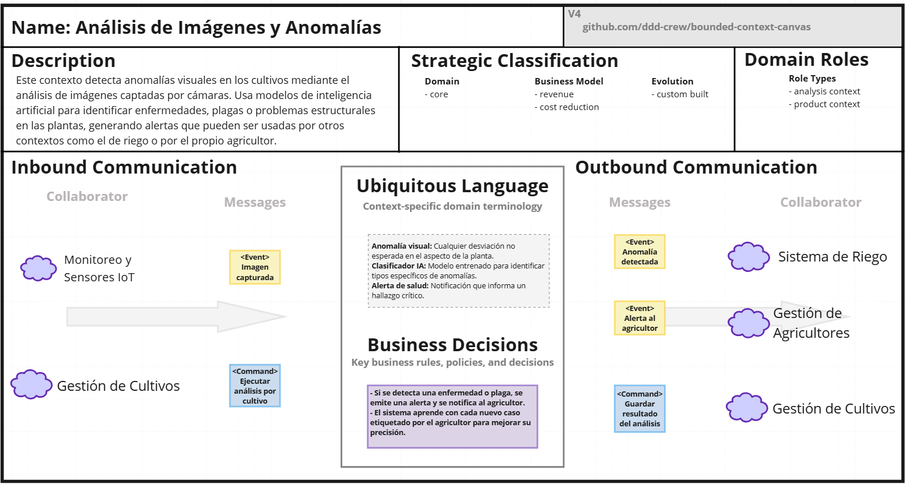
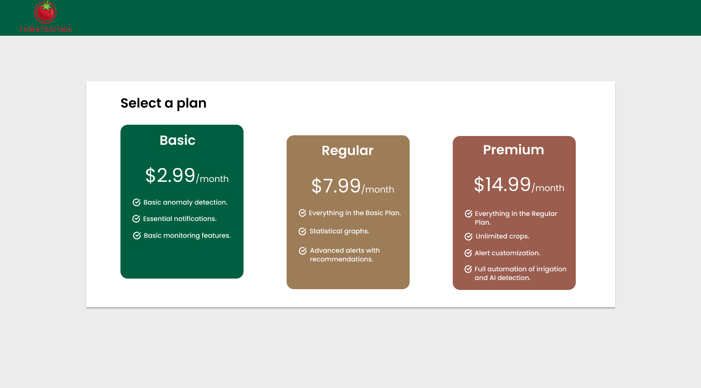
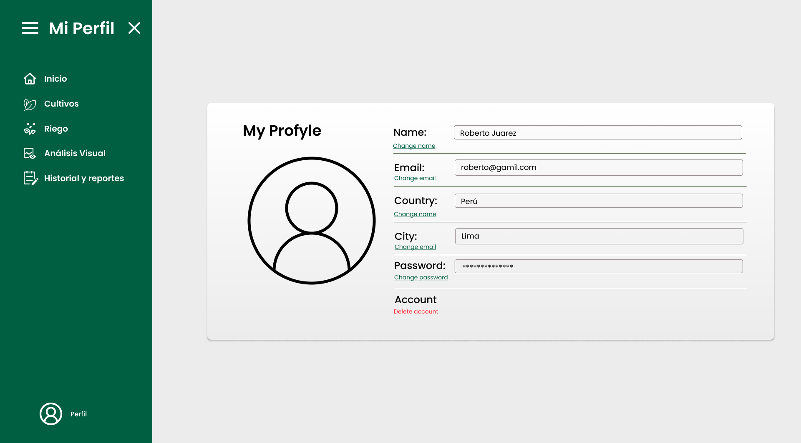
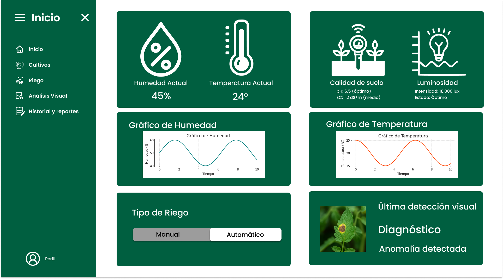
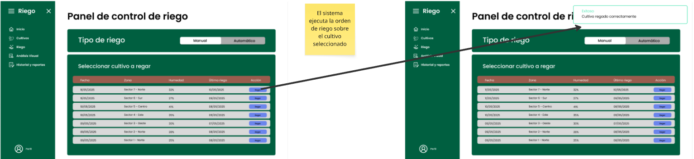

<h1 style="text-align: center;"> Informe del TF  </h1>
<h2 style="text-align: center;"> Universidad Peruana de Ciencias Aplicadas </h2>

<h4 style="text-align: center;"> Ingeniería de Software </h4>
<h4 style="text-align: center;"> Arquitecturas De Software Emergentes </h4>
<h4 style="text-align: center;"> Ciclo 2025-10 </h4>
<h4 style="text-align: center;"> Código del Curso: 1ASI0728 </h4>
<h4 style="text-align: center;"> NRC: 4265 </h4>
<h4 style="text-align: center;"> Docente: Rojas Malasquez,  Royer Edelwer  </h4>
<h4 style="text-align: center;"> Startup: AgroTech  </h4>
<h4 style="text-align: center;"> Producto:  TomateRitmo </h4>

## Team Members
|             Nombre              | Código de alumno |
|:-------------------------------:|:----------------:|
|    Guillen Luna, Paolo César     |    U202124343    |
|       Yauri Paucar, Elias        |    U202211817    |
| Cruz Palomino, Adriano Sebastian |    U202210697    |
| Rengifo Mirabal, Randy Becker    |    u20211d683    |

## Registro de versiones del informe
|   Fecha    | Versión |      Autor      |                                 Descripción de modificación                                 |
|:----------:|:-------:|:---------------:|:-------------------------------------------------------------------------------------------:|
| 06/04/2025 | 1.0     |  Guillen Paolo  | Creación del documento de trabajo en formato markdown junto al realizamiento de la carátula y capítulo 1 |
| 06/04/2025 | 1.1     | Yauri Paucar, Elias  | Registro de las entrevistas de cada segmento objetivo y análisis de entrevistas respectivos |
| 18/04/2025 | 1.2     | Rengifo Murabal, Randy Becker  | Mejoras relacionados a los escenarios as-is y to-be  |
| 22/04/2025 | 1.3     |  Guillen, Paolo; Adriano Cruz; Randy Rengifo; Yauri, Elias | Desarrollo conjunto del event storming así como desarrollo del capítulo cuatro desarrollando los diagramas C4 relacionado a nuestra solución TomateRitmo |
| 22/04/2025 | 1.4     |  | Desarrollo conjunto del event storming así como desarrollo del capítulo cuatro desarrollando los diagramas C4 relacionado a nuestra solución TomateRitmo |
| 22/04/2025 | 1.5     |   | Desarrollo conjunto del event storming así como desarrollo del capítulo cuatro desarrollando los diagramas C4 relacionado a nuestra solución TomateRitmo |
| 22/04/2025 | 1.6     |  r | Desarrollo conjunto del event storming así como desarrollo del capítulo cuatro desarrollando los diagramas C4 relacionado a nuestra solución TomateRitmo |
| 22/04/2025 | 1.7     |  | Desarrollo conjunto del event storming así como desarrollo del capítulo cuatro desarrollando los diagramas C4 relacionado a nuestra solución TomateRitmo |
| 22/04/2025 | 1.8     | | Desarrollo conjunto del event storming así como desarrollo del capítulo cuatro desarrollando los diagramas C4 relacionado a nuestra solución TomateRitmo |
| 22/04/2025 | 1.9     | | Desarrollo conjunto del event storming así como desarrollo del capítulo cuatro desarrollando los diagramas C4 relacionado a nuestra solución TomateRitmo |
| 22/04/2025 | 2.0     |   | Desarrollo conjunto del event storming así como desarrollo del capítulo cuatro desarrollando los diagramas C4 relacionado a nuestra solución TomateRitmo |


## Project Report Collaboration Insights

**TB1**


Insights proporcioonado por github en lo trabajado hasta la fecha del primer entregable

URL del repositorio del proyecto: [https://github.com/ArquiSoftwareEmergente-Grupo1]


## Contenido 
1. [**Capítulo I: Introducción.**](#1.) <br>
1.1. [***Startup Profile***](#1.1.) <br>
1.1.1. [Descripción del startup](#1.1.1.)<br>
1.1.2.[Perfiles de los integrantes del equipo](#1.1.2.)<br>
1.2. [***Solution Profile***](#1.2.)<br>
1.2.1. [Antecedentes y Problemática](#1.2.1.)<br>
1.2.2. [Lean UX Process](#1.2.2.)<br>
1.2.2.1. [Lean UX Problem Statements](#1.2.3.)<br>
1.2.2.2. [Lean UX Assumptions](#1.2.4.)<br>
1.2.2.3. [Lean UX Hypothesis Statements](#1.2.5.)<br>
1.2.2.4.  [Lean UX Canvas](#1.2.5.)<br>
1.3. [***Segmentos objetivo***](#1.2.6.)<br>
2. [**Capítulo II: Requirements Elicitation & Analysis**](#2.)<br>
2.1. [***Competidores***](#2.1.)<br>
2.1.1. [Análisis competitivo](#2.1.1.)<br>
2.1.2. [Estrategias y tácticas frente a competidores](#2.1.2.)<br>
2.2. [***Entrevistas***](#2.2.)<br>
2.2.1. [Diseño de entrevistas](#2.2.1.)<br>
2.2.2. [Registro de entrevistas](#2.2.2.)<br>
2.2.3. [Análisis de entrevistas](#2.2.3.)<br>
2.3. [***Needfinding***](#2.3.)<br>
2.3.1. [User Personas](#2.3.1.)<br>
2.3.2. [User Task Matrix](#2.3.2.)<br>
2.3.3. [User Journey Mapping](#2.3.3.)<br>
2.3.4. [Empathy Mapping](#2.3.4.)<br>
2.3.5. [As-is Scenario Mapping](#2.3.5.)<br>
2.4. [***Ubiquitous Language***](#2.4.)<br>
3. [**Capítulo III: Requirements Specification**](#3.)<br>
3.1. [***To-Be Scenario Mapping***](#3.1.)<br>
3.2. [***User Stories***](#3.2.)<br>
3.3. [***Impact Mapping***](#3.3.)<br>
3.4. [***Product Backlog***](#3.4.)<br>
4. [**Capítulo IV: Strategic-Level Software Design**](#4.)<br>
4.1. [***Strategic-Level Attribute-Driven Design***](#4.1.)<br>
4.1.1. [Design Purpose](#4.1.1.)<br>
4.1.2. [Attribute-Driven Design Inputs](#4.1.2.)<br>
4.1.2.1. [Primary Functionality (Primary User Stories)](#4.1.2.1.)<br>
4.1.2.2. [Quality attribute Scenarios](#4.1.2.2.)<br>
4.1.2.3. [Constraints](#4.1.2.3.)<br>
4.1.3. [Architectural Drivers Backlog](#4.1.3.)<br>
4.1.4. [Architectural Design Decisions](#4.1.4.)<br>
4.1.5. [Quality Attribute Scenario Refinements](#4.1.5.)<br>
4.2. [***Strategic-Level Domain-Driven Design***](#4.2.)<br>
4.2.1. [EventStorming](#4.2.1.)<br>
4.2.2. [Candidate Context Discovery](#4.2.2.)<br>
4.2.3. [Domain Message Flows Modeling](#4.2.3.)<br>
4.2.4. [Bounded Context Canvases](#4.2.4.)<br>
4.2.5. [Context Mapping](#4.2.5.)<br>
4.3. [***Software Architecture***](#4.3.)<br>
4.3.1. [Software Architecture System Landscape Diagram](#4.3.1.)<br>
4.3.2. [Software Architecture Context Level Diagrams](#4.3.2.)<br>
4.3.3. [Software Architecture Container Level Diagrams](#4.3.3.)<br>
4.3.4. [Software Architecture Deployment Diagrams](#4.3.4.)<br>
5. [**Capítulo V: Tactical-Level Software Design**](#5)<br>
5.1. [Bounded Context: Bounded Context Name 1](#5.1)<br>
5.1.1. [Domain Layer](#5.1.1)<br>
5.1.2. [Interface Layer](#5.1.2)<br>
5.1.3. [Application Layer](#5.1.3)<br>
5.1.4. [Infrastructure Layer](#5.1.4)<br>
5.1.6. [Bounded Context Software Architecture Component Level Diagrams](#5.1.6)<br>
5.1.7. [Bounded Context Software Architecture Code Level Diagrams](#5.1.7)<br>
5.1.7.1. [Bounded Context Domain Layer Class Diagrams](#5.1.7.1)<br>
5.1.7.2. [Bounded Context Database Design Diagram](#5.1.7.2)<br>
5.2. [Bounded Context: Bounded Context Name 2](#5.2)<br>
5.2.1. [Domain Layer](#5.2.1)<br>
5.2.2. [Interface Layer](#5.2.2)<br>
5.2.3. [Application Layer](#5.2.3)<br>
5.2.4. [Infrastructure Layer](#5.2.4)<br>
5.2.6. [Bounded Context Software Architecture Component Level Diagrams](#5.2.6)<br>
5.2.7. [Bounded Context Software Architecture Code Level Diagrams](#5.2.7)<br>
5.2.7.1. [Bounded Context Domain Layer Class Diagrams](#5.2.7.1)<br>
5.2.7.2. [Bounded Context Database Design Diagram](#5.2.7.2)<br>
5.3. [Bounded Context: Bounded Context Name 3](#5.3)<br>
5.3.1. [Domain Layer](#5.3.1)<br>
5.3.2. [Interface Layer](#5.3.2)<br>
5.3.3. [Application Layer](#5.3.3)<br>
5.3.4. [Infrastructure Layer](#5.3.4)<br>
5.3.6. [Bounded Context Software Architecture Component Level Diagrams](#5.3.6)<br>
5.3.7. [Bounded Context Software Architecture Code Level Diagrams](#5.3.7)<br>
5.3.7.1. [Bounded Context Domain Layer Class Diagrams](#5.3.7.1)<br>
5.3.7.2. [Bounded Context Database Design Diagram](#5.3.7.2)<br>
5.4. [Bounded Context: Bounded Context Name 4](#5.4)<br>
5.4.1. [Domain Layer](#5.4.1)<br>
5.4.2. [Interface Layer](#5.4.2)<br>
5.4.3. [Application Layer](#5.4.3)<br>
5.4.4. [Infrastructure Layer](#5.4.4)<br>
5.4.6. [Bounded Context Software Architecture Component Level Diagrams](#5.4.6)<br>
5.4.7. [Bounded Context Software Architecture Code Level Diagrams](#5.4.7)<br>
5.4.7.1. [Bounded Context Domain Layer Class Diagrams](#5.4.7.1)<br>
5.4.7.2. [Bounded Context Database Design Diagram](#5.4.7.2)<br>
5.5. [Bounded Context: Bounded Context Name 5](#5.5)<br>
5.5.1. [Domain Layer](#5.5.1)<br>
5.5.2. [Interface Layer](#5.5.2)<br>
5.5.3. [Application Layer](#5.5.3)<br>
5.5.4. [Infrastructure Layer](#5.5.4)<br>
5.5.6. [Bounded Context Software Architecture Component Level Diagrams](#5.5.6)<br>
5.5.7. [Bounded Context Software Architecture Code Level Diagrams](#5.5.7)<br>
5.5.7.1. [Bounded Context Domain Layer Class Diagrams](#5.5.7.1)<br>
5.5.7.2. [Bounded Context Database Design Diagram](#5.5.7.2)<br>
6. [**Capítulo VI: Solution UX Design**](#6.)<br>
6.1. [Style Guidelines](#6.1)<br>
6.1.1. [General Style Guidelines](#6.1.1)<br>
6.1.2. [Web, Mobile & Devices Style Guidelines](#6.1.2)<br>
6.2. [Information Architecture](#6.2)<br>
6.2.2. [Labeling Systems](#6.2.2)<br>
6.2.3. [Searching Systems](#6.2.3)<br>
6.2.4. [SEO Tags and Meta Tags](#6.2.4)<br>
6.2.5. [Navigation Systems](#6.2.5)<br>
6.3. [Landing Page UI Design](#6.3)<br>
6.3.1. [Landing Page Wireframe](#6.3.1)<br>
6.3.2. [Landing Page Mock-up](#6.3.2)<br>
6.4. [Applications UX/UI Design](#6.4)<br>
6.4.1. [Applications Wireframes](#6.4.1)<br>
6.4.2. [Applications Wireflow Diagrams](#6.4.2)<br>
6.4.3. [Applications Mock-ups](#6.4.3)<br>
6.4.4. [Applications User Flow Diagrams](#6.4.4)<br>
6.5. [Applications Prototyping](#6.5)<br>


7. [**Capítulo VII: Product Implementation, Validation & Deployment**](#7.)<br>
8. [**Conclusiones**](#8.)<br>
9. [**Bibliografía**](#9.)<br>
10. [**Anexos**](#10.)<br>


## Student Outcomes
El curso contribuye al cumplimiento del Student Outcome ABET:
ABET – EAC - Student Outcome 3

**Criterio:** Capacidad de comunicarse efectivamente con un rango de audiencias.
En el siguiente cuadro se describe las acciones realizadas y enunciados de
conclusiones por parte del grupo, que permiten sustentar el haber alcanzado el logro
del ABET – EAC - Student Outcome 3.


| Criterio específico | Acciones realizadas | Conclusiones |
|---------------------|---------------------|--------------|
| **Comunica oralmente sus ideas y/o resultados con objetividad a público de diferentes especialidades y niveles jerárquicos, en el marco del desarrollo de un proyecto en ingeniería.** | **Yauri Paucar, Elias**  <br> **TB1:**  <br> Durante el desarrollo del proyecto, se realizaron presentaciones orales donde se explicó de manera objetiva y clara la arquitectura del sistema diseñada. Se utilizaron diagramas como el *System Landscape Diagram*, *Context Level Diagram*, *Container Level Diagram* y *Deployment Diagram* para ilustrar la estructura y distribución del sistema. Estas exposiciones se adaptaron según el perfil de la audiencia, permitiendo que tanto integrantes del equipo técnico como público no especializado comprendieran los conceptos clave del sistema. Se emplearon recursos visuales y un lenguaje técnico accesible, lo que facilitó la comunicación transversal entre áreas del proyecto. <br> **TP1:**  <br> Durante las exposiciones orales correspondientes al Trabajo Parcial 1, presenté de forma clara y objetiva los resultados del diseño e implementación de los bounded contexts: Monitoreo y Sensores IoT y Sistema de Riego Inteligente. A través del uso de diagramas estructurales y funcionales, como el Bounded Context Diagram y Component Diagram, expliqué cómo cada uno de estos módulos se integra dentro de la solución general. Adapté el lenguaje técnico según el perfil de los interlocutores, facilitando así la comprensión tanto por parte de docentes como de compañeros con distintos niveles de especialización. Las presentaciones enfatizaron la lógica de diseño, los flujos de información y la interacción con otros contextos del sistema. <br> **Guillen Luna, Paolo César:** <br> **TB1:** Realizar entrevistas me ayudó a mejorar mi habla y tener una mejor comunicación esto con la finalidad de obtener los requisitios adecuados que podría necesitar nuestra solución <br>**Cruz Palomino, Adriano Sebastian:** <br> **TB1:** <br> Durante las sesiones de Event Storming, me encargué de la identificación y organización de los eventos de dominio relevantes para nuestro sistema. Utilicé ejemplos prácticos para facilitar la participación activa y asegurar que los conceptos más complejos fueran accesibles para todos. <br> **TP1:** <br> En esta etapa, me encargué de presentar los wireframes y mock-ups desarrollados al equipo, explicando las decisiones de diseño basadas en la experiencia de usuario y en los flujos funcionales definidos.  <br>**Rengifo Mirabal, Randy Becker:** <br> **TB1:** <br> Durante el desarrollo del proyecto, realicé entrevistas con usuarios para obtener los requisitos necesarios para nuestra aplicación. Estas entrevistas me permitieron mejorar mi capacidad de comunicación oral, adaptando el lenguaje y la forma de presentación de las preguntas según el perfil de cada entrevistado, asegurando así que la información recopilada fuera clara, precisa y útil para el desarrollo del sistema. <br> **TP1:** <br> Presenté el diseño del Bounded Context "Análisis de Imágenes y Anomalías" al equipo, utilizando diagramas de componentes para explicar claramente cómo funcionarían los módulos de IA y detección visual. Adapté mi lenguaje técnico según la audiencia, asegurando que tanto desarrolladores como stakeholders no técnicos comprendieran la propuesta arquitectónica y su valor para la solución final. | **TB1:** Durante esta primera etapa del proyecto, el equipo demostró una comunicación efectiva tanto oral como escrita, adaptándose a públicos con diferentes niveles de especialización. En las exposiciones orales, se emplearon recursos visuales claros y un lenguaje accesible, lo que facilitó la comprensión de conceptos técnicos complejos por parte de todos los involucrados. Asimismo, en la comunicación escrita, cada integrante contribuyó a la elaboración de documentos estructurados y precisos, asegurando que los entregables reflejen de manera objetiva y coherente el avance del proyecto. Esta experiencia fortaleció nuestras habilidades comunicativas en contextos reales de ingeniería, favoreciendo la colaboración multidisciplinaria y el entendimiento común en el equipo.|
| **Comunica en forma escrita ideas y/o resultados con objetividad a público de diferentes especialidades y niveles jerárquicos, en el marco del desarrollo de un proyecto en ingeniería.** | **Yauri Paucar,Elias**  <br> **TB1:**  <br><br> Como parte del desarrollo del proyecto, se elaboraron documentos técnicos que describen detalladamente los distintos niveles de la arquitectura de software, incluyendo el *System Landscape*, *Context Level*, *Container Level* y *Deployment Diagrams*. Cada uno de estos fue acompañado de descripciones claras, precisas y objetivas sobre los componentes, relaciones y funciones del sistema. La redacción fue adecuada para un público multidisciplinario, permitiendo que tanto profesionales técnicos como administrativos comprendieran el diseño y alcance de la solución propuesta. <br> **TP1:**  <br> En el informe entregado para el TP1, redacté las secciones correspondientes a los bounded contexts Monitoreo y Sensores IoT y Sistema de Riego Inteligente de forma objetiva y estructurada. Se describieron las responsabilidades, componentes clave, tecnologías utilizadas y relaciones con otros módulos del sistema. El contenido fue elaborado considerando que el lector podía tener distintos niveles de conocimiento técnico, por lo que se empleó un lenguaje claro, apoyado con diagramas y explicaciones concisas. Esto permitió transmitir con precisión el diseño e intención de cada bounded context dentro del proyecto de ingeniería desarrollado. <br> **Guillen Luna, Paolo César:** <br> **TB1:** Desarrollar esta entrega me ayudó a comunicarme de forma escrita en un entorno académico de mejor manera, puesto que juntar mis ideas en una solución tan extensa como esta y que se pueda comprender es esencial  **Cruz Palomino, Adriano Sebastian:** <br> **TB1:** <br> Como responsable del Event Storming, documenté de manera estructurada todos los eventos, comandos, agregados y actores identificados, elaborando descripciones claras y concisas que facilitaron la posterior construcción de los modelos de dominio.<br> **TP1:** <br>  Redacté la documentación correspondiente a los wireframes y mock-ups, detallando el objetivo de cada vista y su funcionalidad dentro del sistema. Me aseguré de que la información escrita fuese comprensible tanto para el equipo técnico como para personas que no dominan el tema <br>**Rengifo Mirabal,Randy Becker :** <br> **TB1:** <br> Como parte de las actividades realizadas, documenté de forma estructurada los resultados de las entrevistas aplicadas a los usuarios, elaborando reportes claros, organizados y accesibles para todo el equipo de trabajo. Esto permitió contar con una base de requisitos bien definida y correctamente registrada, facilitando su análisis e integración en las fases posteriores del proyecto. <br> **TP1:** <br> Documenté la arquitectura del Bounded Context "Análisis de Imágenes y Anomalías" con diagramas claros y descripciones concisas de cada componente. Elaboré explicaciones accesibles sobre el funcionamiento del sistema de IA para detección de anomalías en hojas, estructurando la información para que fuera comprensible tanto para el equipo técnico como para los demás miembros del proyecto. |**TB1:** A nivel de grupo, todos comunicaron de forma escrita de forma excelente por el hecho de juntar los capítulos realizados para transmitir lo que es en sí nuestra aplicación.  |

<div id='1.'><h2>Capítulo I: Introducción</h2></div>
<div id='1.1.'><h3> 1.1 Startup Profile</h3></div>
En esta sección se presenta la descripción del startup y los perfiles de los miembros del equipo.


<div id='1.1.1.'><h4> 1.1.1. Descripción del startup</h4></div> 

Nuestra startup, **AgroTech**, nace con el propósito de transformar la agricultura tradicional mediante el uso de tecnologías emergentes como la visión artificial, el Internet de las Cosas (IoT) y la inteligencia artificial. Nos enfocamos inicialmente en el cultivo de **tomates**, combinando sensores inteligentes con una plataforma web/web para monitorear, analizar y automatizar procesos clave del cultivo.
A diferencia de otros sistemas agrícolas que requieren intervención constante del usuario, TomateRitmo busca ofrecer una experiencia completamente automatizada: desde la detección de anomalías en las **hojas** (como plagas o enfermedades) hasta el riego automático en respuesta a niveles críticos de sequedad. Esto permite a los agricultores, tanto principiantes como profesionales, optimizar sus recursos, reducir pérdidas y aumentar la productividad sin descuidar la salud del cultivo.

Nuestro enfoque es práctico, accesible y centrado en el usuario. Creemos que la tecnología aplicada al campo no solo debe ser eficiente, sino también intuitiva, inclusiva y adaptable a distintos niveles de conocimiento técnico.

**Misión:** Desarrollar soluciones inteligentes que automaticen el monitoreo y cuidado de cultivos mediante tecnologías como visión artificial, IoT e inteligencia artificial, facilitando así una agricultura más eficiente, sostenible y accesible para todos.


**Visión:** Agrotech aspira a convertirse en un referente en agricultura automatizada, reconocido por mejorar la calidad de vida del agricultor mediante tecnología de vanguardia, y por su compromiso con una producción agrícola más precisa, sostenible y conectada.


**Logo de la startup**


**Logo del producto**


<div id='1.1.2.'><h4> 1.1.2. Perfiles de los integrantes del equipo</h4></div>

|                                                                                                                                                                                                          Descripción de los perfiles de los integrantes del equipo                                                                                                                                                                                                           |                                                              Foto del integrante                                                              |
|:----------------------------------------------------------------------------------------------------------------------------------------------------------------------------------------------------------------------------------------------------------------------------------------------------------------------------------------------------------------------------------------------------------------------------------------------------------------------------:|:---------------------------------------------------------------------------------------------------------------------------------------------:|
| Mi nombre es **Paolo César Guillen Luna**, estudiante de la carrera de Ingeniería de Software, en la UPC y fanático de los videojuegos. Me considero alguien creativo y con determinación en alcanzar sus metas, dentro del campo del desarrollo de software, me gustaría especializarme en lo que es el testing de este, razón por la cual aparte de seguir la malla curricular de mi carrera también ando aprendiendo herramientas diversas como Playwright, Cypress, etc. |      |
| Mi nombre es **Elias Yauri**, soy una persona muy participativa cuando se trata en el tema laboral y en el trabajo en equipo, siempre trato de que haya una comunicación constante con todos los miembros del grupo para que de esta forma podamos tener toda una buena afinidad como grupo y que el trabajo se realice de manera exitosa.  |  |
| Mi nombre es **Adriano Sebastian Cruz Palomino**, tengo 20 años, soy alumno de Ingeniería de Software en la UPC, actualmente estoy cursando el 7mo ciclo. Soy una persona curiosa, responsable, y comprometida con mis estudios, siempre busco aprender más y mejorar mis habilidades. ||
| Mi nombre es Randy Becker Rengifo Mirabal, tengo 21 años y soy estudiante de la carrera de Ingeniería de Software en la Universidad Peruana de Ciencias Aplicadas (UPC), actualmente cursando el octavo ciclo. Me considero una persona proactiva, responsable y comprometida con mis deberes. Siempre busco nuevas oportunidades para aprender, crecer profesionalmente y fortalecer mis habilidades tanto técnicas como personales. Tengo gran interés por la tecnología, el desarrollo de software y la innovación. Me adapto con facilidad a distintos entornos de trabajo, disfruto trabajar en equipo y estoy enfocado en encontrar soluciones eficientes a los problemas que se presentan. Además, me apasiona estar en constante aprendizaje, ya sea a través de proyectos académicos, personales o colaborativos.||


<div id='1.2.'><h3> 1.2. Solution Profile</h3></div>
<div id='1.2.1.'><h4> 1.2.1. Antecedentes y Problemática</h4></div>


##### What (Qué)
###### ¿Cuál es el problema?
En América Latina, los pequeños y medianos agricultores enfrentan importantes desafíos en el manejo de sus cultivos, principalmente por la falta de acceso a tecnologías automatizadas, monitoreo en tiempo real y datos confiables para la toma de decisiones. Esto genera pérdidas considerables por factores como sequía, enfermedades, plagas o decisiones inadecuadas de riego y fertilización.

Según la FAO (2020), las pérdidas poscosecha pueden alcanzar hasta 30% en hortalizas como el tomate, y gran parte de estas se deben a problemas prevenibles con tecnología. Además, el Banco Mundial (2019) señala que el nivel de digitalización agrícola en la región es muy bajo, especialmente en explotaciones de menos de 5 hectáreas.

##### When (Cuando)
###### ¿Cuándo sucede el problema?
El problema ocurre a lo largo de todo el ciclo del cultivo, pero se vuelve crítico en etapas sensibles como floración y maduración, donde el manejo incorrecto del agua o la falta de detección temprana de plagas puede reducir drásticamente el rendimiento.

Según el IICA (2022), el 80% de los agricultores en zonas rurales no cuenta con herramientas para el monitoreo continuo, lo que agrava el problema durante los momentos de ausencia física o cuando no se tiene tiempo para revisar manualmente cada planta.

##### Where (Dónde)
###### ¿A dónde se dirige?
La solución está pensada para agricultores de pequeña escala, especialmente aquellos que cultivan tomates en regiones con acceso limitado a asesoramiento técnico. También es útil en zonas periurbanas o rurales donde la conexión a internet y electricidad es intermitente, pero se puede trabajar con módulos offline/semiconectados.


###### ¿Dónde surge el problema?
El problema se origina directamente en los campos de cultivo, donde el monitoreo tradicional depende de la experiencia del agricultor. En estos entornos, los sensores y la inteligencia artificial aún no son comunes, pese a su potencial para mejorar los rendimientos (FAO, 2020).


##### Who (Quién)
###### ¿Quiénes están involucrados? ¿Quién lo utilizará?
Los beneficiarios directos son agricultores que cultivan tomate (y potencialmente otros cultivos), que buscan mejorar su productividad mediante herramientas accesibles y automatizadas. También pueden involucrarse cooperativas agrícolas, gobiernos locales y ONGs interesadas en impulsar la agricultura inteligente.

Según la CEPAL (2021), el 60% de los alimentos en América Latina provienen de la agricultura familiar, pero estos productores tienen bajo acceso a tecnologías que optimicen su labor diaria.

##### Why (Por qué)
###### ¿Cuál es la causa del problema?
La causa raíz es la baja adopción de tecnologías agrícolas inteligentes debido a barreras económicas, educativas y de infraestructura. Aunque existen soluciones comerciales, muchas son costosas, complejas o requieren conocimientos técnicos avanzados.

El IICA (2022) advierte que si no se logra una transformación digital efectiva del agro, la región enfrentará serios problemas de productividad, seguridad alimentaria y sostenibilidad.

#### 2H
##### How (Cómo)
###### ¿Cómo se utilizará el producto?
El agricultor podrá interactuar con TomateRitmo a través de una app web/web que muestra datos en tiempo real sobre humedad del suelo, temperatura ambiental, y estado visual de las hojas mediante visión artificial. Si el sistema detecta sequedad o anomalías (como manchas, mordidas o amarillamiento), se activará el riego automático o se enviará una alerta.


##### How much (Cuánto)
###### ¿Cuál es la magnitud del problema?
* 30% de pérdida promedio en cultivos de hortalizas (FAO, 2020)
* Más del 70% de los agricultores en América Latina no usa herramientas digitales (Banco Mundial, 2019)
* El 80% del agua de riego se desperdicia por falta de control preciso (IICA, 2022)

Si TomateRitmo logra implementarse en solo el 20% de pequeños productores de tomate, podría generar un aumento de productividad de hasta un 25% y reducir en más del 40% el uso ineficiente de agua, contribuyendo también a la sostenibilidad ambiental.


<div id='1.2.2.'><h4> 1.2.2. Lean UX Process</h4></div>
<div id='1.2.2.1.'><h5> 1.2.2.1. Lean UX Problem Statements</h5></div>

##### **Problem Statement:** 
Nuestra aplicación "TomateRitmo",desarrollada por nuestra startup, "AgroTech" , surge como una solución innovadora para pequeños y medianos agricultores que desean automatizar y optimizar el cuidado de sus cultivos sin necesidad de conocimientos técnicos avanzados. En esta primera etapa, el enfoque está en el cultivo de tomates, con el objetivo de automatizar tareas clave como el riego y la detección de anomalías (hojas secas, mordidas, marchitas o infestadas) a través de sensores IoT e inteligencia artificial.

Actualmente, muchos agricultores enfrentan dificultades para monitorear el estado de sus cultivos de forma continua, lo que puede derivar en pérdidas por plagas, enfermedades o estrés hídrico. Además, la falta de recursos y tiempo limita la posibilidad de actuar a tiempo. Si bien existen herramientas para monitoreo, muchas son costosas, difíciles de configurar o no permiten una automatización efectiva.

Entonces, el reto es: ¿Cómo podemos brindar una solución automatizada, precisa y accesible para el monitoreo y cuidado de cultivos, que permita al agricultor intervenir solo cuando sea estrictamente necesario?

Para ello, nos enfocamos en:

* Enfoque centrado en el agricultor: la solución debe ser intuitiva y accesible desde una computadora.
* Alcance claro: Nos centramos en el monitoreo y automatización de riego, detección de anomalías visuales mediante IA, y alertas preventivas.
* Medidas de éxito: Reducción de pérdidas por estrés hídrico o plagas, incremento en el rendimiento del cultivo, y adopción sostenida del sistema.

##### **User Assumptions:**
###### **¿Quién es el usuario?**
El usuario es un agricultor principiante o profesional que cultiva tomate y busca mejorar la eficiencia y salud de sus cultivos a través de tecnología. También pueden ser estudiantes de agronomía, técnicos agrícolas, o cooperativas interesadas en la transformación digital del campo.

###### **¿Qué problemas tiene nuestro producto? ¿Qué resuelve?**
TomateRitmo resuelve la falta de monitoreo constante de variables críticas (temperatura, humedad del suelo, apariencia del cultivo), ofreciendo una solución integral que permite actuar a tiempo mediante alertas o incluso ejecutar acciones automáticas como el riego.

###### **¿Qué características son importantes?**

Entre las características que consideramos relevantes están: 
* Monitoreo en tiempo real de humedad y temperatura mediante sensores IoT.
* Visión artificial para detección de anomalías en hojas de tomate.
* Activación automática de riego si el sistema detecta sequedad.
* Notificaciones inteligentes al agricultor vía app web/web.
* Historial visual y ambiental del cultivo.
* Control manual o automático del sistema.

###### **¿Dónde encaja nuestro producto en su trabajo o vida?**
TomateRitmo se integra en la rutina diaria del agricultor, facilitando el seguimiento sin necesidad de presencia constante en el campo. Permite gestionar el cultivo desde casa o mientras realiza otras actividades, generando eficiencia y tranquilidad.

###### **¿Cuándo y cómo es nuestro producto usado?**
El sistema se usa durante todo el ciclo de vida del cultivo, especialmente en etapas críticas como floración o fructificación. Puede usarse de manera autónoma o manual, siendo clave en momentos de clima extremo o cuando el agricultor está ausente.

###### **¿Cómo debe verse nuestro producto y cómo debe comportarse?**
La interfaz debe ser simple, clara y funcional, con íconos visuales e instrucciones breves. El comportamiento del sistema debe ser confiable, proactivo (actuar antes de que haya un daño grave), y generar reportes entendibles para cualquier nivel de conocimiento.


<div id='1.2.2.2.'><h5> 1.2.2.2. Lean UX Assumptions.</h5></div>


##### **Feature Assumptions:**

**Creemos que** al integrar sensores de humedad y temperatura en el terreno, los agricultores podrán evitar el estrés hídrico y proteger sus cultivos de condiciones ambientales adversas.

**Creemos que** al permitir el encendido automático del sistema de riego, se optimizará el uso del agua y se reducirá el esfuerzo manual requerido por parte del agricultor.

**Creemos que** al usar visión artificial para detectar enfermedades, hojas mordidas o signos de sequía en los tomates, los agricultores podrán intervenir rápidamente y prevenir pérdidas mayores.

**Creemos que** una sección educativa dentro de la app, con buenas prácticas agrícolas y consejos de manejo del cultivo de tomate, fomentará una comunidad más preparada y comprometida con la agricultura sostenible.

**Creemos que** implementar un sistema de alertas inteligentes en tiempo real permitirá respuestas inmediatas frente a amenazas como sequía, enfermedades o anomalías visuales, ayudando a preservar la salud del cultivo.


<div id='1.2.2.3.'><h5> 1.2.2.3. Lean UX Hypothesis Statements.</h5></div>

Hipótesis 1: Sensores para evitar estrés hídrico

**Creemos que** al integrar sensores de humedad y temperatura en el terreno, los agricultores podrán evitar el estrés hídrico y proteger sus cultivos de condiciones ambientales adversas.
**Sabremos que** hemos tenido éxito cuando los usuarios reporten una disminución en la pérdida de plantas por sequía y manifiesten mayor control sobre el estado del cultivo.

Hipótesis 2: Riego automático optimizado

**Creemos que** al permitir el encendido automático del sistema de riego, se optimizará el uso del agua y se reducirá el esfuerzo manual requerido por parte del agricultor.
**Sabremos que** hemos tenido éxito cuando se reduzca el consumo innecesario de agua y los usuarios expresen satisfacción con la automatización del riego.

Hipótesis 3: Visión artificial para detección temprana de anomalías

**Creemos que** al usar visión artificial para detectar enfermedades, hojas mordidas o signos de sequía en los tomates, los agricultores podrán intervenir rápidamente y prevenir pérdidas mayores.
**Sabremos que** hemos tenido éxito cuando los usuarios logren tomar decisiones correctivas a tiempo y se observe una disminución en la cantidad de cultivos afectados.

Hipótesis 4: Contenido educativo agrícola

**Creemos que** una sección educativa dentro de la app, con buenas prácticas agrícolas y consejos de manejo del cultivo de tomate, fomentará una comunidad más preparada y comprometida con la agricultura sostenible.
**Sabremos que** hemos tenido éxito cuando los usuarios accedan frecuentemente a esta sección y apliquen los conocimientos en sus prácticas agrícolas, reflejando mejoras en el cultivo.

Hipótesis 5: Alertas inteligentes en tiempo real

**Creemos que** implementar un sistema de alertas inteligentes en tiempo real permitirá respuestas inmediatas frente a amenazas como sequía, enfermedades o anomalías visuales, ayudando a preservar la salud del cultivo.
**Sabremos que** hemos tenido éxito cuando los usuarios reaccionen a las alertas y se reduzcan los daños reportados en el cultivo por falta de acción oportuna.


<div id='1.2.2.4.'><h5> 1.2.2.4. Lean UX Canvas.</h5></div>

El Lean UX Canvas es una herramienta que se utiliza en el campo del diseño centrado en el usuario (UX) y la metodología Lean para optimizar la creación y el desarrollo de productos. Su objetivo principal es proporcionar un marco estructurado para la colaboración entre equipos multidisciplinarios. A través de esta herramienta, los equipos pueden visualizar y analizar aspectos clave del diseño y la experiencia del usuario, lo que facilita la toma de decisiones informadas durante el proceso de desarrollo.

## ***Lean UX Canvas realizado en la aplicación web "Figma":*** 


<div id='1.3.'><h3> 1.3. Segmento Objetivo</h3></div>

1. Pequeños agricultores que cultivan tomate para autoconsumo o venta local, y que buscan mejorar su rendimiento productivo sin depender de conocimientos técnicos avanzados. Este segmento se beneficiará directamente del monitoreo automatizado y la asistencia inteligente para tomar decisiones más acertadas.
2. Productores con experiencia agrícola basada en prácticas empíricas que están abiertos a adoptar herramientas tecnológicas para facilitar sus labores, optimizar recursos como el agua y evitar pérdidas por enfermedades o condiciones climáticas adversas.


[//]: #CAPITULO2
<div id='2.'><h2> Capítulo II: Requirements Elicitation & Analysis</h2>
<div id='2.1.'><h3> 2.1. Competidores</h3></div>
<div id='2.1.1.'><h4> 2.1.Análisis Competitivo</h4></div>

||TomateRitmo  | | | | |
|:-:|:-:|:-:|:-:|:-:|:-:|
|**Overview**|Plataforma especializada en el cultivo de tomate, integrando sensores IoT y visión artificial para detección de anomalías a lo largo del cultivo|Solución agrícola que ofrece monitoreo en tiempo real y análisis de datos para mejorar la eficiencia en cultivos diversos.|Sistema de gestión agronómica que utiliza sensores de suelo para proporcionar recomendaciones de riego y fertilización.	|Herramienta de gestión agrícola que digitaliza operaciones y registros para mejorar la toma de decisiones.	|Plataforma que proporciona análisis de datos y predicciones para optimizar la producción y rentabilidad agrícola.|
|**Ventajas Competitivas**|Enfoque exclusivo en tomate, integración de visión artificial para detección de enfermedades y automatización del cultivo bajo paramétros|Interfaz intuitiva y fácil de usar, adecuada para agricultores con diferentes niveles de experiencia tecnológica.	|Tecnología avanzada de sensores de suelo que proporciona datos precisos para decisiones agronómicas.	|Amplia gama de funciones para la gestión operativa de la finca, incluyendo planificación y seguimiento de tareas.	|Análisis predictivo y seguimiento financiero que ayuda a maximizar la rentabilidad de las explotaciones.|
|**Mercado Objetivo**|Agricultores especializados en tomate, tanto profesionales como pequeños productores.	|Agricultores de diversos cultivos que buscan mejorar la eficiencia mediante tecnología accesible.	|Productores agrícolas que requieren datos precisos del suelo para optimizar riego y fertilización.	|Grandes explotaciones agrícolas que necesitan digitalizar y gestionar múltiples aspectos operativos.	|Agricultores interesados en utilizar análisis de datos para mejorar la producción y la rentabilidad.|
|**Estrategias de Marketing**|Alianzas con cooperativas de tomate y demostraciones en campo	|Promoción a través de ferias agrícolas y asociaciones locales.	|Colaboraciones con distribuidores de equipos agrícolas y presencia en eventos del sector.	|Marketing dirigido a grandes explotaciones y asociaciones agrícolas.	|Campañas digitales enfocadas en la rentabilidad y eficiencia operativa.|
|**Productos & Servicios**|Sensores de humedad y temperatura, visión artificial para detección de enfermedade y sistema de riego automatizado	|Sensores ambientales, plataforma de análisis de datos y soporte técnico.	|Sensores de suelo, plataforma de análisis agronómico y recomendaciones personalizadas.	|Software de gestión agrícola, aplicaciones webes y soporte técnico.	|Plataforma de análisis de datos, predicciones de rendimiento y seguimiento financiero.|
|**Precios & Costos**|Modelo de suscripción mensual con opciones según el tamaño de la explotación.	|Tarifas escalables según el número de sensores y servicios contratados.	|Precios basados en el número de sensores y el tamaño de la explotación.	|Suscripción anual con diferentes niveles de servicio.	|Modelo freemium con opciones de pago para funciones avanzadas.|
|**Canales de distribución (WEB y/o web)**|Aplicación web |Aplicación web y móvil para Android e iOS.	|Aplicación web y móvil para Android e iOS.	|Aplicación web y móvil para Android e iOS.	|Aplicación web y móvil para Android e iOS.	|
|**Fortalezas**|Especialización en tomate con integración de tecnologías avanzadas como visión artifical	|Facilidad de uso y soporte técnico accesible.	|Datos precisos del suelo y recomendaciones agronómicas personalizadas.	|Gestión integral de operaciones agrícolas.	|Análisis predictivo y enfoque en la rentabilidad.|
|**Debilidades**|Enfoque limitado al cultivo de tomate, lo que puede restringir su mercado.	|Menor especialización en cultivos específicos.	|Requiere inversión en sensores y tecnología.	|Puede ser complejo para pequeñas explotaciones.	|Dependencia de la calidad de los datos ingresados por el usuario.|
|**Oportunidades**|Expansión a otros cultivos, integración con sistemas de mercado y exportación.	|Ampliación de servicios y soporte en más regiones.	|Desarrollo de nuevas funciones basadas en inteligencia artificial.	|Integración con maquinaria agrícola y automatización.	|Alianzas con instituciones financieras para ofrecer servicios adicionales.|
|**Amenazas**|Competencia de soluciones más generalistas y cambios en las regulaciones agrícolas.	|Entrada de nuevos competidores con tecnologías más avanzadas.	|Cambios en las condiciones climáticas que afecten la demanda de sus servicios.	|Resistencia al cambio por parte de agricultores tradicionales.	|Fluctuaciones en los precios de los productos agrícolas que afecten la inversión en tecnología.|

<div id='2.1.2.'><h4> 2.1.2. Estrategias y tácticas frente a competidores</h4></div></div>
  
A partir del análisis competitivo realizado se logró identificar las fortalezas, debilidades, oportunidades y amenazas destacadas en los competidores. Esta información adquirida es esencial para trazar estrategias y tácticas para diferenciarnos de nuestros competidore. A continuación se brindará tanto estrategias como tácticas para alcanzar esta meta:

**Fortalezas de nuestros competidores:**

- Ofrecen soluciones para múltiples cultivos, lo que les permite abarcar un mercado más amplio.
- Cuentan con contenido educativo y asesoría agrícola para principiantes.
- Tienen presencia establecida en el mercado con varios años de experiencia y una base sólida de usuarios.

**Estrategias y tácticas para nuestras fortalezas:**

**Estrategias:**
- Posicionar a TomateRitmo como la solución más precisa y avanzada del mercado para el cultivo de tomate.
- Comunicar los beneficios específicos y tangibles que nuestra tecnología aporta frente a enfoques generalistas.
- Enfocar los esfuerzos en nichos especializados con mayor demanda de precisión y rendimiento.

**Tácticas:**
- Mostrar casos reales de éxito y mejoras en rendimiento del cultivo de tomate usando TomateRitmo.
- Participar en ferias agrícolas especializadas y eventos de tecnología agropecuaria.
- Utilizar marketing comparativo que demuestre la efectividad de nuestro enfoque centrado en datos e IA.


**Debilidades de nuestros competidores:**
- No ofrecen una personalización profunda para un cultivo específico.
- La detección de anomalías suele ser manual o limitada a sensores básicos.
- Interfaces de usuario complejas o poco intuitivas.
- En algunos casos, falta de integración con sistemas IoT o automatización limitada.

**Estrategias y tácticas para nuestras debilidades:**

**Estrategias:**
- Aprovechar la especialización en tomate como una ventaja para ofrecer una solución más eficaz y adaptada.
- Enfocarnos en una interfaz sencilla y basada en flujos intuitivos para cualquier usuario.
- Desarrollar tecnología propietaria con visión artificial que supere la capacidad de inspección manual.

**Tácticas:**
- Lanzar versiones beta con usuarios reales que validen la facilidad de uso y efectividad.
- Mostrar ejemplos en tiempo real de cómo se detectan enfermedades con nuestra IA.
- Capacitar a distribuidores o partners locales para mejorar la adopción de la tecnología.


**Oportunidades de nuestros competidores:**
- Pueden expandirse rápidamente a nuevos mercados emergentes gracias a su infraestructura existente.
- Pueden integrar nuevas tecnologías como IA o visión artificial para actualizar sus sistemas.
- Pueden asociarse con instituciones agrícolas o gubernamentales para mejorar su alcance.


**Estrategias y tácticas para nuestras oportunidades:**

**Estrategias:**
- Acelerar la innovación tecnológica en detección y automatización para mantener la delantera.
- Expandirse con versiones localizadas en países con alta producción de tomate.
- Posicionar la solución como un aliado para políticas de agricultura sostenible y modernización.

**Tácticas:**
- Desarrollar alianzas estratégicas con distribuidores agrícolas locales en países clave.
- Identificar oportunidades de subvención o apoyo institucional para tecnología agrícola.
- Incorporar funcionalidades que respondan rápidamente a tendencias del mercado (como ahorro de agua).


**Amenazas de nuestros competidores:**
- La aparición de soluciones más completas que abarquen todo el ciclo agrícola.
- La evolución tecnológica rápida podría hacer obsoletos ciertos enfoques.
- Cambios regulatorios que puedan limitar el uso de tecnologías IoT o drones.


**Estrategias y tácticas para nuestras amenazas:**

**Estrategias:**
- Adoptar una filosofía de innovación constante para evitar ser superados tecnológicamente.
- Anticiparse a los cambios regulatorios con un equipo atento a la normativa agrícola e IoT.
- Diseñar una arquitectura flexible que permita escalar e integrar nuevos módulos sin rediseñar todo.

**Tácticas:**
- Participar en comités, ferias y foros agrícolas donde se anticipen cambios legales o tecnológicos.
- Mantener versiones de TomateRitmo actualizadas regularmente con mejoras incrementales.
- Preparar protocolos de contingencia y adaptación para diversas normativas regionales.


<div id='2.2.'><h3> 2.2. Entrevistas</h3></div>
<div id='2.2.1.'><h4> 2.2.1. Diseño de entrevistas</h4></div>

<p>En esta sección se procederá a detallar las preguntas para el método de recoleccion de
  requisitos que son las entrevistas. Para la formulación se siguieron buenas prácicas tales como 
  formulación de preguntas abiertas, así mismo obtenemos características demográficas con las entrevistas</p>  

  <h4>PREGUNTAS GENERALES</h4>
  <p>Bienvenido gracias por brindarnos esta entrevista (empieza con las preguntas generales) </p>
  
  * Nos gustaría saber su nombre, edad y ocupación
  * ¿Qué tan acostumbrado está con el uso de tecnología en su vida diaria?
  * Dentro de su vida diaria, ¿tiene incovenientes utilizando dichas herramientas digitales?
  * Alguna vez tuvo que enfrentarse con una situación donde usted no entendía para nada como servía una aplicación, de ser así, ¿cómo sobrellevo ese problema?

  <h4>SECTOR AGRICULTORES EXPERIMENTADOS: </h4>
  
1. ¿Cuál es el proceso actual que sigue para monitorear el estado de sus cultivos de tomate?
2. ¿Utiliza alguna tecnología o herramienta digital actualmente? ¿Cuál?
3. ¿Qué información considera más valiosa para optimizar el cuidado de sus cultivos?
4. ¿Ha enfrentado pérdidas por enfermedades, sequía u otros factores ambientales? ¿Qué las causó?
5. ¿Qué tan útil le resultaría recibir alertas en tiempo real sobre amenazas para sus cultivos?
6. ¿Qué opinión le merece una herramienta que detecte automáticamente anomalías en las hojas o el riego?
7. ¿Qué funcionalidades considera indispensables en una app de monitoreo para cultivos de tomate?
8. ¿Qué tan abierto estaría a usar sensores IoT en su terreno? ¿Y visión artificial?
9. ¿Estaría dispuesto a invertir en una herramienta tecnológica que le ayude a prevenir pérdidas?
10. ¿Cuánto estaría dispuesto a pagar por una solución tecnológica que automatice el monitoreo?
11. ¿Qué tanto valoraría una plataforma fácil de usar que cuente con funciones avanzadas para mejorar la productividad agrícola?

  <h4>SECTOR AUTOCULTIVADORES: </h4>

1. ¿Cuál es su motivación principal para cultivar tomates en casa?
2. ¿Cómo hace actualmente el seguimiento del estado de sus plantas?
3. ¿Ha utilizado alguna app o herramienta digital para ayudarle con sus cultivos?
4. ¿Qué información le gustaría recibir para cuidar mejor sus tomates?
5. ¿Qué dificultades ha tenido al momento de mantener sus plantas saludables?
6. ¿Le parecería útil una app que le avise cuando sus tomates presenten señales de enfermedad o sequía?
7. ¿Qué tan dispuesto estaría a probar una app que automatice el riego y detecte problemas visuales?
8. ¿Cuánto estaría dispuesto a invertir en una herramienta que facilite su cultivo en casa?
9. ¿Qué tanto le interesa la trazabilidad o el historial visual del desarrollo de sus tomates?
10. ¿Qué tan importante le parece usar tecnología para obtener mejores resultados en su cultivo personal?

<div id='2.2.2.'><h4> 2.2.2. Registro de entrevistas</h4></div>

***SECTOR AGRICULTORES EXPERIMENTADOS***

|Nombre entrevistado| Sebastian Nicolas Cachis Gonzales |
|-|-|
|Edad|25 años|
|Departamento|Lima, Lima|
|| Sebastián, agricultor de 25 años, monitorea sus cultivos de tomate con observación directa y sensores básicos. Usa apps de clima, pero cree que falta tecnología más precisa. Le interesa recibir alertas sobre plagas, humedad y clima, y valora herramientas que detecten anomalías visuales. Está abierto al uso de sensores IoT y visión artificial. Considera indispensable una app con análisis visual, alertas y recomendaciones. Estaría dispuesto a invertir entre S/ 100 y S/ 300 mensuales si la solución es efectiva, fácil de usar y mejora su productividad.|
|Duración entrevista: 00:00-05:39 |[Link de la Entrevista](https://upcedupe-my.sharepoint.com/:v:/g/personal/u202124343_upc_edu_pe/EYPjbNNRuMNFs-dqTHhm5y0BMp404wumEnN_7yEiyG89dA?nav=eyJyZWZlcnJhbEluZm8iOnsicmVmZXJyYWxBcHAiOiJPbmVEcml2ZUZvckJ1c2luZXNzIiwicmVmZXJyYWxBcHBQbGF0Zm9ybSI6IldlYiIsInJlZmVycmFsTW9kZSI6InZpZXciLCJyZWZlcnJhbFZpZXciOiJNeUZpbGVzTGlua0NvcHkifX0&e=w6xoPz)
|

|Nombre entrevistado| Karen Mora |
|-|-|
|Edad|30 años|
|Departamento|Ecatepec, México|
|[](https://postimg.cc/H8TZ5d6t)| Karen Mora Balderas, de 30 años, quien trabaja apoyando a sus padres en la agricultura, específicamente en el cultivo de tomates y otras verduras. Karen mencionó que su relación con la tecnología es limitada, ya que entiende algunas funciones básicas, pero todavía se le complica manejar herramientas digitales más avanzadas. Cuando enfrenta dificultades, suele pedir ayuda a familiares o consultar tutoriales en YouTube. Respecto al trabajo en el campo, Karen explicó que el monitoreo de los cultivos se realiza de forma manual: revisan planta por planta para detectar plagas, enfermedades o problemas de riego. Aunque cuentan con un termómetro sencillo en el invernadero, no utilizan herramientas digitales más allá de eso. Karen considera que sería valioso contar con información en tiempo real sobre el estado de sus cultivos, especialmente para prevenir daños por plagas, sequías o enfermedades. Ha sufrido pérdidas principalmente por sequías y algunas plagas, y le gustaría recibir alertas oportunas que le permitan actuar rápidamente y reducir pérdidas. Al preguntarle sobre qué funcionalidades valoraría en una aplicación para monitoreo agrícola, mencionó que le gustaría recibir alertas en tiempo real, conocer el estado de la tierra, y, si fuera posible, contar con visión artificial o sensores, siempre que sean accesibles económicamente y fáciles de usar. Aclaró que estaría dispuesta a invertir en este tipo de soluciones si tienen garantía de funcionamiento y si los costos son razonables, ya que ayudarían a minimizar pérdidas y optimizar el trabajo. Finalmente, valoraría mucho que una aplicación pudiera ofrecer funciones adicionales como conteo de producción, registro de pérdidas, información sobre calidad del aire y clima, todo centralizado en una sola herramienta, lo cual le resultaría muy útil para la gestión diaria de sus cultivos. |
|Duración entrevista: 05:39 - 14:48     |[Link de la Entrevista](https://upcedupe-my.sharepoint.com/:v:/g/personal/u202124343_upc_edu_pe/EYPjbNNRuMNFs-dqTHhm5y0BMp404wumEnN_7yEiyG89dA?nav=eyJyZWZlcnJhbEluZm8iOnsicmVmZXJyYWxBcHAiOiJPbmVEcml2ZUZvckJ1c2luZXNzIiwicmVmZXJyYWxBcHBQbGF0Zm9ybSI6IldlYiIsInJlZmVycmFsTW9kZSI6InZpZXciLCJyZWZlcnJhbFZpZXciOiJNeUZpbGVzTGlua0NvcHkifX0&e=w6xoPz)|

|Nombre entrevistado|Farid Briceño De la Cruz|
|-|-|
|Edad|20 años|
|Departamento|Lima, Lima (Ubicación Actual) - Arequipa (Durante su estadía en provincia)|
||Farid nos comenta de su experiencia de agricultor experimentado dentro de su niñez e inicios de su adolescencia, actualmente sigue teniendo contacto con sus familiares que todavía trabaja en chacra, puesto que su familia que se encuentra en Lima es la encargada de vender tomates, en su experiencia nos comenta problemas que sufría los cultivos de tomates en su tiempo que se encontro en provincia y como todavía se encuentra presente, al presentarle la solución de TomateRitmo le parece llamativa y considera que pagar por una aplicación web de este tipo la considera rentable, siempre y cuando mejore la productividad de sus tomates y automatice el proceso de la detección de anomalías de este, algo que menciona es que le gustaría que tenga alertas en tiempo real o por aplicación web, además de incluir alguna guía educativa para el uso de este.|
|Duración entrevista:  14:48 - 30:31  |[Link de la Entrevista](https://upcedupe-my.sharepoint.com/:v:/g/personal/u202124343_upc_edu_pe/EYPjbNNRuMNFs-dqTHhm5y0BMp404wumEnN_7yEiyG89dA?nav=eyJyZWZlcnJhbEluZm8iOnsicmVmZXJyYWxBcHAiOiJPbmVEcml2ZUZvckJ1c2luZXNzIiwicmVmZXJyYWxBcHBQbGF0Zm9ybSI6IldlYiIsInJlZmVycmFsTW9kZSI6InZpZXciLCJyZWZlcnJhbFZpZXciOiJNeUZpbGVzTGlua0NvcHkifX0&e=w6xoPz)|

***SECTOR AUTOCULTIVADORES***

|Nombre entrevistado|Barbara Susana Quezada Portalatino|
|-|-|
|Edad|20 años|
|Departamento|Lima, Lima|
||Bárbara cultiva tomates principalmente por el gusto de consumir alimentos frescos y naturales, además de ser una actividad que disfruta en su tiempo libre. Actualmente, lleva el seguimiento de sus plantas de forma visual y manual, observando el color de las hojas, el crecimiento y la humedad del suelo. Aunque no ha utilizado apps específicas para sus cultivos, estaría muy interesada en una herramienta digital que le brinde alertas sobre enfermedades o falta de agua. Le gustaría recibir información sobre riego adecuado, control de plagas y etapas del desarrollo del tomate. Ha enfrentado dificultades como plagas, hongos y el riego irregular. Considera útil una app que detecte problemas visuales y automatice el riego, y estaría dispuesta a probar una, especialmente si fuera accesible y fácil de usar. También valoraría una herramienta con trazabilidad y registro visual del crecimiento de sus tomates. En general, cree que el uso de tecnología puede mejorar significativamente su experiencia de cultivo en casa.|
|Duración entrevista: 30:31-36:12 |[Link de la Entrevista](https://upcedupe-my.sharepoint.com/:v:/g/personal/u202124343_upc_edu_pe/EYPjbNNRuMNFs-dqTHhm5y0BMp404wumEnN_7yEiyG89dA?nav=eyJyZWZlcnJhbEluZm8iOnsicmVmZXJyYWxBcHAiOiJPbmVEcml2ZUZvckJ1c2luZXNzIiwicmVmZXJyYWxBcHBQbGF0Zm9ybSI6IldlYiIsInJlZmVycmFsTW9kZSI6InZpZXciLCJyZWZlcnJhbFZpZXciOiJNeUZpbGVzTGlua0NvcHkifX0&e=w6xoPz)|

|Nombre entrevistado|Fabrizio Buleje|
|-|-|
|Edad|26 años|
|Departamento|Lima, Lima|
|| Fabrizio, de 26 años, es estudiante de Medicina y aficionado a la jardinería, especialmente al cultivo de tomates. Usa la tecnología frecuentemente para organizar sus estudios y buscar información sobre el cuidado de plantas. Le gustaría una aplicación que le recuerde cuidados, detecte plagas y automatice el riego, ya que facilitaría su trabajo. Considera importante la tecnología para optimizar sus cultivos y estaría dispuesto a invertir en herramientas que lo ayuden.|
|Duración entrevista: 36:12 - 43:35 |[Link de la Entrevista](https://upcedupe-my.sharepoint.com/:v:/g/personal/u202124343_upc_edu_pe/EYPjbNNRuMNFs-dqTHhm5y0BMp404wumEnN_7yEiyG89dA?nav=eyJyZWZlcnJhbEluZm8iOnsicmVmZXJyYWxBcHAiOiJPbmVEcml2ZUZvckJ1c2luZXNzIiwicmVmZXJyYWxBcHBQbGF0Zm9ybSI6IldlYiIsInJlZmVycmFsTW9kZSI6InZpZXciLCJyZWZlcnJhbFZpZXciOiJNeUZpbGVzTGlua0NvcHkifX0&e=w6xoPz)|
 
|Nombre entrevistado|Fiorella Angela Vilca Valverde|
|-|-|
|Edad|23 años|
|Departamento|Lima, Lima|
|  | Fiorella Vilca, tiene 23 años y cultiva tomates en casa. Usa tecnología a diario, aunque a veces le cuesta adaptarse a nuevas apps. Me contó que cultiva porque le gusta saber lo que consume y le resulta terapéutico. Hace seguimiento de sus plantas de forma manual, sin apps específicas, aunque sí busca info en internet. Le interesaría una app que le diga cuánto regar, cómo detectar enfermedades y qué nutrientes usar. Ya tuvo problemas como plantas secas o con manchas y no siempre sabe por qué. Le parecería súper útil una app que automatice el riego y detecte problemas, y estaría dispuesta a pagar entre 100 y 150 soles si le facilita el trabajo. También le interesa tener un historial visual de sus plantas para mejorar en cada temporada. |
|Duración entrevista: 43:35 - 49:11    |[Link de la Entrevista](https://upcedupe-my.sharepoint.com/:v:/g/personal/u202124343_upc_edu_pe/EYPjbNNRuMNFs-dqTHhm5y0BMp404wumEnN_7yEiyG89dA?nav=eyJyZWZlcnJhbEluZm8iOnsicmVmZXJyYWxBcHAiOiJPbmVEcml2ZUZvckJ1c2luZXNzIiwicmVmZXJyYWxBcHBQbGF0Zm9ybSI6IldlYiIsInJlZmVycmFsTW9kZSI6InZpZXciLCJyZWZlcnJhbFZpZXciOiJNeUZpbGVzTGlua0NvcHkifX0&e=w6xoPz)|


<div id='2.2.3.'><h4> 2.2.3. Análisis de entrevistas</h4></div>

**Análisis del segmento de Autocultivadores**
A partir de las entrevistas, los autocultivadores están orientados más a un aspecto emocional por el tema de querer cultivar sus propios alimentos: 

* Las entrevistas revelaron que los autocultivadores aunque no buscan maximizar la producción, desean tener plantas saludables y sentirse satisfechos con su cultivo. Este hallazgo resalta la importancia de herramientas que ofrezcan una experiencia fácil y educativa para mejorar la salud de sus plantas.
* Muchos autocultivadores muestran interés por la automatización del riego, especialmente aquellos que no tienen tiempo o no están familiarizados con las mejores prácticas para regar y el hecho de comentarles que esto sería automático gracias a la detección de anomalías, lo consideran super útil.
* Al mencionarle a los autocultivadores si conocían de anomalías en sus tomates y como podrían resolverlas, ellos se mostraron desconcertados puesto que no conocían de las afecciones que podrían sufrir sus cultivos. Al mencionarles sobre la detección de anomalías de nuestro producto y su accionar automático ellos se sintieron más relajados, sin embargo, comentan que también les gustaría saber cual fue la anomalía y el actuar del producto respectivamente.


**Análisis del segmento de Agricultores Experimentados**

Las entrevistas con agricultores experimentados revelan patrones consistentes que refuerzan la necesidad de soluciones tecnológicas como la que buscamos desarrollar:

* Entre los entrevistados, estos confirmaron que las plagas, enfermedades y las variaciones climáticas (como sequías o lluvias excesivas) han afectado gravemente la producción de tomates. Este hallazgo valida la necesidad de una detección temprana de problemas que TomateRitmo busca resolver mediante visión artificial e IoT.
* Mencionan que a veces por falta de tiempo no se percatan de las enfermedades o problemas de riego hasta que es demasiado tarde, lo que subraya la importancia de alertas en tiempo real y la automatización que ofrecerían soluciones como la que se está desarrollando.
* Los entrevistados están dispuestos a  pagar siempre que los resultados sean evidentes y se traduzcan en mayor productividad.
  
<div id='2.3.'><h3> 2.3 Needfinding</h3></div>
<div id='2.3.1.'><h4> 2.3.1. User Personas</h4></div>
    <p>En esta sección se presentan las personas que se han identificado como usuarios de la aplicación. Teniendo en cuenta
    nuestros segmentos predefinidos, AGRICULTORES EXPERIMENTADOS y AUTOCULTIVADORES A continuación se presentan los User Persona.</p>

 **Agricultores experimentados**


 **Autocultivadores**


 
<div id='2.3.2.'><h4> 2.3.2. User Task Matrix</h4></div>
En esta sección se presenta el User Task Matrix, que concentra las tareas que los User Persona (que representan a cada segmento) realizan actualmente para cumplir sus objetivos. Estas tareas existen independientemente del desarrollo de una solución tecnológica, y han sido identificadas a partir de entrevistas realizadas a agricultores experimentados y autocultivadores.
Se han considerado dos segmentos principales:

* Agricultores experimentados: Productores de tomate con varios años de experiencia, que enfrentan desafíos como enfermedades de cultivo, variaciones climáticas y limitaciones de tiempo para el monitoreo.
* Autocultivadores: Personas que cultivan tomates en casa, generalmente por interés personal o alimentario, con menor experiencia técnica y un enfoque emocional hacia sus plantas.

| Tareas                                                          | Agricultor Experimentado |   | Autocultivador |   |
| :-------------------------------------------------------------- | :----------------------- | :-: | :------------- | :-: |
|                                                                 | Frecuencia             | Importancia | Frecuencia   | Importancia |
| Revisar visualmente el estado de las plantas (hojas, frutos...) | Alta                   | Alta        | Alta         | Alta        |
| Observar condiciones del clima (lluvia, calor, sequía)          | Alta                   | Alta        | Media        | Alta        |
| Detectar manualmente enfermedades o plagas                     | Media                  | Alta        | Baja         | Media       |
| Regar las plantas manualmente                                  | Alta                   | Alta        | Alta         | Alta        |
| Tomar decisiones sobre riego o fumigación                      | Alta                   | Alta        | Baja         | Media       |
| Consultar con otros agricultores o vecinos                     | Media                  | Media       | Baja         | Media       |
| Investigar o preguntar por síntomas en las plantas             | Media                  | Media       | Media        | Alta        |
| Usar su experiencia para ajustar el manejo del cultivo         | Alta                   | Alta        | Baja         | Media       |
| Evaluar si el cultivo está avanzando como esperaba              | Alta                   | Alta        | Alta         | Alta        |

**Análisis de tareas**
Tanto los agricultores como los autocultivadores observan y cuidan sus cultivos constantemente, aunque por razones distintas: los agricultores buscan productividad, mientras que los autocultivadores priorizan el bienestar de la planta y el aprendizaje.
Las tareas más frecuentes e importantes en ambos segmentos son:

* Revisar visualmente las plantas
* Regar manualmente
* Evaluar si el cultivo está progresando adecuadamente
  
Las principales diferencias están en la complejidad de las decisiones:

* Los agricultores experimentados toman decisiones técnicas sobre riego, enfermedades o plagas.
* Los autocultivadores rara vez detectan problemas técnicos, pero tienen interés en aprender más sobre ellos.

<div id='2.3.3.'><h4> 2.3.3. User Journey Mapping</h4></div>

 **Agricultores experimentados**


 **Autocultivadores**


<div id='2.3.4.'><h4> 2.3.4. Empathy Mapping</h4></div>

 **Agricultores experimentados**


 **Autocultivadores**


<div id='2.3.5.'><h4> 2.3.5. As-is Scenario Mapping</h4></div>

 **Agricultores experimentados**


 **Autocultivadores**


<div id='2.4.'><h3> 2.4 Ubiquitous Language</h3></div>

El siguiente vocabulario reúne términos clave del dominio agrícola utilizados de manera transversal en el proyecto TomateRitmo. Estos términos permiten una comunicación clara entre el equipo de desarrollo, los usuarios y otros actores involucrados, especialmente considerando que el producto se orienta a agricultores que, en su mayoría, aún no integran tecnología avanzada en su práctica diaria.


* **Fase fenológica:** 	Etapas de desarrollo de la planta de tomate, como germinación, floración, fructificación y maduración.
* **Plaga:** Organismos (insectos, hongos, bacterias) que dañan el cultivo y afectan su rendimiento o calidad.
* **Enfermedad del cultivo:** Alteración fisiológica causada por microorganismos (hongos, virus, bacterias) que generan síntomas visibles en las hojas o frutos.
* **Estrés hídrico:** Condición en la que la planta no recibe suficiente agua, afectando su crecimiento y productividad.
* **Manejo del cultivo:** Conjunto de prácticas agrícolas (riego, fertilización, poda, control de plagas, etc.) para asegurar un desarrollo saludable del tomate.
* **Monitoreo del cultivo:** Observación regular del estado de las plantas para detectar problemas o evaluar su desarrollo. Puede ser visual o mediante sensores.
* **Riego:** Aplicación de agua al cultivo. Puede hacerse de forma manual, por gravedad, por goteo o automatizado.
* **Cultivo a pequeña escala:** Producción agrícola realizada en espacios reducidos, como jardines, macetas o huertos urbanos, usual en autocultivadores

  
[//]: #CAPITULO3

<div id='3.'><h2>Capítulo 3: Requirements Specification</h2></div>
<div id='3.1.'><h3> 3.1. To-be scenario mapping</h3></div>

<p>Se presenta el escenario ideal con nuestra solución de nuestro ususarios incluyendo nuestros 2 segmentos. </p>

<p>La imagen muestra el escenario ideal de AGRICULTORES EXPERIMENTADOS con los pasos y lo que hace, piensa y siente.</p>

<p>La imagen muestra el escenario ideal con los pasos de los AUTOCULTIVADORES y lo que hace, piensa y siente.</p>


<div id='3.2.'><h3> 3.2. User Stories</h3></div>


# User Stories para TomateRitmo

## Epic 01: Detección Visual de Anomalías en Hojas (EPIC01)

| User Story ID    | Título                                                      | Descripción | Criterios de aceptación| Epic ID|
|:--------------------------------------------------------------:|:-----------------------:| :---: | :-------------: | :-------: |
|US01 | Identificación automática de hojas enfermas | Como agricultor, quiero que el sistema detecte hojas con anomalías para poder actuar rápidamente. | Escenario 1: Captura de anomalía visualDado que la cámara escanea las hojasCuando detecta una señal de enfermedad (color, textura, manchas)Entonces se registra la anomalía y se notifica al usuario.Escenario 2: Clasificación del tipo de enfermedadDado que se detecta una anomalíaCuando el modelo la reconoceEntonces se muestra el tipo de problema detectado (ej. tizón, manchas fúngicas). | EPIC01| 
|US02 | Reporte fotográfico de anomalías | Como usuario, quiero ver la foto exacta de la hoja anómala para confirmar si es una enfermedad. | Escenario 1: Visualización de imagen en la appDado que se ha detectado una anomalíaCuando entro al historial o alertaEntonces puedo ver la imagen destacada con la anomalía resaltada.Escenario 2: Comparación con imágenes de referenciaDado que tengo dudas sobre la anomalíaCuando abro el detalleEntonces veo imágenes de referencia con descripciones. | EPIC01| 
|US03 | Historial de detecciones visuales | Como agricultor, quiero ver un historial de anomalías detectadas en mis cultivos para tomar decisiones de tratamiento. | Escenario 1: Visualización cronológicaDado que accedo al historialCuando selecciono un rango de fechasEntonces veo cada anomalía con su fecha, imagen y tipo.Escenario 2: Filtro por tipo de problemaDado que hay muchas deteccionesCuando filtro por tipo de enfermedadEntonces solo veo las coincidencias. | EPIC01| |US04 | Confirmación de diagnóstico por el usuario | Como agricultor, quiero poder confirmar si la anomalía detectada es realmente una enfermedad para entrenar el sistema. | Escenario 1: Confirmación manualDado que veo una detecciónCuando la revisoEntonces puedo marcarla como correcta o falsa.Escenario 2: Retroalimentación para IADado que he confirmado varias vecesCuando doy feedbackEntonces el sistema mejora en sus futuras detecciones. | EPIC01|

## Epic 02: Sensores de Humedad y Automatización de Riego (EPIC02)
| User Story ID    | Título                                                      | Descripción | Criterios de aceptación| Epic ID|
|:--------------------------------------------------------------:|:-----------------------:| :---: | :-------------: | :-------: |
|US05 | Activación automática de riego por baja humedad | Como autocultivador, quiero que el sistema active el riego si detecta que el suelo está seco para no perder mi cultivo. | Escenario 1: Riego automatizadoDado que el sensor detecta baja humedadCuando está por debajo del umbral críticoEntonces se activa el sistema de riego automáticamente.Escenario 2: Registro de eventoDado que se ha activado el riegoCuando reviso el historialEntonces veo hora y duración del riego. | EPIC02|
|US06 | Notificación por humedad crítica | Como agricultor, quiero recibir alertas cuando la humedad está en niveles peligrosos para actuar. | Escenario 1: Notificación inmediataDado que el sensor detecta humedad bajaCuando cae por debajo del umbralEntonces recibo una alerta push.Escenario 2: Recomendación de acciónDado que la alerta llegaCuando la abroEntonces veo recomendaciones (riego, revisar tubería, etc.). | EPIC02|
|US07 | Configuración de umbrales de humedad | Como usuario, quiero configurar los umbrales de humedad mínima y máxima para personalizar el sistema a mi zona. | Escenario 1: Personalización por tipo de sueloDado que tengo suelo arenosoCuando cambio el umbralEntonces el sistema se ajusta al nuevo rango.Escenario 2: Diferenciación por áreaDado que tengo varias zonasCuando configuro umbrales por zonaEntonces cada zona se riega de forma independiente. | EPIC02|
|US08 | Control manual del sistema de riego | Como agricultor, quiero poder activar o desactivar manualmente el riego desde la app. | Escenario 1: Activación manualDado que estoy en la appCuando presiono el botón de riegoEntonces el sistema se enciende y aparece una confirmación.Escenario 2: Estado visibleDado que ya está activadoCuando entro en la appEntonces veo si está activo o no y desde cuándo. | EPIC02|

## Epic 03: Notificaciones Inteligentes y Recomendaciones (EPIC03)


| User Story ID    | Título                                                      | Descripción | Criterios de aceptación| Epic ID|
|:--------------------------------------------------------------:|:-----------------------:| :---: | :-------------: | :-------: |
|US09 | Alertas por anomalías visuales | Como usuario, quiero que me avisen cuando se detecte una anomalía visual para tomar acción inmediata. | Escenario 1: Alerta de hoja anómalaDado que la IA detecta un problemaCuando se confirmaEntonces recibo una notificación con la imagen y tipo de anomalía.Escenario 2: Recomendaciones específicasDado que abro la alertaCuando la leoEntonces recibo recomendaciones como “eliminar hoja”, “aplicar fungicida”, etc. | EPIC03|
|US10 | Personalización de notificaciones | Como autocultivador, quiero elegir qué alertas recibir (visual, humedad, temperatura) para no saturarme. | Escenario 1: Activación/desactivación de categoríasDado que entro a configuraciónCuando desmarco ciertas alertasEntonces ya no las recibo.Escenario 2: Definición de urgenciasDado que selecciono prioridadCuando hay una alerta de alta prioridadEntonces sí me llega aunque esté en modo silencioso. | EPIC03|
|US11 | Notificaciones sin repetición excesiva | Como usuario, quiero evitar recibir la misma notificación muchas veces para no saturarme. | Escenario 1: Control de frecuenciaDado que ya recibí una alertaCuando el estado no cambiaEntonces no recibo más notificaciones en 30 minutos.Escenario 2: Reactivación tras cambioDado que hay una nueva anomalíaCuando se detectaEntonces se reinicia el contador de notificaciones. | EPIC03|
|US12 | Mensajes de resumen diario | Como agricultor, quiero recibir un resumen diario del estado del cultivo para tener una visión rápida. | Escenario 1: Reporte por correo o appDado que termina el díaCuando reviso notificacionesEntonces veo un resumen de anomalías, riegos, humedad, etc.Escenario 2: Gráfica simple del estadoDado que el reporte es generadoCuando lo abroEntonces veo una gráfica o emoji (bien, medio, mal). | EPIC03|


## Epic 04: Visualización y Análisis de Datos (EPIC04)

| User Story ID    | Título                                                      | Descripción | Criterios de aceptación| Epic ID|
|:--------------------------------------------------------------:|:-----------------------:| :---: | :-------------: | :-------: |
|US13 | Visualización de parámetros en tiempo real | Como usuario, quiero ver en vivo la humedad, temperatura y estado visual del cultivo. | Escenario 1: Panel en tiempo realDado que entro a la appCuando estoy en el dashboardEntonces veo valores en vivo de sensores.Escenario 2: Indicadores de alertaDado que un valor es críticoCuando lo veoEntonces se marca con color rojo y alerta visual. | EPIC04|
|US14 | Gráficos de evolución de humedad y temperatura | Como agricultor, quiero ver cómo cambian estos parámetros a lo largo del tiempo. | Escenario 1: Gráfica por día/semanaDado que entro al historialCuando selecciono “últimos 7 días”Entonces veo una gráfica de línea con evolución.Escenario 2: Análisis visual de patronesDado que hay variacionesCuando el sistema detecta patronesEntonces me sugiere cambios o ajustes. | EPIC04|
|US15 | Comparación entre zonas de cultivo | Como usuario, quiero comparar cómo están mis diferentes zonas para ajustar mis decisiones. | Escenario 1: Comparación paralelaDado que tengo múltiples zonasCuando entro a “comparar zonas”Entonces veo parámetros lado a lado.Escenario 2: Alertas por desigualdadDado que una zona tiene humedad mucho menorCuando supera una diferencia umbralEntonces recibo alerta. | EPIC04|
|US16 | Exportación de datos ambientales | Como agricultor, quiero poder exportar mis datos para analizarlos con otras herramientas. | Escenario 1: Descarga de CSVDado que entro a “exportar datos”Cuando selecciono rangoEntonces se genera un archivo CSV.Escenario 2: Envío automático al correoDado que configuro una rutinaCuando se cumpleEntonces recibo los datos en mi email. | EPIC04|


## Epic 05: Configuración y Personalización del Sistema (EPIC05)

| User Story ID    | Título                                                      | Descripción | Criterios de aceptación| Epic ID|
|:--------------------------------------------------------------:|:-----------------------:| :---: | :-------------: | :-------: |
|US17 | Personalización de zonas de cultivo | Como usuario, quiero poder nombrar y organizar mis zonas para un mejor monitoreo. | Escenario 1: Asignación de nombreDado que accedo a configuraciónCuando renombro una zonaEntonces aparece el nuevo nombre en todas las secciones.Escenario 2: División de zonas por plantasDado que tengo distintos tiposCuando creo zonasEntonces puedo separar por variedad de tomate. | EPIC05|
|US18 | Ajuste de frecuencia de escaneo visual | Como usuario, quiero definir cada cuánto se realiza un análisis visual para ahorrar batería. | Escenario 1: Selección de frecuenciaDado que estoy en configuraciónCuando elijo cada 2h en vez de cada 1hEntonces el sistema cambia su rutina.Escenario 2: Ahorro de energíaDado que tengo poca batería solarCuando reduzco frecuenciaEntonces se optimiza el consumo. | EPIC05|
|US19 | Activación/desactivación del modo automático | Como agricultor, quiero desactivar el modo automático si quiero tener control total. | Escenario 1: Cambio de modoDado que estoy en configuraciónCuando desactivo “modo automático”Entonces todo control debe ser manual.Escenario 2: Mensaje de advertenciaDado que desactivoCuando confirmoEntonces se me advierte de posibles riesgos. | EPIC05|
|US20 | Configuración de prioridades de acción | Como usuario, quiero definir qué acciones se hacen automáticamente y cuáles requieren aprobación. | Escenario 1: Definición de acciones automáticasDado que entro a “acciones”Cuando marco “riego sí, poda no”Entonces el sistema solo actúa en riego.Escenario 2: Aprobación previaDado que hay una anomalía visualCuando se requiere podaEntonces recibo una notificación para aprobar antes de actuar. | EPIC05|


**Technical Stories**

| Technical Story ID | Título | Descripción | Criterios de aceptación|
|:--------------------------------------------------------------:|:-----------------------:| :---: | :-------------: |
|TS01 | API para registrar datos de sensores | Como desarrolladorQuiero crear un endpoint para recibir y guardar datos de sensoresPara tener un historial ambiental del cultivo | Escenario 1: Datos válidosDado que un sensor envía datos completosCuando se recibe la solicitudEntonces se guarda correctamente con fecha y hora.Escenario 2: Datos incompletosDado que faltan datos importantesCuando se recibe la solicitudEntonces se responde con error 400 y no se guarda.|
|TS02 | API para obtener datos históricos | Como desarrolladorQuiero crear un endpoint para consultar datos pasadosPara analizar el comportamiento ambiental del cultivo | Escenario 1: Consulta por fechaDado que hay datos registradosCuando se pide información de un rango de fechasEntonces se devuelve una lista ordenada por fecha.Escenario 2: Sin datos disponiblesDado que no hay datos para ese períodoCuando se hace la solicitudEntonces se devuelve una lista vacía.|
|TS03 | Almacenamiento de imágenes para análisis | Como desarrolladorQuiero guardar imágenes de hojas subidas por el usuarioPara analizarlas y mantener un historial visual del cultivo | Escenario 1: Imagen válidaDado que la imagen cumple los requisitosCuando el usuario la subeEntonces se almacena con su fecha y estado del cultivo.Escenario 2: Imagen demasiado pesadaDado que excede el tamaño permitidoCuando se subeEntonces se rechaza con mensaje explicativo.|
|TS04 | Modelo para detectar enfermedades en hojas | Como desarrolladorQuiero integrar un modelo que analice imágenes de hojasPara detectar posibles enfermedades de forma automática | Escenario 1: Enfermedad encontradaDado que una hoja tiene síntomas visiblesCuando se analiza la imagenEntonces se devuelve un resultado con tipo de anomalía.Escenario 2: Hoja sanaDado que no se detecta problemaCuando se analizaEntonces se devuelve un estado saludable.|
|TS05 | Alerta por baja humedad del suelo | Como desarrolladorQuiero que el sistema revise la humedad constantementePara emitir alertas cuando esté por debajo de lo recomendado | Escenario 1: Humedad bajaDado que el sensor detecta un valor críticoCuando se compara con el umbralEntonces se genera una alerta visible para el usuario.Escenario 2: Humedad normalDado que todo está dentro de lo esperadoCuando se revisaEntonces no se genera ninguna alerta.|
|TS06 | Activación automática del sistema de riego | Como desarrolladorQuiero que el sistema active el riego si el suelo está secoPara mantener condiciones óptimas automáticamente | Escenario 1: Condiciones secas detectadasDado que la humedad está por debajo del mínimoCuando se activa la lógicaEntonces se envía una señal de encendido al sistema de riego.Escenario 2: Humedad ya suficienteDado que la tierra está húmedaCuando se revisaEntonces no se realiza ninguna acción.|
|TS07 | Desactivar sistema de riego por usuario | Como desarrolladorQuiero permitir que el usuario desactive el riego automáticoPara que tenga control manual si lo desea | Escenario 1: Usuario desactiva automáticoDado que accede a los controlesCuando presiona el botón de desactivaciónEntonces el sistema deja de enviar señales automáticas.Escenario 2: Usuario reactiva automáticoDado que cambia de opiniónCuando vuelve a activarloEntonces el riego responde nuevamente a la lógica.|
|TS08 | Registro de eventos en el sistema | Como desarrolladorQuiero guardar un registro de todas las acciones y eventos importantesPara poder revisar lo que ocurrió si hay problemas | Escenario 1: Evento registradoDado que ocurre una acción (como un riego o alerta)Cuando se completaEntonces se guarda en el historial con hora y tipo.Escenario 2: Consulta de historialDado que un usuario lo solicitaCuando consulta el historialEntonces ve los eventos ordenados cronológicamente.|
|TS09 | Interfaz de carga de imágenes desde la app | Como desarrollador frontendQuiero crear una pantalla para que el usuario tome o suba fotosPara analizar el estado de las hojas de tomate | Escenario 1: Foto tomada con cámaraDado que el usuario accede a la opciónCuando toma la fotoEntonces esta se muestra en vista previa antes de enviar.Escenario 2: Foto seleccionada de galeríaDado que elige una imagenCuando la seleccionaEntonces se carga en la app para enviar.|
|TS10 | Vista de alertas en el panel del usuario | Como desarrollador frontendQuiero que el usuario vea las alertas activas en una sección claraPara que pueda actuar rápidamente | Escenario 1: Alerta activa visibleDado que hay una alertaCuando el usuario accede a la secciónEntonces ve el tipo de alerta y cuándo ocurrió.Escenario 2: Sin alertasDado que no hay problemasCuando entra a la secciónEntonces se muestra un mensaje “todo está bien”.|
|TS11 | Configuración de umbrales de humedad | Como desarrolladorQuiero permitir al usuario definir el nivel mínimo y máximo de humedadPara que el sistema se ajuste a su preferencia | Escenario 1: Ajuste de valoresDado que el usuario modifica el mínimo a 40%Cuando guarda la configuraciónEntonces el sistema usa ese nuevo valor.Escenario 2: Valores fuera de rangoDado que intenta poner un número inválidoCuando guardaEntonces se muestra un mensaje de error.|
|TS12 | Visualización de gráfica de humedad del suelo | Como desarrollador frontendQuiero mostrar una gráfica con los datos de humedad del díaPara que el usuario entienda cómo varía | Escenario 1: Datos disponiblesDado que hay datos del sensorCuando entra a la gráficaEntonces se muestra una línea con valores por hora.Escenario 2: No hay datosDado que no hubo lecturasCuando entraEntonces se muestra un mensaje “sin datos disponibles”.|
|TS13 | Módulo de recomendaciones por enfermedad detectada | Como desarrolladorQuiero mostrar sugerencias al usuario cuando se detecta una enfermedadPara que sepa qué hacer en cada caso | Escenario 1: Enfermedad detectadaDado que se identifica una hoja enfermaCuando se muestra el resultadoEntonces también aparece una recomendación de acción.Escenario 2: Error del sistemaDado que no se puede cargar la sugerenciaCuando ocurreEntonces se muestra un mensaje de error.|
|TS14 | Control de acceso para usuarios registrados | Como desarrolladorQuiero que solo usuarios registrados puedan subir imágenes y configurar alertasPara mantener el uso controlado del sistema | Escenario 1: Usuario con accesoDado que ha iniciado sesiónCuando intenta usar una función protegidaEntonces se permite el uso.Escenario 2: Usuario sin accesoDado que no ha iniciado sesiónCuando intenta accederEntonces se redirige a la pantalla de ingreso.|
|TS15 | Recordatorio de revisión semanal del cultivo | Como desarrolladorQuiero enviar un mensaje al usuario cada semanaPara recordarle que revise el estado general del cultivo | Escenario 1: Recordatorio programadoDado que es día lunesCuando se activa el recordatorioEntonces aparece un mensaje en la app.Escenario 2: Recordatorio no deseadoDado que el usuario lo desactivaCuando llega el díaEntonces no se muestra el mensaje.|

<div id='3.3'><h3> 3.3. Impact Mapping. </h3></div>


<div id='3.4'><h3> 3.4. Product Backlog.</h3></div>
Para una correcta calificacion de los story points, optamos por seguir la escala de Fibonacci

| Orden | ID | Título | Descripción breve | Story Points |
|:--------------------------------------------------------------:|:-----------------------:| :---: | :-------------: | :-------------: |
|1 | US05 | Activación automática de riego por baja humedad | Automatiza el riego según los datos del sensor de humedad. | 5|
|2 | US06 | Notificación por humedad crítica | Envío de alertas cuando la humedad cae a niveles peligrosos. | 3|
|3 | US13 | Visualización de parámetros en tiempo real | Muestra humedad y temperatura en tiempo real en la app. | 5|
|4 | US07 | Configuración de umbrales de humedad | Permite al usuario personalizar los niveles críticos de humedad. | 3|
|5 | US08 | Control manual del sistema de riego | Activa o desactiva el riego manualmente desde la app. | 3|
|6 | US01 | Identificación automática de hojas enfermas | Detección visual de anomalías en hojas usando visión artificial. | 13|
|7 | US09 | Alertas por anomalías visuales | Notificación inmediata cuando se detecta una hoja enferma. | 5|
|8 | US02 | Reporte fotográfico de anomalías | Muestra la imagen de la hoja anómala detectada. | 3|
|9 | US04 | Confirmación de diagnóstico por el usuario | Permite validar si una anomalía detectada es real o falsa. | 3|
|10 | US03 | Historial de detecciones visuales | Muestra el historial de anomalías con filtros por tipo. | 5|
|11 | US10 | Personalización de notificaciones | Configura qué tipos de alertas recibir y sus prioridades. | 3|
|12 | US11 | Notificaciones sin repetición excesiva | Controla la frecuencia con la que se repiten las alertas. | 2|
|13 | US12 | Mensajes de resumen diario | Envía al usuario un resumen diario de riego, anomalías y humedad. | 5|
|14 | US14 | Gráficos de evolución de humedad y temperatura | Muestra cambios en estos parámetros a lo largo del tiempo. | 5|
|15 | US15 | Comparación entre zonas de cultivo | Compara condiciones ambientales entre diferentes áreas. | 5|
|16 | US17 | Personalización de zonas de cultivo | Permite nombrar y dividir zonas dentro del cultivo. | 3|
|17 | US18 | Ajuste de frecuencia de escaneo visual | Configura cada cuánto tiempo se hace el análisis visual. | 3|
|18 | US19 | Activación/desactivación del modo automático | Permite apagar el modo automático de riego o análisis visual. | 3|
|19 | US20 | Configuración de prioridades de acción | Define qué acciones se hacen automáticas y cuáles requieren confirmación. | 5|
|20 | US16 | Exportación de datos ambientales | Descarga o envío automático de datos históricos. | 3|
|21 | TS01 | API para registrar datos de sensores | Endpoint para guardar datos ambientales (humedad, temperatura, etc.) | 5|
|22 | TS05 | Alerta por baja humedad del suelo | Generar alertas si la humedad está por debajo del umbral definido | 3|
|23 | TS06 | Activación automática del sistema de riego | Encender riego si el nivel de humedad está bajo | 5|
|24 | TS11 | Configuración de umbrales de humedad | Permitir que el usuario defina niveles personalizados de humedad mínima/máxima | 3|
|25 | TS02 | API para obtener datos históricos | Permitir consultar datos ambientales por fecha | 3|
|26 | TS12 | Visualización de gráfica de humedad del suelo | Mostrar gráfico de humedad por hora del día | 3|
|27 | TS04 | Modelo para detectar enfermedades en hojas | Analizar imágenes de hojas para detectar enfermedades automáticamente | 8|
|28 | TS03 | Almacenamiento de imágenes para análisis | Guardar imágenes de hojas con metadatos (fecha, estado) | 3|
|29 | TS09 | Interfaz de carga de imágenes desde la app | Pantalla para que el usuario suba fotos desde cámara o galería | 5|
|30 | TS10 | Vista de alertas en el panel del usuario | Sección en la app que muestra las alertas activas | 3|
|31 | TS13 | Módulo de recomendaciones por enfermedad | Sugerencias automáticas según tipo de enfermedad detectada | 5|
|32 | TS08 | Registro de eventos en el sistema | Guardar y consultar eventos como riegos, alertas, errores | 5|
|33 | TS07 | Desactivar sistema de riego por usuario | Permitir al usuario pausar o reactivar el riego automático | 3|
|34 | TS14 | Control de acceso para usuarios registrados | Restringir funciones como subida de imágenes y alertas solo a usuarios logueados | 5|
|35 | TS15 | Recordatorio de revisión semanal del cultivo | Enviar un recordatorio semanal al usuario para revisar el estado del cultivo | 2|


<div id="4."><h2>Capítulo IV: Strategic-Level Software Design</h2></div>
<div id="4.1."><h3>4.1. Strategic-Level Attribute-Driven Design</h3></div>
<div id="4.1.1."><h4>4.1.1. Design Purpose</h4></div>

Nuestro propósito para nuestro proceso de diseño basado en nuestra arquitectura, la cuál se ha definido cómo una arquitectura monolítica separada por módulos.
Si bien lo ideal sería realizar nuestra solución en base a microservicios, realizarla en una arquitectura monolítica de forma inicial nos ayudará en gran medida a desarrollarlo en un enfoque más ágil con el fin de tener un prototipo funcional lo antes posible. Con ayuda de Domain Driven Design, podremos diferenciar los módulos del negocio a desarrollar y priorizar los core del negocio. Posteriormente se pensaría trasladarlo a un modelo de microservicios en caso el producto tuviese buena aceptación, esto por el tema de la escalabilidad.


<div id="4.1.2."><h4>4.1.2. Attribute-Driven Design Inputs</h4></div>
<div id="4.1.2.1."><h4>4.1.2.1. Primary Functionality (Primary User Stories)</h4></div>

Las funcionalidades primarias de TomateRitmo están alineadas con los objetivos centrales del sistema: brindar asistencia automatizada al agricultor, facilitar la toma de decisiones informadas y mejorar el cuidado del cultivo de tomate mediante el uso de sensores e inteligencia artificial.

Estas funcionalidades han sido seleccionadas considerando su impacto directo en el core del negocio, su relación con atributos de calidad clave como la autonomía operativa, la reactividad del sistema, la usabilidad y la adaptabilidad, así como su dependencia en módulos fundamentales para futuras extensiones del sistema.

A continuación, se listan las historias de usuario consideradas como funcionalidades primarias para el diseño de alto nivel:

|Orden | ID | Título | Descripción breve | Story Points | Justificación|
|:----:|:--:|:--:|:------:|:--:|:-----|
|1 | US05 | Activación automática de riego por baja humedad | Automatiza el riego según los datos del sensor de humedad. | 5 | Automatiza la acción más crítica para la salud del cultivo: el riego. Es el corazón funcional del sistema.|
|2 | US01 | Identificación automática de hojas enfermas | Detección visual de anomalías en hojas usando visión artificial. | 13 | Aporta valor diferencial mediante IA. Es la base para todo el módulo de diagnóstico y alertas visuales.|
|3 | US06 | Notificación por humedad crítica | Envío de alertas cuando la humedad cae a niveles peligrosos. | 3 | Garantiza que el usuario esté informado en tiempo real si el sistema falla o requiere intervención.|
|4 | US13 | Visualización de parámetros en tiempo real | Muestra humedad y temperatura en tiempo real en la app. | 5 | Permite al usuario tener supervisión activa sobre las condiciones del cultivo, lo cual mejora la transparencia y confianza en el sistema.|
|5 | US07 | Configuración de umbrales de humedad | Permite al usuario personalizar los niveles críticos de humedad. | 3 | Brinda flexibilidad al sistema, adaptándolo a distintos tipos de suelos o cultivos, reforzando su adaptabilidad.|

<div id="4.1.2.2."><h4>4.1.2.2. Quality Attribute Scenarios</h4></div>
A continuación se presentan los escenarios para los atributos de calidad identificados en nuestra solución. Se define Quality Attribute Scenario cómo QAS.

**Los siguientes QAS están siendo considerados en un entorno de pruebas académicos.** 
QAS1: Consulta de parámetros en tiempo real

**Performance - Throughput**
| Elemento | Descripción |
| :------: | :---------- |
|Estímulo | El usuario consulta el estado actual de humedad y temperatura del cultivo.|
|Fuente de estímulo | Usuario de la aplicación web TomateRitmo.|
|Entorno (Medioambiente) | Uso normal del sistema desde el aplicativo web.|
|Artefacto | Módulo de visualización en tiempo real de parámetros ambientales.|
|Respuesta | El sistema recupera los datos en tiempo real desde la base de datos o caché.|
|Medida de respuesta | El 95% de las respuestas deben tardar menos de 2 segundos en mostrarse.|


QAS2: Recepción de alertas críticas
**Availability – System Uptime**
| Elemento | Descripción |
| :------: | :---------- |
|Estímulo | El usuario desea recibir una notificación ante una condición de humedad crítica.|
|Fuente de estímulo | Usuario final o sistema de notificaciones automáticas.|
|Entorno (Medioambiente) | Condiciones normales de operación, con conexión intermitente.|
|Artefacto | Módulo de notificaciones y motor de alertas.|
|Respuesta | El sistema debe garantizar el envío de alertas incluso si el sistema ha estado inactivo brevemente.|
|Medida de respuesta | El 99% de las alertas deben entregarse correctamente dentro de los 5 minutos siguientes al evento.|


QAS3: Escaneo programado de hojas con IA
**Performance – Latencia del Análisis Visual**
| Elemento | Descripción |
| :------: | :---------- |
|Estímulo | El sistema inicia un escaneo visual automático de las hojas del cultivo.|
|Fuente de estímulo | Sistema de escaneo programado o manual por el usuario.|
|Entorno (Medioambiente) | Operación automática con conectividad estable.|
|Artefacto | Motor de análisis de visión artificial para hojas.|
|Respuesta | El sistema debe procesar la imagen, aplicar el modelo y generar el resultado en poco tiempo.|
|Medida de respuesta | El 90% de los análisis deben completarse en menos de 10 segundos desde la captura de imagen.|

QAS4: Detección confiable de enfermedades
**Reliability – Diagnóstico Visual**
| Elemento | Descripción |
| :------: | :---------- |
|Estímulo | El sistema detecta una posible anomalía en una hoja mediante visión artificial.|
|Fuente de estímulo | Motor de análisis de imágenes del sistema.|
|Entorno (Medioambiente) | En escaneos automáticos programados.|
|Artefacto | Modelo de detección de enfermedades en hojas.|
|Respuesta | El sistema debe generar una alerta confiable sin falsos positivos excesivos.|
|Medida de respuesta | Al menos el 90% de las detecciones deben ser correctamente clasificadas como reales o falsas.|

QAS5: Activación manual del riego
**Usability – Validación de Diagnóstico por el Usuario**
| Elemento | Descripción |
| :------: | :---------- |
|Estímulo | El sistema muestra una hoja detectada como enferma para que el usuario la confirme o rechace.|
|Fuente de estímulo | Usuario interactuando con la app tras recibir una alerta de detección visual.|
|Entorno (Medioambiente) | Dentro de la app web, luego de una detección automática.|
|Artefacto | Interfaz de validación de diagnósticos visuales.|
|Respuesta | El sistema debe permitir validar o descartar la anomalía fácilmente, almacenando el feedback.|
|Medida de respuesta | El 95% de las validaciones deben completarse en menos de 10 segundos, y el feedback debe guardarse exitosamente.|

<div id="4.1.2.3."><h4>4.1.2.3. Constraints</h4></div>

Los siguientes son los constraints o restricciones que influyen directamente en las decisiones arquitectónicas del producto a desarrollar llamado "TomateRitmo". Estas restricciones pueden provenir de factores tecnológicos, organizacionales o regulatorios:

* **Tecnológicos:**

- El sistema debe funcionar en computadores con conexión a internet.
- La visión artificial debe ejecutarse mediante modelos livianos compatibles con dispositivos de gama media o con capacidad de ejecución en la nube vía API REST.

* **Operacionales:**

- El sistema debe estar disponible al menos el 95% del tiempo durante horarios agrícolas (05:00 a 20:00).
- La solución debe ser usable en zonas rurales con conectividad intermitente, por lo que debe contar con mecanismos de almacenamiento local y sincronización posterior.

* **Legales / Éticos:**

- El sistema debe cumplir con principios éticos de transparencia en las decisiones automatizadas, incluyendo la explicación de los diagnósticos realizados por IA.
- Debe proteger los datos de los usuarios bajo normativas de privacidad como la Ley de Protección de Datos Personales en Perú (Ley N.° 29733).

<div id="4.1.3."><h4>4.1.3. Architectural Drivers Backlog</h4></div>

A continuación se presenta un backlog de los principales drivers arquitectónicos, priorizados de acuerdo con su impacto en el sistema TomateRitmo:

|ID | Driver Arquitectónico | Tipo (Calidad, Funcional, Restricción) | Prioridad|
|:-:|:-:|:-:|:-:|
|AD1 | Visión artificial para detección de enfermedades | Calidad (Desempeño, Fiabilidad) | Alta|
|AD2 | Procesamiento en tiempo real de datos IoT | Calidad (Performance, Escalabilidad) | Alta|
|AD3 | Interfaz amigable y validación de diagnósticos | Calidad (Usabilidad) | Media|
|AD4 | Tolerancia a la conectividad inestable | Restricción tecnológica / Calidad | Alta|
|AD5 | Control manual y automático del riego | Funcional | Media|
|AD6 | Seguridad y privacidad de datos personales | Calidad (Seguridad) / Restricción legal | Alta|
|AD7 | Soporte multiplataforma web | Restricción tecnológica | Media|

<div id="4.1.4."><h4>4.1.4. Architectural Design Decisions</h4></div>

Las siguientes son las decisiones de diseño arquitectónico más relevantes adoptadas durante la planificación de TomateRitmo:

* ADD01 - Modularización por componentes funcionales: Se decidió separar el sistema en módulos clave (captura de datos IoT, análisis IA, notificaciones, interfaz de usuario) para facilitar el mantenimiento y escalabilidad.
* ADD02 - Uso de arquitectura orientada a eventos: Para la comunicación entre módulos (especialmente alertas y diagnósticos), se empleará una arquitectura basada en eventos que mejora el tiempo de respuesta y desacopla los componentes.
* ADD04 - Persistencia local y sincronización automática: Para mitigar problemas de conectividad rural, se permite trabajar offline con almacenamiento local, y luego sincronizar con el backend una vez restablecida la conexión, por ahora se planea implementar solo en dispositivos de escritorio que cuenten con una versión de Windows 10 y navegador CHrome por temas de compatibilidad.
* ADD04 - Modelo AI explicable : Para fomentar la confianza del usuario en las decisiones de la IA, se incluirá una explicación visual y textual básica del porqué se marcó una hoja como “enferma”.

<div id="4.1.5."><h4>4.1.5. Quality Attribute Scenario Refinements</h4></div>

En base a los "Quality Attribute Scenarios", se presentan las mejoras que se podrían realizar a lo largo del desarrollo del producto TomateRitmo y como se podría estar probando de forma acorde.

* **QAS1 (Consulta de parámetros en tiempo real):**

- Se realizarán pruebas de estrés con datos simulados desde sensores físicos y virtuales.
- Se usará caching local y pruebas A/B para mejorar el tiempo de respuesta.

* **QAS3 y QAS4 (Visión artificial):**

- Los modelos serán entrenados con datasets balanceados de hojas sanas y enfermas de tp,ates de acuerdo a su fase fenológica.

* **QAS5 (Usabilidad en validación del diagnóstico):**

- La validación del diagnóstico se realizaría tras la creación del prototipo inicial, en base a su feedback podremos verificar si los usuarios consideran válida los diagnósticos brindados por la aplicación y si considera adecuado su actuar.
- El feedback se registrará y analizará en fases tempranas del desarrollo (con base en Lean UX).

* **QAS2 (Notificaciones):**

- Se verificará la entrega bajo múltiples condiciones de red (Wi-Fi/datos webes).

Las alertas se enviarán utilizando Firebase Cloud Messaging con tolerancia a reintentos.
<div id="4.2."><h3>4.2. Strategic-Level Domain-Driven Design</h3></div>
<div id="4.2.1."><h4>4.2.1. EventStorming</h4>

El proceso de EventStorming fue utilizado para identificar los eventos clave, comandos, actores y entidades involucradas en el dominio de "TomateRitmo". Esta dinámica colaborativa permitió visualizar de manera integral el flujo de actividades desde que el sistema detecta información del cultivo hasta que el agricultor actúa o revisa los datos.


 
Link Miro: https://miro.com/welcomeonboard/NDlrcmFyU2hNdVBFUFJvL1pCNG12MDFGSXk4d3ArY3N5a2FrRU5vZmRVcHJJMG53WkltK3hDRC9nWTNmOGRxQUdlQThRUnQ0VlNBT0JybXBJUHpxdjhxR08vcXFoR1FJeE55MHluODNXWFdYamduajFCeXZpZkpWY1kyQUdxZGdnbHpza3F6REdEcmNpNEFOMmJXWXBBPT0hdjE=?share_link_id=924911885159

</div>
<div id="4.2.2."><h4>4.2.2. Candidate Context Discovery</h4>

Durante esta sesión de descubrimiento de contextos candidatos, el equipo utilizó la técnica look-for-pivotal-events como eje central para descomponer el dominio. Esta técnica se basa en identificar eventos clave del negocio que generan cambios importantes de estado en las entidades, permitiendo agrupar funcionalidades con alta cohesión en torno a dichos eventos.

**Proceso realizado**

1. Inicio con el EventStorm general:

- Se modeló todo el flujo del sistema desde el registro de agricultores hasta el análisis automatizado de cultivos.

- Se colocaron los eventos del dominio (naranjas), comandos (azules), actores (amarillos) y entidades o agregados (anaranjado claro).

2. Identificación de eventos pivote:

- Se analizaron los eventos que marcaban transiciones clave en el negocio, como:

  - Cultivo registrado en el sistema

  - Sensor IoT conectado

  - Zona de monitoreo configurada

  - Monitoreo de cultivo iniciado

  - Riego automático ejecutado

  - Anomalía detectada en cultivo

- Estos eventos ayudaron a delinear fronteras naturales entre distintos procesos y objetivos del sistema.

3. Agrupamiento por cohesión funcional:

- A partir de los eventos pivote, se agruparon elementos relacionados (comandos, eventos, actores, entidades) para formar bounded contexts coherentes y delimitados.

**Bounded Contexts identificados**

1. Gestión de Agricultores:

- Registra y administra la identidad del agricultor.

- Eventos como Nuevo agricultor registrado.

2. Gestión de Cultivos:

- Relacionado con la selección, historial y riego manual de cultivos específicos.

- Eventos como Historial del cultivo visualizado, Riego aplicado al cultivo.

3. Monitoreo y Sensores IoT:

- Activación e inicio del monitoreo de los cultivos por sensores.

- Integra dispositivos y gestiona lectura de datos.

4. Sistema de Riego Inteligente:

- Automatiza o permite riego manual basado en condiciones climáticas.

- Eventos como Necesidad de riego registrada, Sistema de riego activado.

5. Análisis de Imágenes y Anomalías:

- Captura, analiza imágenes y detecta posibles problemas en el cultivo.

- Eventos como Anomalía detectada en cultivo, Notificación enviada al agricultor.

A continuación, se muestran capturas del EventStorm en sus distintas fases, que evidencian el proceso de identificación de los contextos candidatos:

Step 1 - Collect Domain Events


Step 2 - Refine Domain Events


Step 3 - Track causes


 
Link Miro: https://miro.com/welcomeonboard/NDlrcmFyU2hNdVBFUFJvL1pCNG12MDFGSXk4d3ArY3N5a2FrRU5vZmRVcHJJMG53WkltK3hDRC9nWTNmOGRxQUdlQThRUnQ0VlNBT0JybXBJUHpxdjhxR08vcXFoR1FJeE55MHluODNXWFdYamduajFCeXZpZkpWY1kyQUdxZGdnbHpza3F6REdEcmNpNEFOMmJXWXBBPT0hdjE=?share_link_id=924911885159
</div>
<div id="4.2.3."><h4>4.2.3. Domain Message Flows Modeling</h4>

Para esta sección se aplicó la técnica de Domain Storytelling, con el fin de visualizar la colaboración entre los bounded contexts del sistema TomateRitmo en respuesta a los casos de uso clave del negocio. Se elaboraron diagramas detallados que evidencian cómo interactúan los actores, contextos y sistemas para dar soporte a las funcionalidades más relevantes para los usuarios del sistema, tanto agricultores experimentados como autocultivadores.

A continuación, se presentan los escenarios modelados:

Escenario 1: Activación Automática de Riego
Este escenario modela el flujo completo desde la detección de una lectura de humedad crítica hasta la activación automática del sistema de riego y la notificación correspondiente al agricultor.


Escenario 2: Detección de Anomalías Visuales en Hojas con IA
Este flujo describe cómo se detectan y reportan problemas visuales en las hojas de las plantas mediante visión artificial.


Escenario 3: Visualización de Parámetros en Tiempo Real
Este escenario muestra cómo un agricultor puede consultar la humedad y temperatura actual del cultivo desde la app.


 
Link Miro: https://miro.com/welcomeonboard/NDlrcmFyU2hNdVBFUFJvL1pCNG12MDFGSXk4d3ArY3N5a2FrRU5vZmRVcHJJMG53WkltK3hDRC9nWTNmOGRxQUdlQThRUnQ0VlNBT0JybXBJUHpxdjhxR08vcXFoR1FJeE55MHluODNXWFdYamduajFCeXZpZkpWY1kyQUdxZGdnbHpza3F6REdEcmNpNEFOMmJXWXBBPT0hdjE=?share_link_id=924911885159

</div>
<div id="4.2.4."><h4>4.2.4. Bounded Context Canvases</h4>
En esta sección se presentan los Bounded Context Canvases derivados del análisis realizado durante las sesiones de EventStorming y Candidate Context Discovery del sistema TomateRitmo. Cada canvas representa un modelo detallado de los contextos delimitados identificados en el dominio, agrupando funcionalidades altamente cohesionadas y desacopladas del resto del sistema.

Los bounded contexts fueron priorizados según su importancia estratégica dentro del sistema, considerando su impacto en la experiencia del usuario, la automatización del cultivo, y la complejidad técnica involucrada. En el caso de TomateRitmo, los contextos definidos son:

1. Análisis de Imágenes y Anomalías



2. Sistema de Riego Inteligente


3. Monitoreo y Sensores IoT


4. Gestión de Cultivos


5. Gestión de Agricultores


 
Link Miro: https://miro.com/welcomeonboard/NDlrcmFyU2hNdVBFUFJvL1pCNG12MDFGSXk4d3ArY3N5a2FrRU5vZmRVcHJJMG53WkltK3hDRC9nWTNmOGRxQUdlQThRUnQ0VlNBT0JybXBJUHpxdjhxR08vcXFoR1FJeE55MHluODNXWFdYamduajFCeXZpZkpWY1kyQUdxZGdnbHpza3F6REdEcmNpNEFOMmJXWXBBPT0hdjE=?share_link_id=924911885159

</div>
<div id="4.2.5."><h4>4.2.5. Context Mapping</h4>
En esta sección se muestra las relaciones estratégicas entre los Bounded Contexts identificados durante el diseño. El equipo analizó la distribución de capacidades y exploró distintas alternativas de organización, considerando patrones clásicos de DDD como Conformist, Customer/Supplier, Partnership, ACL y Open Host Service (OHS/PL).

El mapa resultante evidencia cómo se conectan contextos como Gestión de Agricultores, Monitoreo IoT, Análisis de Imágenes y Sistema de Riego, dejando explícitas las dependencias, direcciones (Upstream/Downstream) y tipos de integración utilizados. Esto permite una evolución independiente y controlada de cada parte del sistema.

A continuación, se presenta el diagrama final del Context Mapping para TomateRitmo:


</div>
<div id="4.3."><h3>4.3. Software Architecture</h3></div>
<div id="4.3.1."><h4>4.3.1. Software Architecture System Landscape Diagram</h4></div>


Representa el ecosistema completo del software, mostrando TomateRitmo como sistema central y cómo interactúa con sistemas externos como sensores IoT, OpenWeatherMap API, plataforma AI, sistema de riego y bases de datos. Ofrece una visión general de la integración del sistema dentro del panorama tecnológico más amplio.

**Propósito:**  
Brindar una visión general de los componentes principales y sus interacciones.

**Arquitectura:**
- **Frontend:**  
  `Chaki'y App`: Aplicación web o SAP (Single Page Application) para usuarios.
- **Backend:**  
  `Sistema IoT`: Red de sensores (temperatura, humedad) y actuadores (purificadores, humidificadores).
- **Dependencias externas:**  
  - `Google Weather`: Datos meteorológicos en tiempo real.
  - `Servicio de Email`: Notificaciones push/correo.

**Flujos principales:**
1. Usuarios acceden a la app vía HTTPS.
2. La app controla dispositivos IoT mediante MQTT/HTTP.
3. Se consultan datos externos (API de clima) y se envían alertas (SMTP).

**Tecnologías clave:**  
HTTPS, MQTT, APIs REST, SMTP.

<div id="4.3.1.1."><h4>4.3.1. Software Architecture Context Level Diagrams</h4></div>


Ofrece una visión de alto nivel del sistema TomateRitmo, mostrando cómo se relaciona con sus usuarios (autocultivadores y agricultores experimentados) y sistemas externos. Ilustra los flujos de información principales entre el sistema central y las entidades externas como sensores IoT, OpenWeatherMap, servicios de notificaciones y la plataforma de visión artificial.

**Propósito:**  
Mostrar cómo el sistema interactúa con usuarios y sistemas externos, definiendo el alcance global.

**Elementos principales:**
- **Actores:**
  - `Usuario adulto`: Personas con problemas respiratorios que monitorean su entorno.
  - `Usuario tutor`: Padres/madres que supervisan las condiciones ambientales para niños con afecciones respiratorias.
- **Sistema central:**  
  `Chaki'y`: Solución IoT que recopila datos ambientales, genera alertas y controla dispositivos.
- **Sistemas externos:**  
  - `Google Weather API`: Proporciona datos meteorológicos externos.
  - `Servicio de Email`: Envía notificaciones a usuarios.
  - `Sistema Médico` (opcional): Integración con historiales clínicos.

**Flujos clave:**
1. Usuarios interactúan con la interfaz web/móvil para configurar alertas y controlar dispositivos.
2. Chaki'y consulta datos climáticos externos y envía notificaciones por correo.
3. Integración opcional con sistemas médicos para recomendaciones personalizadas.

**Tecnologías destacadas:**  
API REST (Google Weather), SMTP (emails), HL7/FHIR (historiales médicos).

<div id="4.3.2."><h4>4.3.2. Software Architecture Container Level Diagrams</h4></div>


Muestra la arquitectura técnica del sistema TomateRitmo, presentando los principales componentes (contenedores) y sus interacciones. Incluye una App web, Web Dashboard, API Gateway, y varios servicios especializados como AI Service, IoT Ingestor, Auth Service y bases de datos. Define claramente cómo los diferentes componentes se comunican entre sí y con sistemas externos.

**Propósito:**  
Detallar la arquitectura interna con microservicios y componentes IoT.

**Componentes clave:**
- **Frontend:**  
  `Aplicación Web` (React/Angular): Interfaz de usuario.
- **Backend (Microservicios):**  
  - `API Gateway`: Punto único de entrada.
  - `Servicio de Monitoreo`: Procesa datos de sensores.
  - `Servicio de Automatización`: Ejecuta reglas ambientales.
- **Bases de datos:**  
  - `TimescaleDB`: Almacena series temporales (datos de sensores).
  - `PostgreSQL`: Configuraciones de usuarios.
- **IoT/Edge:**  
  - `Edge Gateway` (Raspberry Pi): Procesamiento local.
  - `Sensores` (ESP32): Humedad, calidad del aire.
  - `Actuadores`: Control de dispositivos.

**Flujos técnicos:**
1. Sensores → Edge Gateway → Message Broker (Kafka) → Servicios backend.
2. Automatización envía comandos a actuadores vía MQTT.

**Tecnologías destacadas:**  
Kafka (eventos), MQTT (IoT), TimescaleDB (series temporales), React (frontend).

<div id="4.3.3."><h4>4.3.3. Software Architecture Deployment Diagrams</h4></div>


**Propósito:**  
Mostrar la infraestructura física/cloud donde se ejecuta el sistema.

**Entornos:**
- **Cloud (AWS/Azure/GCP):**  
  - `Aplicación Web`: Frontend en React.
  - `Backend`: Microservicios (Node.js/Python) + PostgreSQL/TimescaleDB.
  - `Message Broker`: Kafka/RabbitMQ para eventos.
- **Edge (Hogar del usuario):**  
  - `Gateway local` (Raspberry Pi): Procesa datos de sensores.
  - `Red de sensores`: Dispositivos ESP32 (WiFi/Zigbee).
  - `Actuadores`: Purificadores/humidificadores conectados.

**Conectividad:**
1. **Cloud-Edge:**  
   - Sincronización de datos vía MQTT/HTTPS.
   - Funcionamiento offline con caché local (SQLite).
2. **Usuarios:**  
   - Acceden a la app web mediante HTTPS.

**Tecnologías clave:**  
Kubernetes (orquestación cloud), MQTT (IoT), SQLite (edge), HTTPS.

<div id='5.'><h2>Capítulo V: Tactical-Level Software Design</h2></div>

<div id="5.1"><h3>5.1 Bounded Context: Análisis de Imágenes y Anomalías</h3></div>
Este bounded context se encarga de capturar imágenes de los cultivos, analizarlas mediante visión artificial y detectar posibles problemas como enfermedades o plagas. A partir del análisis, se generan alertas y reportes visuales que permiten al agricultor tomar decisiones informadas.

**Eventos clave:** Anomalía detectada en cultivo, Notificación enviada al agricultor.

<div id="5.1.1"><h4>5.1.1 Domain Layer</h4></div>
La capa de dominio para el Análisis de Imágenes y Anomalías se centra en la lógica de negocio pura relacionada con la detección de problemas en los cultivos a través del procesamiento de imágenes. Aquí se definen las entidades clave como `AnomaliaDetectada` y `ConfiguracionAnalisis`, junto con el Value Object `ResultadoAnalisis`. Los Domain Services, como `ServicioAnalisisImagenes`, encapsulan los algoritmos y la lógica para analizar las imágenes y determinar si existen anomalías relevantes, abstrayéndose de los detalles de implementación de la inteligencia artificial o el almacenamiento de imágenes.

**Entidades (Entities)**
* AnomaliaDetectada
    * AnomaliaId (GUID)
    * ZonaCultivoId (GUID)
    * TipoAnomalia (enum: Enfermedad, Plaga, Otro)
    * Gravedad (enum: Baja, Media, Alta)
    * FechaDeteccion (datetime)
    * ImagenURL (string)
* ConfiguracionAnalisis
    * FrecuenciaEscaneo (int - minutos)
    * ModelosActivos (lista de identificadores de modelos)

**Value Objects**
* ResultadoAnalisis
    * Confianza (decimal)
    * EtiquetaDetectada (string)
    * RutaImagenProcesada (string)

**Aggregate Root**
* AnomaliaDetectada

**Domain Services**
* ServicioAnalisisImagenes
    * AnalizarImagen(imagen: Imagen) → ResultadoAnalisis
    * DetectarAnomalia(resultado: ResultadoAnalisis) → AnomaliaDetectada

<div id="5.1.2"><h4>5.1.2 Interface Layer</h4></div>
Esta capa actúa como intermediaria entre el mundo exterior (como la recepción de nuevas imágenes) y la lógica de análisis del dominio. Los Command Handlers (`ProcesarImagenCommandHandler` y `NotificarAnomaliaCommandHandler`) reciben órdenes para iniciar el análisis de una imagen o para disparar una notificación cuando se detecta una anomalía. El Event Handler `NuevaImagenRecibidaHandler` reacciona a la llegada de nuevas imágenes, ya sea desde dispositivos IoT o la aplicación móvil, y desencadena el proceso de análisis en la capa de dominio.

**Command Handlers**
* ProcesarImagenCommandHandler
    * Ejecuta la lógica de análisis al recibir una imagen.
* NotificarAnomaliaCommandHandler
    * Lanza la notificación en caso de detección.

**Event Handlers**
* NuevaImagenRecibidaHandler
    * Dispara análisis al recibir nueva imagen desde IoT o App.

**Application Services**
* AnalisisService
    * ProcesarImagenSubida(dto: ImagenDTO)
    * EnviarNotificacion(anomalia: AnomaliaDetectada)

<div id="5.1.3"><h4>5.1.3 Application Layer</h4></div>
La capa de aplicación orquesta los servicios del dominio para implementar casos de uso específicos. El `AnalisisService` define las operaciones de alto nivel, como procesar una imagen subida por un usuario o enviar una notificación cuando se detecta una anomalía. La API y los Webhooks proporcionan los puntos de entrada para interactuar con estas funcionalidades, permitiendo tanto la carga directa de imágenes para análisis como la recepción automática de imágenes desde otros sistemas.

**API**
* POST /api/analisis/imagen
* GET /api/anomalias/historial

**Webhooks**
* POST /webhook/nueva-imagen: Para recibir imágenes desde dispositivos o la app.

<div id="5.1.4"><h4>5.1.4 Infrastructure Layer</h4></div>
En la capa de infraestructura se encuentran las implementaciones concretas de las abstracciones definidas en las capas superiores. El `AnomaliaRepository` se encarga de la persistencia de las anomalías detectadas. Los Adaptadores actúan como puentes hacia servicios externos: `AnalizadorModeloML` se comunica con el modelo de inteligencia artificial entrenado para realizar la clasificación de imágenes, y `AlmacenamientoImagenes` gestiona el almacenamiento y la recuperación de las imágenes. Finalmente, el `ServicioNotificaciones` implementa la lógica para enviar alertas a los agricultores a través de diferentes canales.

**Repositorios**
* AnomaliaRepository
    * Guardar(anomalia: AnomaliaDetectada)
    * ObtenerHistorialPorZona(zonaId)

**Adaptadores**
* AnalizadorModeloML
    * Se conecta al modelo de IA entrenado para clasificar imágenes.
* AlmacenamientoImagenes
    * Guarda y recupera imágenes originales y procesadas.

**Otros**
* ServicioNotificaciones
    * Envía alertas por email, push o SMS al agricultor.
      
<div id="5.1.6"><h4>5.1.6 Bounded Context Software Architecture Component Level Diagrams</h4></div>

[](https://postimg.cc/mzskqNDt)

**Diagrama de componente de bounded context de análisis de imágenes y anomalías**

<div id="5.1.7"><h4>5.1.7 Bounded Context Software Architecture Code Level Diagrams</h4></div>

Esta sección profundiza en la implementación de los componentes del bounded context de Análisis de Imágenes y Anomalías, presentando diagramas que muestran la estructura de clases y el diseño de la base de datos respectivo a este bounded context.

<div id="5.1.7.1"><h5>5.1.7.1 Bounded Context Domain Layer Class Diagrams</h5></div>

[](https://postimg.cc/TyD5BXBQ)

**Diagrama de clases relacionado al bounded context Análisis de imágenes y anomalías que estariamos tomando en cuenta para TomateRitmo**

<div id="5.1.7.2"><h5>5.1.7.2 Bounded Context Database Design Diagram</h5></div>

**Diagrama completo de nuestro sistema (por ahora bd relacional) donde se ven las tablas principales con las que se trabajaran**


**Sección de la BD relacionada al Bounded context actual**

<div id="5.2"><h3>5.2 Bounded Context: Monitoreo y Sensores IoT</h3></div>
Este bounded context se encarga de iniciar y controlar el monitoreo de los cultivos mediante sensores ambientales IoT. Integra dispositivos físicos, recopila datos como humedad y temperatura, y los transmite al sistema para su visualización y análisis. Es clave para la detección temprana de condiciones críticas y el funcionamiento del riego automático.

<div id="5.2.1"><h4>5.2.1 Domain Layer</h4></div>
Dentro de la capa de dominio del Monitoreo y Sensores IoT, se define la esencia del sistema de recopilación y análisis de datos ambientales. Aquí se modelan las entidades fundamentales como los Sensores Ambientales y las Lecturas Ambientales, junto con los Value Objects que representan rangos críticos para las mediciones. Los Domain Services encapsulan la lógica de negocio para procesar las lecturas recibidas y detectar si alguna condición ambiental se encuentra fuera de los parámetros seguros, activando posibles alertas o acciones en otros bounded contexts.

**Entidades (Entities)**
* SensorAmbiental
    * SensorId (GUID)
    * TipoSensor (enum: Humedad, Temperatura, Luminosidad)
    * Ubicacion (string)
    * Estado (enum: Activo, Inactivo)
* LecturaAmbiental
    * SensorId (GUID)
    * FechaHora (datetime)
    * Valor (decimal)

**Value Objects**
* RangoCritico
    * Minimo (decimal)
    * Maximo (decimal)

**Aggregate Root**
* SensorAmbiental

**Domain Services**
* ServicioMonitoreo
    * ProcesarLectura(sensorId, valor)
    * DetectarCondicionesCriticas()

<div id="5.2.2"><h4>5.2.2 Interface Layer</h4></div>
La capa de interfaz para el Monitoreo y Sensores IoT actúa como un puente entre el mundo exterior (principalmente los dispositivos IoT) y el corazón del sistema. El Event Handler `SensorDataReceivedHandler` es el encargado de recibir y procesar los datos brutos provenientes de los sensores. Los Application Services exponen las funcionalidades clave de este bounded context, como guardar las lecturas recibidas y evaluar si las condiciones actuales ameritan alguna acción. Los DTOs facilitan la transferencia de datos entre capas, asegurando que la información se maneje de manera eficiente.

**Event Handlers**
* SensorDataReceivedHandler
    * Procesa las nuevas lecturas desde los sensores.

**Application Services**
* MonitoreoService
    * GuardarLectura(LecturaAmbientalDTO)
    * EvaluarCondiciones()

**DTOs**
* LecturaAmbientalDTO
    * sensorId
    * valor
    * fechaHora

<div id="5.2.3"><h4>5.2.3 Application Layer</h4></div>
La capa de aplicación del Monitoreo y Sensores IoT define cómo se exponen las funcionalidades del dominio a través de diferentes canales. La API proporciona puntos de entrada para que otros sistemas o interfaces de usuario consulten el estado de los sensores o envíen nuevas lecturas. Los Webhooks actúan como receptores de eventos, permitiendo que los dispositivos IoT envíen datos de manera asíncrona al sistema para su procesamiento.

**API**
* POST /api/sensores/lecturas
* GET /api/sensores/estado

**Webhooks**
* POST /webhook/sensor-dato: recibe lectura de sensor IoT.

<div id="5.2.4"><h4>5.2.4 Infrastructure Layer</h4></div>
En la capa de infraestructura del Monitoreo y Sensores IoT se encuentran las implementaciones concretas necesarias para interactuar con el mundo exterior y persistir los datos. Los Repositorios se encargan de almacenar las lecturas de los sensores y el estado de los dispositivos. Los Adaptadores juegan un papel crucial al traducir los protocolos de comunicación utilizados por los dispositivos IoT (como MQTT o HTTP) a un formato que el sistema pueda entender. El `AlmacenamientoLocalAdapter` proporciona una capa de resiliencia al guardar temporalmente las lecturas en caso de problemas de conexión. Finalmente, el `MonitorLogger` registra la actividad del sistema para facilitar el diagnóstico y seguimiento.

**Repositorios**
* SensorRepository
    * GuardarLectura
    * ObtenerEstado
    * ObtenerHistorial

**Adaptadores**
* SensorIoTAdapter
    * Traduce mensajes MQTT o HTTP de los dispositivos físicos.
* AlmacenamientoLocalAdapter
    * Guarda temporalmente lecturas en caso de desconexión.

**Otros**
* MonitorLogger
    * Registro de eventos e incidencias del monitoreo.
      
<div id="5.2.6"><h4>5.2.6 Bounded Context Software Architecture Component Level Diagrams</h4></div>


<div id="5.2.7"><h4>5.2.7 Bounded Context Software Architecture Code Level Diagrams</h4></div>
<div id="5.2.7.1"><h5>5.2.7.1 Bounded Context Domain Layer Class Diagrams</h5></div>


<div id="5.2.7.2"><h5>5.2.7.2 Bounded Context Database Design Diagram</h5></div>


<div id="5.3"><h3>5.3 Bounded Context: Sistema de Riego Inteligente </h3></div>
Este bounded context se encarga de activar o desactivar el sistema de riego de forma automática o manual, en función de los niveles de humedad del suelo u otras condiciones ambientales. Integra sensores, reglas de disparo y control de dispositivos físicos de riego.

**Eventos clave:** Necesidad de riego registrada, Sistema de riego activado.

<div id="5.3.1"><h4>5.3.1 Domain Layer</h4></div>
La capa de dominio para el Sistema de Riego Inteligente alberga la lógica central y las reglas de negocio que determinan cuándo y cómo se debe activar el riego. Aquí se definen las entidades clave como el propio Riego y las Reglas de Riego, junto con los Value Objects que representan las condiciones ambientales. Los Domain Services encapsulan la lógica compleja para evaluar las condiciones y tomar decisiones sobre el riego, formando el corazón inteligente del sistema.

**Entidades (Entities)**
* Riego
    * RiegoId (GUID)
    * ZonaCultivoId (GUID)
    * Modo (enum: Automático, Manual)
    * Estado (enum: Activo, Inactivo)
    * FechaHoraInicio (datetime)
    * DuracionMinutos (int)
* ReglaDeRiego
    * ReglaId (GUID)
    * UmbralHumedadMinima (decimal)
    * Accion (enum: ActivarRiego, NotificarAgricultor)

**Value Objects**
* CondicionHumedad
    * ValorActual (decimal)
    * Umbral (decimal)

**Aggregate Root**
* Riego

**Domain Services**
* ServicioRiegoInteligente
    * EvaluarYAplicarRiego()
    * ProgramarRiegoManual(zona, duracion)

<div id="5.3.2"><h4>5.3.2 Interface Layer</h4></div>
Esta capa sirve como punto de interacción para activar o supervisar el sistema de riego. Los Command Handlers reciben las órdenes para iniciar o detener el riego, ya sea de forma manual a través de una interfaz de usuario o automáticamente desencadenado por otros sistemas. Los Event Handlers, por otro lado, reaccionan a eventos importantes dentro del dominio, como la detección de bajos niveles de humedad, y pueden desencadenar acciones como iniciar el riego.

**Command Handlers**
* ActivarRiegoCommandHandler
    * Inicia el riego en la zona especificada.
* DetenerRiegoCommandHandler
    * Finaliza el riego manual o automático.

**Event Handlers**
* BajaHumedadDetectadaHandler
    * Reacciona ante condiciones críticas y lanza comandos de riego.

<div id="5.3.3"><h4>5.3.3 Application Layer</h4></div>
La capa de aplicación orquesta los servicios del dominio para exponer funcionalidades específicas a los usuarios o a otros sistemas. El RiegoService define los casos de uso principales, como iniciar un riego manual o revisar las condiciones ambientales para la activación automática. La API y los Webhooks proporcionan los puntos de entrada para interactuar con estas funcionalidades, permitiendo tanto el control directo como la integración con otros componentes del sistema.

**Application Services**
* RiegoService
    * IniciarRiegoManual(zona, minutos)
    * RevisarCondicionesYActivar()

**API**
* POST /api/riego/manual
* GET /api/riego/estado

**Webhooks**
* POST /webhook/activar-riego: activación automática desde monitoreo.

<div id="5.3.4"><h4>5.3.4 Infrastructure Layer</h4></div>
En la capa de infraestructura se encuentran las implementaciones concretas que hacen posible el funcionamiento del sistema de riego. Los Repositorios se encargan de la persistencia del estado del riego. Los Adaptadores actúan como puentes hacia el mundo exterior, interactuando con el hardware de riego para ejecutar las acciones físicas y consultando los sensores para obtener las condiciones ambientales actuales. Finalmente, los Loggers registran la actividad del sistema para su seguimiento y diagnóstico.

**Repositorios**
* RiegoRepository
    * GuardarEstado, ObtenerRiegosActivos

**Adaptadores**
* RiegoHardwareAdapter
    * Ejecuta comandos físicos hacia válvulas o bombas.
* CondicionesRepositoryAdapter
    * Consulta sensores para evaluar el estado actual.

**Otros**
* RiegoLogger
    * Guarda eventos de activación/desactivación de riego.
      

<div id="5.3.6"><h4>5.3.6 Bounded Context Software Architecture Component Level Diagrams</h4></div>


<div id="5.3.7"><h4>5.3.7 Bounded Context Software Architecture Code Level Diagrams</h4></div>

Esta sección profundiza en la implementación de los componentes del bounded context de Monitoreo y Sensores IoT, presentando diagramas que muestran la estructura de clases y el diseño de la base de datos respectivo a este bounded context.

<div id="5.3.7.1"><h5>5.3.7.1 Bounded Context Domain Layer Class Diagrams</h5></div>


<div id="5.3.7.2"><h5>5.3.7.2 Bounded Context Database Design Diagram</h5></div>


<div id="5.4"><h3>5.4 Bounded Context: Gestión de Cultivos </h3></div>
Este bounded context está relacionado con la administración de cultivos individuales, su historial y control manual del riego. Aquí se centraliza toda la actividad operativa asociada al manejo de un cultivo.

<div id="5.4.1"><h4>5.4.1 Domain Layer</h4></div>
En esta capa se encuentra la definición central de lo que significa un cultivo dentro de nuestro sistema. Aquí se modelan las reglas de negocio más importantes, las entidades que representan los conceptos clave y los eventos que ocurren en el ciclo de vida de un cultivo. Es donde se establece el "lenguaje ubicuo" del dominio, asegurando que todos los involucrados entiendan los términos y procesos de la misma manera.

**Entidades (Entities)**
* Cultivo
    * CultivoId (GUID)
    * Nombre (string)
    * Zona (string)
    * Tipo (string)
    * EstadoActual (enum: Activo, EnReposo, Finalizado)
    * Historial (List<RegistroCultivo>)
* RegistroCultivo
    * Fecha (datetime)
    * Evento (string)
    * Descripcion (string)

**Aggregate Root**
* Cultivo

**Domain Events**
* CultivoRegistrado
* RiegoAplicado
* HistorialVisualizado

**Domain Services**
* ServicioCultivo
    * AplicarRiego(cultivoId: GUID)
    * AgregarEventoHistorial(cultivoId, evento)

<div id="5.4.2"><h4>5.4.2 Interface Layer</h4></div>
Esta capa actúa como la puerta de entrada a las funcionalidades del contexto de Gestión de Cultivos. Su propósito principal es facilitar la comunicación entre el sistema y el mundo exterior, ya sea a través de interfaces de usuario, APIs para otras aplicaciones o la recepción de eventos. Los Command Handlers procesan las solicitudes de acciones, mientras que los Query Handlers se encargan de obtener información.

**Command Handlers**
* RegistrarCultivoCommandHandler
* AplicarRiegoCommandHandler

**Query Handlers**
* ConsultarHistorialCultivoHandler

**Application Services**
* CultivoService
    * RegistrarCultivo(dto)
    * AplicarRiego(id)
    * VerHistorial(id)

<div id="5.4.3"><h4>5.4.3 Application Layer</h4></div>
La capa de aplicación es la responsable de orquestar las operaciones del dominio para ejecutar los casos de uso de la aplicación. No contiene lógica de negocio intrínseca, sino que coordina las entidades, servicios de dominio y repositorios para lograr tareas específicas del usuario. Aquí se definen los flujos de trabajo de alto nivel y se exponen las funcionalidades principales a través de una API.

**API**
* POST /api/cultivos
* PUT /api/cultivos/{id}/riego
* GET /api/cultivos/{id}/historial

<div id="5.4.4"><h4>5.4.4 Infrastructure Layer</h4></div>
En esta capa se encuentran las implementaciones concretas de las abstracciones definidas en las capas superiores. Es la encargada de manejar los detalles técnicos como la persistencia de datos, la comunicación con servicios externos y el registro de eventos. Aquí se decide cómo se almacenan los cultivos, cómo se envían las notificaciones o cómo se registran las acciones, sin que las capas de dominio o aplicación necesiten conocer estos detalles.

**Repositorios**
* CultivoRepository
    * GetById, Save, AgregarEvento

**Base de Datos**
* PostgresCultivoStore

**Otros**
* LoggerRiego: Guarda logs de riegos aplicados
  
<div id="5.4.6"><h4>5.4.6 Bounded Context Software Architecture Component Level Diagrams</h4></div>


<div id="5.4.7"><h4>5.4.7 Bounded Context Software Architecture Code Level Diagrams</h4></div>

Esta sección profundiza en la implementación de los componentes del bounded context de Gestión de Cultivos, presentando diagramas que muestran la estructura de clases y el diseño de la base de datos respectivo a este bounded context.

<div id="5.4.7.1"><h5>5.4.7.1 Bounded Context Domain Layer Class Diagrams</h5></div>


<div id="5.4.7.2"><h5>5.4.7.2 Bounded Context Database Design Diagram</h5></div>


<div id="5.5"><h3>5.5 Bounded Context: Gestión de Agricultores </h3></div>
Este bounded context se encarga de registrar y administrar la identidad de los agricultores, manteniendo información personal, zonas de cultivo asignadas y preferencias de notificación. Es esencial para personalizar la experiencia y asociar acciones o eventos a un usuario responsable.

<div id="5.5.1"><h4>5.5.1 Domain Layer</h4></div>
En esta capa se define el corazón del negocio, con las reglas, entidades y lógica principal relacionadas con los agricultores.

**Entidades (Entities)**
* Agricultor
    * AgricultorId (GUID)
    * NombreCompleto (string)
    * Email (string)
    * Telefono (string)
    * ZonaCultivoAsignada (string)
    * PreferenciasNotificacion (ValueObject)

**Value Objects**
* PreferenciasNotificacion
    * TipoAlerta (enum: Crítica, Moderada, Informativa)
    * Canal (enum: Email, SMS, App)

**Aggregate Root**
* Agricultor es la raíz del agregado.

**Domain Events**
* NuevoAgricultorRegistrado

**Domain Services**
* GestorDeRegistroAgricultores
    * RegistrarAgricultor(dto: DatosAgricultor): Agricultor

<div id="5.5.2"><h4>5.5.2 Interface Layer</h4></div>
Esta capa se encarga de la interacción con el usuario o con otros sistemas, presentando la funcionalidad del dominio.

**Command Handlers**
* RegistrarAgricultorCommandHandler
* ActualizarPreferenciasNotificacionCommandHandler

**Event Handlers**
* NotificarRegistroHandler
    * Envia confirmación al agricultor tras su registro.

<div id="5.5.3"><h4>5.5.3 Application Layer</h4></div>
Aquí se orquestan las operaciones del dominio para cumplir casos de uso específicos de la aplicación.

**Application Services**
* AgricultorService
    * RegistrarNuevoAgricultor(dto)
    * ActualizarPreferencias(dto)
    * ObtenerAgricultores()

**API**
* POST /api/agricultores
* PUT /api/agricultores/{id}/preferencias
* GET /api/agricultores

<div id="5.5.4"><h4>5.5.4 Infrastructure Layer</h4></div>
Esta capa proporciona las implementaciones concretas de las abstracciones definidas en capas superiores, como el acceso a bases de datos o servicios externos.

**Repositorios**
* AgricultorRepository
    * GetById, Save, ListAll

**Notificación**
* EmailNotifier
* SMSNotifier

**Persistencia**
* SQLAgricultorStore
    * Implementación de IAgricultorRepository
      
<div id="5.5.6"><h4>5.5.6 Bounded Context Software Architecture Component Level Diagrams</h4></div>


<div id="5.5.7"><h4>5.5.7 Bounded Context Software Architecture Code Level Diagrams</h4></div>

Esta sección profundiza en la implementación de los componentes del bounded context de Gestión de Agricultores, presentando diagramas que muestran la estructura de clases y el diseño de la base de datos respectivo a este bounded context.

<div id="5.5.7.1"><h5>5.5.7.1 Bounded Context Domain Layer Class Diagrams</h5></div>


<div id="5.5.7.2"><h5>5.5.7.2 Bounded Context Database Design Diagram</h5></div>


<div id='6.'><h2>Capítulo VI: Solution UX Design</h2></div>

<div id='6.1'><h3>6.1. Style Guidelines</h3></div>

El sistema de diseño definido para TomateRitmo constituye la base estética, comunicacional y funcional sobre la cual se construye toda la experiencia digital de la solución. Su propósito es garantizar consistencia visual, claridad comunicativa y coherencia de interacción en todos los entornos en los que se implemente el producto, desde su versión web hasta futuras versiones móviles o adaptadas a otros dispositivos.

Este sistema centralizado de lineamientos fue diseñado pensando en nuestro público objetivo: agricultores y autocultivadores, muchos de ellos con experiencia limitada en el uso de herramientas digitales, pero con necesidades reales de control, monitoreo y respuesta oportuna ante eventos que puedan afectar sus cultivos. En ese sentido, cada elemento de este sistema responde a un objetivo funcional, sin descuidar la identidad de marca ni la percepción de profesionalismo.

Entre los componentes claves del sistema de estilo destacan:

El nombre del producto, TomateRitmo, que refleja la capacidad de la plataforma para seguir el "ritmo" del cultivo del tomate, monitoreando su estado a través de sensores e inteligencia artificial, y permitiendo una intervención rápida y precisa.

La identidad visual, basada en los colores verde y marrón, refuerza la conexión con la naturaleza y la tierra, evocando salud, frescura y confiabilidad. Esta paleta fue seleccionada intencionalmente para generar cercanía y tranquilidad en el usuario.

La tipografía elegida, Poppins, es moderna, versátil y de alta legibilidad, lo que permite construir interfaces limpias, jerarquizadas y accesibles, compatibles tanto con navegadores modernos como con dispositivos de gama media.

El sistema de espaciado y márgenes, pensado en modularidad, asegura orden visual, legibilidad y una experiencia de navegación clara y sin saturaciones, incluso en pantallas pequeñas o con múltiples componentes simultáneos.

El tono comunicacional implementado en los textos de la interfaz, alertas y descripciones es sereno, accesible y respetuoso, enfocado en explicar acciones o eventos de forma sencilla, pero sin subestimar al usuario.

<div id='6.1.1'><h4>6.1.1. General Style Guidelines</h4></div>

Esta sección establece los fundamentos visuales y comunicacionales del producto TomateRitmo, definiendo una guía base compartida por todo el equipo de desarrollo y diseño. Las decisiones aquí detalladas garantizan una experiencia coherente, accesible y profesional a lo largo de la interfaz web, móvil y demás representaciones digitales del producto.

**Branding**  
TomateRitmo es una solución tecnológica orientada a monitorear la salud del cultivo de tomate, combinando visión artificial, sensores IoT y automatización del riego. El nombre hace referencia al “ritmo” natural de crecimiento del cultivo y a cómo la plataforma lo analiza de forma inteligente y continua. Su identidad busca comunicar cercanía, inteligencia y conexión con la tierra, destacando su valor como herramienta innovadora al servicio del agricultor.

**Logotipo del Startup:**


**Logotipo del producto:**


**Typography**
Se seleccionó la familia tipográfica Poppins por su estilo moderno, redondeado y altamente legible en entornos digitales. Este tipo de letra transmite profesionalismo sin perder calidez, lo cual es ideal para interfaces que desean ser percibidas como accesibles y confiables. Se utilizaron las siguientes variantes para jerarquía visual:

Poppins Regular: para texto base.

Poppins Medium y SemiBold: para subtítulos e ítems destacados.

Poppins Bold: para títulos principales.


**Colors**  
El sistema de color de **TomateRitmo** fue definido estratégicamente para generar una experiencia visual alineada con los valores del producto: sostenibilidad, precisión tecnológica y conexión con la tierra. La paleta se divide en colores primarios, secundarios, de wireframe y de texto, todos aplicados de manera consistente a lo largo de la interfaz.

**Colores Primarios**  
- **Main Green**: `#005F40`  
  Representa la esencia de lo natural, frescura y vitalidad. Es el color predominante en botones primarios, encabezados destacados y fondo del header.  
- **Main White**: `#FFFFFF`  
  Se utiliza como base de la interfaz para brindar claridad, limpieza visual y contraste con los componentes de acción.

**Colores Secundarios**  
- **Secondary Green**: `#337D50`  
  Refuerza la identidad vegetal en secciones complementarias y hover states.  
- **Light Red**: `#9A5D4E`  
  Inspirado en el color del tomate maduro, este tono aporta calidez y cercanía a la interfaz. Se utiliza en secciones visuales clave para reforzar la identidad del cultivo y también en botones o detalles gráficos que buscan llamar la atención del usuario.  
- **Dark Brown**: `#743E31`  
  Comunica firmeza y conexión con el suelo agrícola, usado en fondos secundarios o acentos visuales.  
- **Olive Drab**: `#9D7C58`  
  Color de soporte para distinguir tarjetas informativas, etiquetas o botones secundarios.

**Colores para Wireframes**  
Estos colores fueron usados en las etapas tempranas del diseño (mock-ups estructurales) para construir jerarquía visual sin interferencias cromáticas:

- **Darker Gray**: `#706F6F`  
- **Light Gray**: `#8F8F8F`  
- **White Gray**: `#D9D9D9`  
- **Black**: `#000000`

**Colores de Texto**  
Para mantener un contraste óptimo y buena legibilidad, se definieron tres variantes principales:

- **Black**: `#000000` para encabezados, texto de cuerpo y elementos clave.
- **White**: `#FFFFFF` en botones o fondos oscuros.
- **Dark Green**: `#005F40`, usado ocasionalmente en subtítulos o destacados para mantener unidad con la identidad visual.

Esta paleta no solo cumple una función estética, sino que también aporta al reconocimiento visual de los elementos interactivos, estados del sistema y diferenciación de contenido en la interfaz.


**Spacing**  
El espaciado dentro de la interfaz sigue un sistema modular con márgenes y paddings uniformes (8px, 16px, 24px, etc.), facilitando el orden visual y la alineación de elementos. Este esquema se adapta a los distintos tamaños de pantalla mediante reglas de diseño responsive, garantizando una distribución consistente en desktop, tablet y mobile.

**Tone of Voice & Communication Style**  
La comunicación visual y textual de TomateRitmo se basa en un tono respetuoso, claro y sereno, con lenguaje sencillo que prioriza la comprensión por parte de usuarios con diferentes niveles de experiencia digital. A continuación se indican los ejes tonales adoptados:

Divertido / Serio: Equilibrado, con una inclinación hacia lo serio, sin perder calidez.

Formal / Casual: Formal accesible, evitando tecnicismos innecesarios.

Respetuoso / Irreverente: Siempre respetuoso, en línea con el público agrícola.

Entusiasta / Sereno: Sereno, con enfoque en transmitir control y confianza en la automatización.

**Referencia de diseño**  
La inspiración general del sistema de diseño fue tomada de patrones de Design Systems como Material Design, adaptándolos al contexto agrícola y a las limitaciones técnicas de los usuarios objetivo. Esta base permitió establecer una lógica visual que mantiene la coherencia y optimiza la experiencia del usuario.

<div id='6.1.2'><h4>6.1.2. Web, Mobile & Devices Style Guidelines</h4></div>
El diseño visual de TomateRitmo se adapta a distintos dispositivos para garantizar una experiencia fluida, intuitiva y coherente tanto en entornos web como móviles. Para lograrlo, se aplicaron principios de diseño responsivo, reorganización de componentes y simplificación de interacciones.

En la versión web, se prioriza una navegación estructurada desde un panel lateral y superior, con componentes visuales amplios y bien distribuidos. Los formularios, tarjetas de información y paneles de control están pensados para brindar una experiencia clara, especialmente útil para usuarios que consultan información detallada del estado del cultivo.

En este entorno, se respeta los siguientes principios:

- Botones e íconos universales, como tachos, alertas, y flechas, que refuerzan la intuición del usuario.

- Pop-ups accesibles, centrados y con botones de “Aceptar”, “Cancelar” y “Cerrar”, optimizados para no interferir con la experiencia.

- Colores consistentes con el branding definido: verde para acciones positivas, rojo para advertencias y gris para estados neutros.

<div id='6.2'><h3>6.2. Information Architecture</h3></div>

La arquitectura de información de TomateRitmo está diseñada para ofrecer un flujo de navegación claro, accesible y lógico para todo tipo de usuarios. El contenido se organiza de forma jerárquica y secuencial, permitiendo un aprendizaje progresivo y la rápida ubicación de funcionalidades clave.

Desde la Landing Page hasta el Panel de Control, se prioriza el agrupamiento visual por contexto de uso: monitoreo, riego, análisis y configuración. El objetivo es reducir la carga cognitiva y mejorar la orientación, facilitando el acceso incluso a usuarios con escasa experiencia digital.

<div id='6.2.2'><h4>6.2.2. Labeling Systems</h4></div>

Para asegurar la comprensión inmediata del contenido, se utilizaron etiquetas simples, directas y consistentes en toda la interfaz. Las secciones y botones emplean palabras claves como:
"Cultivos", "Riego", "Análisis Visual", "Historial", "Configurar" y "Mi perfil".

Todas las tarjetas, menús y vistas principales cuentan con títulos visibles y orientadores. Las acciones críticas (activar riego, guardar, eliminar) están acompañadas de verbos de acción claros. El uso de texto breve evita ambigüedades y mejora la velocidad de navegación.

<div id='6.2.3'><h4>6.2.3. Searching Systems</h4></div>

El sistema de búsqueda en TomateRitmo está pensado para facilitar el acceso a información almacenada sobre cultivos y eventos. Las principales funcionalidades de búsqueda incluyen:

- Filtro por nombre de cultivo y fecha de creación.

- Historial con orden cronológico inverso y filtros por fecha.

Tras cada búsqueda, los resultados se muestran en tarjetas o tablas con etiquetas destacadas, fechas y botones de acción rápida. Esto permite al usuario obtener una visión clara y actuar de inmediato si es necesario.

<div id='6.2.4'><h4>6.2.4. SEO Tags and Meta Tags</h4></div>

Para mejorar la visibilidad del proyecto en motores de búsqueda, se implementaron las siguientes metaetiquetas en la Landing Page y plataforma web:

```html
<title>TomateRitmo - Agricultura Inteligente</title>
<meta charset="UTF-8">
<meta name="description" content="TomateRitmo es una solución web de monitoreo agrícola que automatiza el riego y detecta enfermedades en hojas de tomate mediante IA e IoT.">
<meta name="keywords" content="agricultura inteligente, cultivo de tomate, riego automático, visión artificial, sensores agrícolas, monitoreo de cultivos">
<meta name="author" content="Agrotech">
<meta name="copyright" content="Copyright Agrotech team">
```

Estos elementos mejoran el posicionamiento en buscadores (SEO) y garantizan la correcta interpretación del contenido por parte de rastreadores web.

<div id='6.2.5'><h4>6.2.5. Navigation Systems</h4></div>

La navegación dentro de TomateRitmo está diseñada para ser predecible, jerárquica y basada en tareas. El usuario siempre sabe en qué sección se encuentra y qué acción puede realizar a continuación.

Las decisiones clave incluyen:

Menú lateral persistente con acceso rápido a las secciones principales.

Botones en el menu lateral con accesos contextuales (perfil, alertas, logout).

Flujos guiados, por ejemplo, para añadir un cultivo o registrar un riego, que siguen una secuencia paso a paso.

Pop-ups y mensajes contextuales que acompañan al usuario en tareas críticas, sin interrumpir el flujo general.

Estos elementos permiten que tanto agricultores experimentados como nuevos usuarios puedan completar sus objetivos de forma satisfactoria desde el primer uso.


<div id='6.3'><h3>6.3. Landing Page UI Design</h3></div>
<div id='6.3.1'><h4>6.3.1. Landing Page Wireframe</h4></div>

Esta vista representa la estructura básica y jerarquizada de la landing page de **TomateRitmo**. A través de un enfoque de diseño centrado en el contenido y la conversión, se definieron las siguientes secciones clave:

- **Encabezado fijo** con navegación horizontal, íconos y botón destacado de "Sign up".
- **Hero section** centrada en captar la atención del visitante, con un mensaje principal, botón de acción y fondo visual que ocupará toda la anchura de la pantalla.
- **Sección de beneficios o funcionalidades**, que emplea íconos distribuidos horizontalmente para representar gráficamente los principales servicios del sistema.
- **Planes de suscripción**, dispuestos en tarjetas verticales con diferente jerarquía visual para destacar el plan premium.
- **Testimonio de usuarios**, en formato carrusel, diseñado para reforzar la confianza en el producto mediante evidencia social.
- **Formulario de contacto**, con campos organizados para mantener la claridad en la interacción.
- **Equipo de trabajo**, con tarjetas individuales que presentan a los miembros del equipo.
- **Pie de página**, con enlaces secundarios, datos de contacto, redes sociales y derechos de autor.

Este wireframe permite validar la arquitectura general de la página antes de aplicar estilos visuales, y garantiza una navegación fluida y orientada a la conversión.


<div id='6.3.2'><h4>6.3.2. Landing Page Mock-up</h4></div>

El mock-up de la landing page de **TomateRitmo** aplica todos los lineamientos de estilo definidos en el sistema de diseño. Este diseño visual incluye los colores oficiales de la marca, la tipografía establecida y los íconos representativos del ámbito agrícola.

Entre los aspectos destacados del diseño visual se encuentran:

- **Fondo de imagen a pantalla completa** en el hero section, mostrando tomates frescos como símbolo directo del cultivo objetivo del producto.
- **Tipografía clara y moderna**, jerarquizada para facilitar la lectura y guiar la atención del usuario.
- **Íconos ilustrativos personalizados**, para cada funcionalidad principal: detección visual, riego automático, monitoreo en tiempo real y alertas inteligentes.
- **Diseño de tarjetas de precios**, con contraste cromático para resaltar la progresión de funcionalidades entre los planes Básico, Regular y Premium.
- **Testimonios auténticos**, con fotografía real de usuario objetivo, generando confianza y proximidad.
- **Formulario de contacto simple**, con una combinación de color cálido (naranja) que destaca sobre el fondo verde y fomenta la interacción.
- **Presentación del equipo de desarrollo**, con tarjetas individuales que humanizan la propuesta del producto.
- **Pie de página completo**, que reúne tanto datos de contacto como enlaces útiles y accesos a redes sociales.

Este mock-up muestra el producto en una etapa avanzada de diseño, listo para ser validado con usuarios y posteriormente implementado en entorno web.


<div id='6.4'><h3>6.4. Applications UX/UI Design</h3></div>
<div id='6.4.1'><h4>6.4.1. Applications Wireframes</h4></div>

**LogIn**  
Pantalla de inicio de sesión donde el usuario introduce su correo electrónico y contraseña para acceder a la plataforma.  


**LogIn - Fallido**  
Variante de la pantalla de inicio de sesión con mensaje de error por credenciales incorrectas o fallidas.  


**Register**  
Formulario de registro para nuevos usuarios, donde deben ingresar su nombre, correo electrónico, y contraseña.  


**Suscripción**  
Pantalla donde se muestran los diferentes planes de suscripción disponibles con sus respectivos precios y beneficios.  


**Pagar**  
Interfaz para completar el pago de la suscripción elegida, incluyendo campos para método de pago y confirmación.  


**Mi perfil**  
Visualización del perfil del usuario con su información personal editable como nombre, correo y rol asignado.  


**Panel de Control**  
Vista principal después del login, que resume los indicadores clave del sistema: cultivos, riego y análisis visual.  


**Cultivos**  
Módulo de gestión de cultivos, donde se muestra una tabla con los cultivos registrados y sus detalles básicos.  


**Añadir Cultivo**  
Modal para agregar un nuevo cultivo, con campos para tipo, ubicación y parámetros personalizados.  


**Añadir Cultivo - Exitoso**  
Confirmación visual de que el nuevo cultivo fue añadido correctamente al sistema.  


**Riego Automático**  
Panel para configurar y monitorear el riego automático, incluyendo sensores de humedad y programación.  


**Riego Manual**  
Interfaz donde el usuario puede activar el riego de forma manual seleccionando el cultivo y tipo de riego.  


**Riego Manual - Riego exitoso**  
Mensaje de éxito que indica que la acción de riego manual se ejecutó correctamente.  


**Análisis Visual**  
Módulo de análisis de hojas donde se permite cargar imágenes para que el sistema detecte posibles enfermedades.  


**Análisis Visual - Diagnóstico comprobado**  
Resultado de un análisis visual exitoso con diagnóstico confirmado de una enfermedad en la hoja.  


**Historial de Reportes**  
Vista del historial de reportes generados por el sistema, con opción para filtrar y revisar eventos pasados.  


**Historial de Reportes - Reporte Exportado**  
Muestra un reporte que ha sido exportado, incluyendo datos tabulares y gráficos ambientales.  


<div id='6.4.2'><h4>6.4.2. Applications Wireflow Diagrams</h4></div>

Esta sección presenta los wireflows desarrollados para cada uno de los User Goals identificados en base a los perfiles de usuario objetivo de la aplicación TomateRitmo. Cada flujo representa gráficamente la secuencia de pantallas y decisiones del usuario para completar una tarea, incluyendo los cambios de estado de la interfaz y puntos críticos de experiencia (Happy/Unhappy points).

User Goal 1: Iniciar sesión correctamente
Descripción del flujo:
El usuario introduce sus credenciales. Si son correctas, accede al panel de control donde visualiza el estado de su cultivo. En caso de error, el sistema muestra un mensaje indicando que las credenciales son inválidas.


User Goal 2: Registrarse y activar una suscripción
Descripción del flujo:
El usuario completa el formulario de registro, selecciona el plan de suscripción adecuado (básico, regular o premium) y accede automáticamente al panel principal con su cuenta activa.


User Goal 3: Registrar un nuevo cultivo
Descripción del flujo:
El usuario ingresa a la sección de “Cultivos”, hace clic en “Añadir cultivo”, completa el formulario emergente y ve reflejado el nuevo cultivo en la lista de registros activos.


User Goal 4: Analizar visualmente una hoja
Descripción del flujo:
El usuario sube una imagen de hoja a través del módulo “Análisis Visual”. El sistema genera un diagnóstico automático, que puede ser confirmado o corregido, y se registra como alerta.


User Goal 5: Ejecutar un riego manual
Descripción del flujo:
Desde el panel de riego, el usuario selecciona el tipo de riego manual, escoge el cultivo a regar y ejecuta la orden. El sistema confirma la acción con un mensaje de éxito.


User Goal 6: Consultar el historial de reportes
Descripción del flujo:
El usuario accede al historial, filtra por fecha o evento, y puede exportar los datos en un archivo. También puede visualizar gráficos ambientales asociados a los registros.


URL Miro: [Link Miro](https://miro.com/app/board/uXjVI_sIm0o=/?share_link_id=128411326592)

<div id='6.4.3'><h4>6.4.3. Applications Mock-ups</h4></div>

**LogIn**  
Pantalla de inicio de sesión con diseño visual aplicado, donde el usuario introduce su correo y contraseña.  


**LogIn - Fallido**  
Mock-up que muestra la alerta visual por intento de inicio de sesión con credenciales incorrectas.  


**Register**  
Diseño de la pantalla de registro, con campos estilizados para ingresar datos personales del nuevo usuario.  


**Suscripción**  
Pantalla de suscripción con diseño visual de los diferentes planes disponibles y botón de selección.  


**Pagar**  
Mock-up del formulario de pago con estilos aplicados y campos para tarjeta de crédito/débito.  


**Mi perfil**  
Diseño de la sección de perfil con vista clara de los datos personales y opción de edición.  


**Panel de Control**  
Vista principal del sistema con elementos visuales como gráficos e iconos para navegación rápida.  


**Cultivos**  
Mock-up del módulo de cultivos, con tabla estilizada que permite ver, editar o eliminar registros.  


**Añadir Cultivo**  
Ventana emergente con campos visualmente jerarquizados para añadir un nuevo cultivo.  


**Añadir Cultivo - Exitoso**  
Confirmación con diseño limpio que informa sobre el éxito en el registro del cultivo.  


**Riego Automático**  
Panel visualmente organizado para gestionar riego automático, con datos de humedad en tiempo real.  


**Riego Manual**  
Diseño de la interfaz para riego manual, con controles intuitivos y selección de cultivo.  


**Riego Manual - Riego exitoso**  
Notificación visual confirmando que el riego manual se realizó correctamente.  


**Análisis Visual**  
Interfaz para cargar imágenes de hojas con elementos visuales destacados para análisis.  


**Análisis Visual - Diagnóstico comprobado**  
Mock-up del resultado del análisis visual con detalles gráficos del diagnóstico identificado.  


**Historial de Reportes**  
Diseño visual del historial de reportes, con tarjetas informativas y opción de vista gráfica.  


**Historial de Reportes - Reporte Exportado**  
Mock-up del reporte generado con detalles exportados y gráficos ambientales incluidos.  


<div id='6.4.4'><h4>6.4.4. Applications User Flow Diagrams</h4></div>

Esta sección presenta los User Flows definidos para los principales objetivos de usuario en la solución TomateRitmo. Cada flujo se deriva de los wireflows previamente establecidos y se complementa con los mock-ups de alta fidelidad que representan los estados reales de la aplicación.

User Goal 1: Iniciar sesión correctamente
Explicación del flujo:
El usuario accede a la pantalla de login e ingresa sus credenciales. Si son correctas (happy path), es redirigido al panel principal donde visualiza los datos de su cultivo. Si las credenciales son inválidas (unhappy path), el sistema muestra un mensaje de error y permite reintentar.


User Goal 2: Registrar un nuevo cultivo
Explicación del flujo:
Desde la sección “Cultivos”, el usuario accede al botón "Registrar cultivo". El sistema despliega un modal con un formulario. Si completa todos los campos y guarda (happy path), el nuevo cultivo se añade correctamente al listado. Si falta información o se cancela, el flujo se interrumpe (unhappy path).


User Goal 3: Registrarse y activar una suscripción
Explicación del flujo:
El usuario llena el formulario de registro. Tras crear la cuenta, se le presentan los planes de suscripción. Al elegir uno (happy path), se habilita el acceso a todas las funciones de la plataforma. Un flujo alternativo contempla que el usuario cierre el proceso antes de seleccionar un plan (unhappy path).


User Goal 4: Validar el análisis de una hoja
Explicación del flujo:
El usuario accede al módulo de análisis visual. Luego de que el sistema detecta una anomalía, el usuario puede confirmar o corregir el diagnóstico. Si lo valida (happy path), se registra una alerta exitosa. En caso contrario, el sistema permite enviar una corrección (unhappy path).


User Goal 5: Ejecutar riego manual
Explicación del flujo:
Desde el panel de riego, el usuario selecciona el modo manual y escoge un cultivo. Al hacer clic en “Regar” (happy path), el sistema ejecuta la acción y muestra una notificación de éxito. Si no se elige ningún cultivo o falla la conexión, se muestra un mensaje de error (unhappy path).



User Goal 6: Exportar historial de reportes
Explicación del flujo:
El usuario accede al historial, filtra los eventos y pulsa “Exportar datos”. Si la acción se ejecuta correctamente (happy path), se muestra un mensaje confirmando la exportación. En caso de error o falta de conexión (unhappy path), se notifica al usuario que no se pudo generar el archivo.


URL Miro: [Link Miro](https://miro.com/app/board/uXjVI_sIm0o=/?share_link_id=128411326592)

<div id='6.5'><h3>6.5. Applications Prototyping</h3></div>

**Prototipo Navegable**  
Representación interactiva del flujo completo de la aplicación web, que permite simular la navegación entre las pantallas diseñadas.


Url Figma: [Link Figma](https://www.figma.com/proto/ggq6jW5mYoQ4aSStfHaPTI/Web-Application?node-id=50-1607&p=f&t=JAxaIJA9953YIqKg-1&scaling=min-zoom&content-scaling=fixed&page-id=0%3A1&starting-point-node-id=50%3A1607)


<div id='8.'><h2>Conclusiones</h2></div>

* **TB1:** Para esta entrega fue primordial aprender sobre el negocio de la agricultura de tomates, al estar enfocandonos en un sector agrícola, aprender sobre este es ideal para cubrir las necesidades de tanto profesionales como agricultores amateurs, mediante el uso de entrevistas e investigación pudimos hallar las necesidades y problemas que sufre actualmente este sector dentro de lo que es nuestro país. En base a esto planteamos los requisitos que estos necesitan y con ayuda de herramientas como "UXPressia" pudimos organizar esta información para tener la información de nuestros segmentos agrupadas respectivamente. A partir de lo mapeado en los requisitos, se planteó realizar una estructura monolítica para nuestra solución, al ser un prototipo lo que buscamos presentar, el uso de esta arquitectura para el desarrollo del proyecto la consideramos como la más adecuada. Finalmente al momento de diseñar nuestra base de datos y plantear la arquitectura con un diagrama C4, pudimos delimitar hasta donde se pensaría llegar con la solución en temas de desarrollo.
  
<div id='9.'><h2>Bibliografía</h2></div>

FAO. (2020). Perdidas y desperdicios de alimentos en América Latina. Organización de las Naciones Unidas para la Alimentación y la Agricultura. https://www.fao.org

IICA. (2022). Transformación digital de la agricultura. Instituto Interamericano de Cooperación para la Agricultura. https://www.iica.int

CEPAL. (2021). La digitalización del agro: Una oportunidad para el desarrollo rural sostenible. Comisión Económica para América Latina y el Caribe. https://www.cepal.org

Banco Mundial. (2019). Hacia una Agricultura 4.0. https://www.worldbank.org

Zhang, Y., et al. (2020). IoT-based smart agriculture: An overview on technologies and applications. Agricultural Systems, Elsevier. https://www.sciencedirect.com/journal/agricultural-systems


<div id='10.'><h2>Anexos</h2></div>

Entrevistas: [https://upcedupe-my.sharepoint.com/:v:/g/personal/u202124343_upc_edu_pe/EYPjbNNRuMNFs-dqTHhm5y0BMp404wumEnN_7yEiyG89dA?nav=eyJyZWZlcnJhbEluZm8iOnsicmVmZXJyYWxBcHAiOiJPbmVEcml2ZUZvckJ1c2luZXNzIiwicmVmZXJyYWxBcHBQbGF0Zm9ybSI6IldlYiIsInJlZmVycmFsTW9kZSI6InZpZXciLCJyZWZlcnJhbFZpZXciOiJNeUZpbGVzTGlua0NvcHkifX0&e=w6xoPz]

**TB1:** [https://upcedupe-my.sharepoint.com/:v:/g/personal/u202124343_upc_edu_pe/EVpU0Y5hWh5Gpy8xnA54JrIB93kq9baRnlbXzkc19ebBEw?nav=eyJyZWZlcnJhbEluZm8iOnsicmVmZXJyYWxBcHAiOiJPbmVEcml2ZUZvckJ1c2luZXNzIiwicmVmZXJyYWxBcHBQbGF0Zm9ybSI6IldlYiIsInJlZmVycmFsTW9kZSI6InZpZXciLCJyZWZlcnJhbFZpZXciOiJNeUZpbGVzTGlua0NvcHkifX0&e=Ft2a1o]
